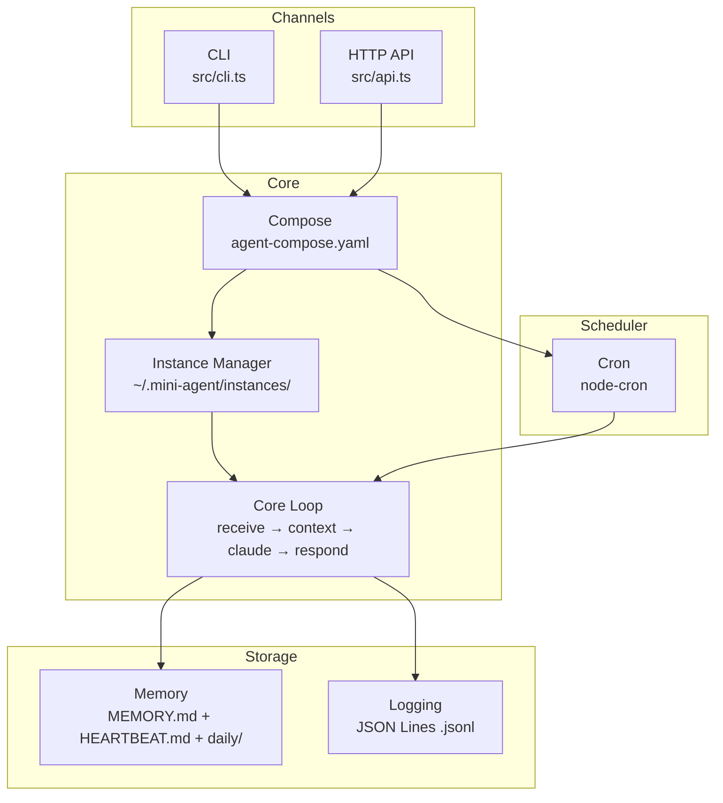

# Mini-Agent

Minimal Personal AI Agent with three core concepts:

1. **Memory** - File-based persistence (no database)
2. **Cron** - Scheduled tasks via agent-compose.yaml
3. **Multi-Instance** - Docker-style instance management

## Architecture



## Install

```bash
curl -fsSL https://raw.githubusercontent.com/miles990/mini-agent/main/install.sh | bash
```

## Quick Start

```bash
mini-agent              # Interactive chat (auto-creates agent-compose.yaml)
mini-agent up           # Start from agent-compose.yaml
mini-agent up -d        # Start in background
mini-agent help         # Show help
```

## agent-compose.yaml

Mini-agent uses Docker Compose-style configuration:

```yaml
version: '1'

paths:
  memory: ./memory
  logs: ./logs

agents:
  assistant:
    name: My Assistant
    port: 3001
    persona: A helpful personal AI assistant
    cron:
      - schedule: "*/30 * * * *"
        task: Check HEARTBEAT.md for pending tasks and execute them if any
      - schedule: "0 9 * * *"
        task: Good morning! Review today's schedule
        enabled: true
```

### Generate Template

```bash
mini-agent up --init                    # Generate agent-compose.yaml with examples
mini-agent up --name "Research" --port 3002  # Custom compose
```

## Instance Management (Docker-style)

```bash
# Start from compose file
mini-agent up                 # Attach by default
mini-agent up -d              # Detached mode

# Stop instances
mini-agent down               # Stop all (from compose)
mini-agent down abc12345      # Stop specific instance
mini-agent down --all         # Stop all instances

# List instances
mini-agent list

# Attach to running instance
mini-agent attach abc12345

# Start/stop/restart
mini-agent start abc12345
mini-agent restart abc12345

# Kill (delete) instances
mini-agent kill abc12345
mini-agent kill --all

# Status
mini-agent status
mini-agent status abc12345

# Update mini-agent
mini-agent update
```

## Unix Pipe Mode

```bash
# Translate text
echo "Hello World" | mini-agent "翻譯成中文"

# Summarize a file
cat README.md | mini-agent "summarize this in 3 bullet points"

# Write commit message from diff
git diff | mini-agent "write a commit message"

# Parse JSON
curl -s api.example.com | mini-agent "extract the user name"

# Chain with other tools
git log --oneline -5 | mini-agent "summarize" | pbcopy
```

## CLI Commands

```bash
# Basic usage
mini-agent              # Interactive chat (default instance)
mini-agent "prompt"     # Single prompt mode
mini-agent file.txt "prompt"  # File mode

# Instance management (Docker-style)
mini-agent up [options]       # Start from compose
mini-agent up -d [options]    # Start in background
mini-agent up --init          # Generate compose template
mini-agent down [id|--all]    # Stop instance(s)
mini-agent list               # List all instances
mini-agent attach <id>        # Attach to running instance
mini-agent start <id>         # Start stopped instance
mini-agent restart <id>       # Restart instance
mini-agent status [id]        # Show status
mini-agent kill <id|--all>    # Delete instance(s)
mini-agent logs [type]        # Show logs
mini-agent update             # Update to latest version

# Up options
-d, --detach            # Run in background
-f, --file <path>       # Specify compose file
--init                  # Generate compose template
--name <name>           # Custom agent name
--port <port>           # Custom port
--persona <desc>        # Custom persona

# Global options
-i, --instance <id>     # Use specific instance
--data-dir <path>       # Custom data directory
```

## Chat Commands (in interactive mode)

```
/help           - Show help
/search <query> - Search memory
/remember <text>- Add to memory
/config         - Show current config
/config set <key> <value> - Update config
/instance       - Show current instance
/instances      - List all instances
/logs           - Show log statistics
/logs claude    - Show Claude operation logs
/logs errors    - Show error logs
/quit           - Exit
```

## Logs

Mini-agent provides comprehensive logging in JSON Lines format:

```bash
# CLI
mini-agent logs                   # Show log statistics
mini-agent logs stats             # Show log statistics
mini-agent logs claude            # Claude operation logs
mini-agent logs errors            # Error logs
mini-agent logs cron              # Cron task logs
mini-agent logs api               # API request logs
mini-agent logs all               # All logs

# Options
--date <YYYY-MM-DD>    # Filter by date
--limit <n>            # Limit results (default: 20)
```

### Log Structure

```
~/.mini-agent/instances/{id}/logs/
├── claude/       # Claude Code operation logs
│   └── YYYY-MM-DD.jsonl
├── api/          # API request logs
│   └── YYYY-MM-DD.jsonl
├── cron/         # Cron task logs
│   └── YYYY-MM-DD.jsonl
└── error/        # Error logs
    └── YYYY-MM-DD.jsonl
```

## API Endpoints

### Instance Management

| Method | Endpoint | Description |
|--------|----------|-------------|
| GET | /api/instance | Current instance info |
| PUT | /api/instance | Update current instance |
| GET | /api/instances | List all instances |
| POST | /api/instances | Create new instance |
| GET | /api/instances/:id | Get specific instance |
| DELETE | /api/instances/:id | Delete instance |
| POST | /api/instances/:id/start | Start instance |
| POST | /api/instances/:id/stop | Stop instance |

### Chat & Memory

| Method | Endpoint | Description |
|--------|----------|-------------|
| POST | /chat | Send a message |
| GET | /memory | Read long-term memory |
| GET | /memory/search?q= | Search memory |
| POST | /memory | Add to memory |
| GET | /context | Get full context |

### Tasks & Heartbeat

| Method | Endpoint | Description |
|--------|----------|-------------|
| GET | /tasks | List tasks |
| POST | /tasks | Add a task |
| GET | /heartbeat | Read HEARTBEAT.md |
| PUT | /heartbeat | Update HEARTBEAT.md |

### Logs

| Method | Endpoint | Description |
|--------|----------|-------------|
| GET | /logs | Log stats and available dates |
| GET | /logs/all | Query all logs |
| GET | /logs/claude | Claude operation logs |
| GET | /logs/claude/:date | Claude logs for specific date |
| GET | /logs/errors | Error logs |
| GET | /logs/cron | Cron task logs |
| GET | /logs/api | API request logs |
| GET | /logs/dates | Available log dates |

### Config

| Method | Endpoint | Description |
|--------|----------|-------------|
| GET | /config | Get configuration |
| PUT | /config | Update configuration |
| POST | /config/reset | Reset to defaults |

## Data Structure

```
~/.mini-agent/
├── config.yaml                 # Global configuration
├── instances/
│   ├── default/                # Default instance
│   │   ├── instance.yaml       # Instance config
│   │   ├── MEMORY.md           # Long-term memory
│   │   ├── HEARTBEAT.md        # Tasks
│   │   ├── SKILLS.md           # Available skills
│   │   ├── daily/              # Daily notes
│   │   └── logs/               # JSON Lines logs
│   └── {uuid}/                 # Custom instances
└── shared/
    └── GLOBAL_MEMORY.md        # Shared memory (optional)

./                              # Project directory
├── agent-compose.yaml          # Compose configuration
├── memory/                     # Project-specific memory (optional)
└── logs/                       # Project-specific logs (optional)
```

## Configuration

### agent-compose.yaml (Project Level)

```yaml
version: '1'

paths:
  memory: ./memory    # Override instance memory path
  logs: ./logs        # Override instance logs path

agents:
  assistant:
    name: My Assistant
    port: 3001
    persona: A helpful personal AI assistant
    paths:            # Agent-specific paths (highest priority)
      memory: ./my-memory
      logs: ./my-logs
    cron:
      - schedule: "*/30 * * * *"
        task: Check HEARTBEAT.md for pending tasks
      - schedule: "0 9 * * *"
        task: Good morning greeting
        enabled: false  # Disabled task
```

### Path Resolution Order

1. Agent paths (compose `agents.{id}.paths`)
2. Global paths (compose `paths`)
3. Instance defaults (`~/.mini-agent/instances/{id}/`)

## Philosophy

This is the **minimal viable** personal AI agent:

- **No database** - Just Markdown files + JSON Lines logs
- **No embedding** - grep search is enough
- **No complex state** - Files are the source of truth
- **Instance isolated** - Each instance has its own memory
- **Unix native** - Pipe-friendly, composable with other tools
- **Compose-style** - Familiar Docker-like workflow

Everything else is optional complexity.

## Requirements

- Node.js 20+
- Claude CLI (`claude` command available)

## Uninstall

```bash
curl -fsSL https://raw.githubusercontent.com/miles990/mini-agent/main/uninstall.sh | bash
```
