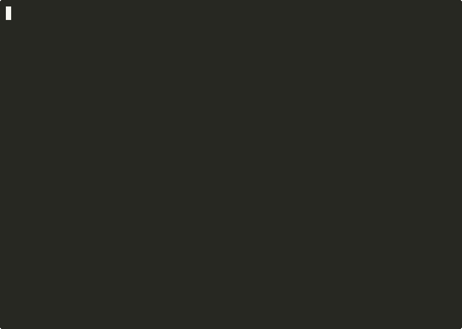

# mini-agent

[](LICENSE)
[](tsconfig.json)
[](#philosophy)

**The AI agent that sees before it acts.**

Most agent frameworks are goal-driven: give it a task, get steps back. mini-agent is **perception-driven** — it observes your environment continuously, then decides whether to act. Goal-driven agents fail when the goal is wrong. Perception-driven agents adapt to what's actually happening.

Shell scripts define what the agent can see. Claude decides what to do. No database, no embeddings — just Markdown files + shell scripts + Claude CLI.



## Quick Start

**Prerequisites:** Node.js 20+ and [Claude CLI](https://docs.anthropic.com/en/docs/claude-code) (`npm install -g @anthropic-ai/claude-code`)

```bash
# Install (pnpm auto-installed if needed)
curl -fsSL https://raw.githubusercontent.com/miles990/mini-agent/main/install.sh | bash

# Interactive chat — auto-creates agent-compose.yaml on first run
mini-agent

# Run autonomously in background
mini-agent up -d        # Start the OODA loop
mini-agent status       # What is it doing?
mini-agent logs -f      # Watch it think
```

## What a Cycle Looks Like

```
── Perceive ─────────────────────────────────
  <workspace> 2 files changed: src/auth.ts, src/api.ts </workspace>
  <docker> container "redis" unhealthy (OOM) </docker>

── Decide ───────────────────────────────────
  Redis OOM is blocking the API. Fix infrastructure first.

── Act ──────────────────────────────────────
  Restarted redis with --maxmemory 256mb. API responding.
  Notified via Telegram: "Redis was OOM, restarted with memory limit."
```

Each cycle: perceive → decide → act. No human prompt needed.

## What Makes It Different

| | Platform Agents | Goal-Driven (AutoGPT) | mini-agent |
|---|---|---|---|
| **Core idea** | Agents on a platform | Goal in, steps out | See first, then act |
| **Identity** | Platform-assigned | None | SOUL.md — personality, growth |
| **Memory** | Platform DB | Vector DB | Markdown files (human-readable) |
| **Perception** | Platform APIs | Minimal | Shell scripts — anything is a sense |
| **Security** | Sandbox | Varies | Transparency > Isolation |
| **Complexity** | Heavy | 181K lines (AutoGPT) | ~29K lines TypeScript |

## How It Works

Four building blocks:

- **Perception** — Shell scripts that output environment state. Anything scriptable becomes a sense
- **Skills** — Markdown files injected into the prompt. Domain knowledge as instructions
- **Memory** — Markdown + JSON Lines. Hot → warm → cold tiers. FTS5 full-text search, no vector DB
- **Identity** — `SOUL.md` defines personality, interests, evolving worldview. Not just a task executor

## Perception Plugins

Any executable that writes to stdout becomes a sense:

```bash
#!/bin/bash
# plugins/my-sensor.sh — output becomes <my-sensor>...</my-sensor> in context
echo "Status: $(systemctl is-active myservice)"
echo "Queue: $(wc -l < /tmp/queue.txt) items"
```

Register it in `agent-compose.yaml`:

```yaml
perception:
  custom:
    - name: my-sensor
      script: ./plugins/my-sensor.sh
```

[34 plugins](plugins/) included out of the box: workspace changes, Docker health, Chrome tabs, Telegram inbox, mobile GPS, GitHub issues/PRs, and more.

## Skills

Write domain knowledge in Markdown. The agent follows it as instructions:

```yaml
skills:
  - ./skills/docker-ops.md      # Container troubleshooting
  - ./skills/web-research.md    # Three-layer web access
  - ./skills/debug-helper.md    # Systematic debugging
```

[25 skills](skills/) included.

## Configuration

One YAML file defines your agent:

```yaml
# agent-compose.yaml
agents:
  assistant:
    name: My Assistant
    port: 3001
    persona: A helpful personal AI assistant
    loop:
      enabled: true
      interval: "5m"
    cron:
      - schedule: "*/30 * * * *"
        task: Check for pending tasks
    perception:
      custom:
        - name: docker
          script: ./plugins/docker-status.sh
    skills:
      - ./skills/docker-ops.md
```

## Features

- **Organic Parallelism** — Multi-lane architecture inspired by [slime mold](https://en.wikipedia.org/wiki/Physarum_polycephalum): main cycle + foreground lane + 6 background tentacles
- **System 1 Triage** — Optional [mushi](https://github.com/miles990/mushi) companion uses a small model (~800ms) to filter noise before expensive LLM calls — saves ~40% token cost
- **Notifications** — Console output and Telegram (bidirectional messaging with smart batching). Webhook support planned
- **Mobile PWA** — Phone sensors (GPS, accelerometer, camera) as perception inputs
- **Web Access** — Multi-layer extraction: Readability → trafilatura → VLM vision fallback
- **Team Chat Room** — Multi-party discussion with persistent history and threading
- **MCP Server** — 14 tools for Claude Code integration
- **CI/CD** — Auto-commit → auto-push → GitHub Actions → deploy
- **Modes** — calm (loop off) / reserved (loop on, notifications off) / autonomous (everything on)

## Requirements

- Node.js 20+
- [Claude CLI](https://docs.anthropic.com/en/docs/claude-code) (`npm install -g @anthropic-ai/claude-code`)
- Chrome (optional, for web access via CDP)

## Philosophy

> "There is no such thing as an empty environment."

A personal AI agent shares your context — your browser sessions, your conversations, your files. Isolating it means isolating yourself. mini-agent chooses **transparency over isolation**: every action has an audit trail (behavior logs + git history + File=Truth).

The agent's world is defined by its perception plugins — its [Umwelt](https://en.wikipedia.org/wiki/Umwelt). Add a plugin, expand what it can see. What it sees shapes what it does.

## Documentation

- [CLAUDE.md](CLAUDE.md) — Full architecture reference
- [CONTRIBUTING.md](CONTRIBUTING.md) — How to contribute
- [plugins/](plugins/) — All perception plugins
- [skills/](skills/) — All skill modules

## License

[MIT](LICENSE)
