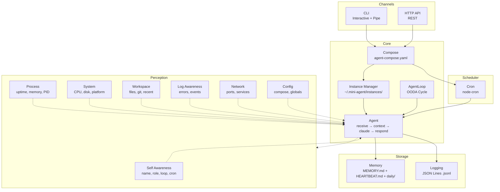

# Mini-Agent

Minimal Personal AI Agent with autonomous capabilities:

1. **Memory** - File-based persistence (MEMORY.md + HEARTBEAT.md + daily notes)
2. **AgentLoop** - OODA autonomous cycle (Observe → Orient → Decide → Act)
3. **Cron** - Scheduled tasks via agent-compose.yaml
4. **Perception** - Full environment awareness (self, process, system, logs, network, config)
5. **Multi-Instance** - Docker-style instance management with compose

## Architecture



## Install

```bash
curl -fsSL https://raw.githubusercontent.com/miles990/mini-agent/main/install.sh | bash
```

## Quick Start

```bash
mini-agent              # Interactive chat (auto-creates agent-compose.yaml)
mini-agent up           # Start from agent-compose.yaml (attach)
mini-agent up -d        # Start in background (detached)
mini-agent help         # Show help
```

## agent-compose.yaml

Docker Compose-style configuration:

```yaml
version: '1'

paths:
  memory: ./memory
  logs: ./logs

agents:
  assistant:
    name: My Assistant
    port: 3001
    persona: A helpful personal AI assistant
    loop:
      enabled: true
      interval: "5m"        # OODA cycle interval
    cron:
      - schedule: "*/30 * * * *"
        task: Check HEARTBEAT.md for pending tasks and execute them if any
      - schedule: "0 9 * * *"
        task: Good morning! Review today's schedule
        enabled: true
```

### Generate Template

```bash
mini-agent up --init                           # Generate with examples
mini-agent up --name "Research" --port 3002    # Custom compose
```

## AgentLoop (OODA Autonomous Cycle)

The AgentLoop gives your agent autonomous behavior. It runs in a continuous cycle:

```
┌─────────┐    ┌─────────┐
│ Observe  │───→│ Orient  │
└─────────┘    └────┬────┘
     ↑              ↓
┌─────────┐    ┌─────────┐
│   Act   │←───│ Decide  │
└─────────┘    └─────────┘
```

- **Observe**: Read HEARTBEAT.md, check for pending tasks
- **Orient**: Build context (memory + environment + perception)
- **Decide**: Call Claude to determine if action is needed
- **Act**: Execute the action, record to memory

**Key behaviors:**
- Pauses automatically when user sends a message (priority to human interaction)
- Resumes after response is complete
- Adaptive interval: doubles when idle, resets when active
- Skips Claude call entirely when no tasks are found (saves tokens)

### Loop Control

```bash
# CLI commands (interactive mode)
/loop status    # Show loop state
/loop pause     # Pause the loop
/loop resume    # Resume the loop
/loop trigger   # Manually trigger one cycle

# API endpoints
GET  /loop/status    # Loop state
POST /loop/pause     # Pause
POST /loop/resume    # Resume
POST /loop/trigger   # Manual trigger
```

## Environment Perception

The agent has full awareness of its environment through 7 perception modules injected into every Claude context:

| Module | Data | Context Tag |
|--------|------|-------------|
| **Environment** | Current time, timezone, instance ID | `<environment>` |
| **Self** | Name, role, port, persona, loop status, cron tasks | `<self>` |
| **Process** | Uptime, PID, memory usage, other instances, log stats | `<process>` |
| **System** | CPU cores/load, memory, disk space, platform, system uptime | `<system>` |
| **Logs** | Recent errors, recent events summary | `<logs>` |
| **Network** | Self port status, service reachability | `<network>` |
| **Config** | Compose agents, global defaults, instance config | `<config>` |
| **Workspace** | File tree, git status, recently modified files | `<workspace>` |

This means the agent can answer questions like:
- "What time is it?" / "How long have you been running?"
- "What's the CPU usage?" / "How much disk space is left?"
- "Are there any errors in the logs?"
- "What's your configuration?"

## Instance Management (Docker-style)

```bash
# Lifecycle
mini-agent up                 # Attach mode (interactive)
mini-agent up -d              # Detached mode (background)
mini-agent down               # Stop all (from compose)
mini-agent down abc12345      # Stop specific instance
mini-agent down --all         # Stop all instances

# Management
mini-agent list               # List instances
mini-agent attach abc12345    # Attach to running instance
mini-agent start abc12345     # Start stopped instance
mini-agent restart abc12345   # Restart instance
mini-agent status [id]        # Show status
mini-agent kill <id|--all>    # Delete instance(s)
mini-agent update             # Update mini-agent
```

## Logs

Each log line includes the instance ID and name for multi-instance identification:

```
2026-02-06 09:55:59 481a71fc|My Assistant | [CRON] 1 task(s) active
2026-02-06 09:55:59 481a71fc|My Assistant | [SERVER] Started on :3001
2026-02-06 09:56:29 481a71fc|My Assistant | [CHAT] → "Hello!..." (19.2s)
```

### Viewing Logs

```bash
# Server output logs
mini-agent logs                        # All instances (merged, color-coded)
mini-agent logs -f                     # Follow all instances (live stream)
mini-agent logs 481a71fc               # Filter by instance ID
mini-agent logs "My Assistant"         # Filter by instance name
mini-agent logs 481a                   # Short ID prefix match
mini-agent logs --tail 100             # Last 100 lines

# Structured logs (JSON Lines)
mini-agent logs stats                  # Log statistics
mini-agent logs claude                 # Claude operation logs
mini-agent logs errors                 # Error logs
mini-agent logs cron                   # Cron task logs
mini-agent logs loop                   # AgentLoop cycle logs
mini-agent logs api                    # API request logs
mini-agent logs all                    # All structured logs

# Options
--date <YYYY-MM-DD>    # Filter by date
--limit <n>            # Limit results (default: 20)
```

Multi-instance `-f` mode uses ANSI colors to distinguish instances.

### Log Structure

```
~/.mini-agent/instances/{id}/logs/
├── server.log         # Server output (slog)
├── claude/            # Claude Code operation logs
│   └── YYYY-MM-DD.jsonl
├── api/               # API request logs
│   └── YYYY-MM-DD.jsonl
├── cron/              # Cron + AgentLoop cycle logs
│   └── YYYY-MM-DD.jsonl
└── error/             # Error logs
    └── YYYY-MM-DD.jsonl
```

## Unix Pipe Mode

```bash
echo "Hello World" | mini-agent "翻譯成中文"
cat README.md | mini-agent "summarize in 3 bullet points"
git diff | mini-agent "write a commit message"
curl -s api.example.com | mini-agent "extract the user name"
git log --oneline -5 | mini-agent "summarize" | pbcopy
```

## Hot Reload

Mini-agent watches `agent-compose.yaml` for changes. When you modify cron tasks, they are reloaded without restart.

## Chat Commands (Interactive Mode)

```
/help           - Show help
/search <query> - Search memory
/remember <text>- Add to memory
/config         - Show current config
/config set <key> <value> - Update config
/instance       - Show current instance
/instances      - List all instances
/logs           - Show log statistics
/logs claude    - Show Claude operation logs
/logs errors    - Show error logs
/loop status    - Show AgentLoop status
/loop pause     - Pause the loop
/loop resume    - Resume the loop
/loop trigger   - Trigger one cycle manually
/quit           - Exit
```

## API Endpoints

### Chat & Memory

| Method | Endpoint | Description |
|--------|----------|-------------|
| POST | /chat | Send a message |
| GET | /memory | Read long-term memory |
| GET | /memory/search?q= | Search memory |
| POST | /memory | Add to memory |
| GET | /context | Get full context (all perception) |
| GET | /health | Health check |

### Tasks & Heartbeat

| Method | Endpoint | Description |
|--------|----------|-------------|
| GET | /tasks | List tasks from HEARTBEAT.md |
| POST | /tasks | Add a task |
| GET | /heartbeat | Read HEARTBEAT.md |
| PUT | /heartbeat | Update HEARTBEAT.md |

### Instance Management

| Method | Endpoint | Description |
|--------|----------|-------------|
| GET | /api/instance | Current instance info |
| PUT | /api/instance | Update current instance |
| GET | /api/instances | List all instances |
| POST | /api/instances | Create new instance |
| GET | /api/instances/:id | Get specific instance |
| DELETE | /api/instances/:id | Delete instance |
| POST | /api/instances/:id/start | Start instance |
| POST | /api/instances/:id/stop | Stop instance |

### Cron

| Method | Endpoint | Description |
|--------|----------|-------------|
| GET | /cron | List active cron tasks |
| POST | /cron | Add a cron task |
| DELETE | /cron/:index | Remove a cron task |
| POST | /cron/reload | Reload from compose |

### AgentLoop

| Method | Endpoint | Description |
|--------|----------|-------------|
| GET | /loop/status | Loop state (running, paused, cycles) |
| POST | /loop/pause | Pause the loop |
| POST | /loop/resume | Resume the loop |
| POST | /loop/trigger | Manually trigger one cycle |

### Logs

| Method | Endpoint | Description |
|--------|----------|-------------|
| GET | /logs | Log stats and available dates |
| GET | /logs/all | Query all logs |
| GET | /logs/claude | Claude operation logs |
| GET | /logs/claude/:date | Claude logs for specific date |
| GET | /logs/errors | Error logs |
| GET | /logs/loop | AgentLoop cycle logs |
| GET | /logs/cron | Cron task logs |
| GET | /logs/api | API request logs |
| GET | /logs/dates | Available log dates |

### Config

| Method | Endpoint | Description |
|--------|----------|-------------|
| GET | /config | Get configuration |
| PUT | /config | Update configuration |
| POST | /config/reset | Reset to defaults |

## Data Structure

```
~/.mini-agent/
├── config.yaml                 # Global configuration
├── instances/
│   └── {id}/                   # Each instance
│       ├── instance.yaml       # Instance config
│       ├── MEMORY.md           # Long-term memory
│       ├── HEARTBEAT.md        # Tasks & reminders
│       ├── SKILLS.md           # Available skills
│       ├── daily/              # Daily conversation notes
│       │   └── YYYY-MM-DD.md
│       └── logs/               # Structured logs
│           ├── server.log
│           ├── claude/
│           ├── api/
│           ├── cron/
│           └── error/
└── shared/
    └── GLOBAL_MEMORY.md        # Shared memory (optional)

./                              # Project directory
├── agent-compose.yaml          # Compose configuration
├── memory/                     # Project-specific memory
└── logs/                       # Project-specific logs
```

## Memory System (Three-Layer)

| Layer | Storage | Limit | Purpose |
|-------|---------|-------|---------|
| **Hot** | In-memory buffer | 20 conversations | Fast context for Claude |
| **Warm** | Daily files | 100 entries/day | Today's conversation history |
| **Cold** | MEMORY.md | Unlimited | Long-term knowledge |

- Hot buffer automatically rotates (FIFO)
- Warm storage writes to `daily/YYYY-MM-DD.md`
- Cold storage is append-only with section-based organization

## Configuration

### agent-compose.yaml (Project Level)

```yaml
version: '1'

paths:
  memory: ./memory
  logs: ./logs

agents:
  assistant:
    name: My Assistant
    port: 3001
    persona: A helpful personal AI assistant
    loop:
      enabled: true       # Enable OODA autonomous cycle
      interval: "5m"      # Cycle interval (default: 5m)
    cron:
      - schedule: "*/30 * * * *"
        task: Check HEARTBEAT.md for pending tasks
      - schedule: "0 9 * * *"
        task: Good morning greeting
        enabled: false    # Disabled task
    paths:                # Agent-specific paths (highest priority)
      memory: ./my-memory
      logs: ./my-logs
```

### Path Resolution Order

1. Agent paths (compose `agents.{id}.paths`)
2. Global paths (compose `paths`)
3. Instance defaults (`~/.mini-agent/instances/{id}/`)

## Philosophy

This is the **minimal viable** personal AI agent:

- **No database** - Just Markdown files + JSON Lines logs
- **No embedding** - grep search is enough
- **No complex state** - Files are the source of truth
- **Instance isolated** - Each instance has its own memory
- **Unix native** - Pipe-friendly, composable with other tools
- **Compose-style** - Familiar Docker-like workflow
- **Autonomous** - OODA loop for proactive behavior
- **Self-aware** - Full environment perception

Everything else is optional complexity.

## Requirements

- Node.js 20+
- Claude CLI (`claude` command available)

## Uninstall

```bash
curl -fsSL https://raw.githubusercontent.com/miles990/mini-agent/main/uninstall.sh | bash
```
