# Mini-Agent

Minimal Personal AI Agent with autonomous capabilities:

1. **Memory** - File-based persistence (MEMORY.md + HEARTBEAT.md + SOUL.md + daily notes)
2. **Identity** - SOUL.md defines who the agent *is* — personality, interests, evolving thoughts
3. **AgentLoop** - OODA autonomous cycle (Observe → Orient → Decide → Act)
4. **Dual-Track Learning** - Track A (personal curiosity) + Track B (project evolution)
5. **Perception** - Full environment awareness (builtin + custom shell plugins)
6. **Skills** - Markdown knowledge modules injected into system prompt
7. **Smart Guidance** - Core behavior: always provide actionable, state-aware guidance
8. **Learning-to-Action Loop** - Three safety levels: self-improve → propose feature → propose architecture
9. **Web Access** - Three-layer web fetching (curl → Chrome CDP → user login)
10. **Telegram** - Bidirectional Telegram integration (receive messages, smart batched replies, file download)
11. **Multi-Instance** - Docker-style instance management with compose
12. **Graceful Shutdown** - Clean stop of all services (Telegram, AgentLoop, Cron, HTTP)
13. **Observability** - Multi-dimensional logging: diagnostics, behavior tracking, CDP operations, activity perception
14. **CI/CD** - GitHub Actions self-hosted runner → launchd deployment with health check and Telegram notification
15. **Launchd** - Native macOS process management with KeepAlive auto-restart (dynamic plist per instance)
16. **Reliable Notifications** - Unified TG notification with retry, failure counting, and photo/screenshot support
17. **Unified Status** - Single `/status` API aggregating all subsystems (claude, loop, cron, telegram)

## Architecture

```mermaid
graph TB
    subgraph Channels
        CLI[CLI<br/>Interactive + Pipe]
        API[HTTP API<br/>REST]
        TG[Telegram<br/>Long Poll + Reply]
    end

    subgraph Core
        Compose[Compose<br/>agent-compose.yaml]
        Instance[Instance Manager<br/>~/.mini-agent/instances/]
        Agent[Agent<br/>receive → context → claude → respond]
        Loop[AgentLoop<br/>OODA Cycle]
    end

    subgraph Perception
        Self[Self Awareness<br/>name, role, loop, cron]
        Process[Process<br/>uptime, memory, PID]
        System[System<br/>CPU, disk, platform]
        Workspace[Workspace<br/>files, git, recent]
        Logs[Log Awareness<br/>errors, events]
        Network[Network<br/>ports, services]
        Config[Config<br/>compose, globals]
        Custom[Custom Plugins<br/>Shell Scripts]
    end

    subgraph Skills
        Skill[Markdown Skills<br/>Injected into System Prompt]
    end

    subgraph Storage
        Memory[Memory<br/>MEMORY.md + HEARTBEAT.md + daily/]
        LogStore[Logging<br/>JSON Lines .jsonl]
    end

    subgraph Scheduler
        Cron[Cron<br/>node-cron]
    end

    CLI --> Compose
    API --> Compose
    TG --> Agent
    Compose --> Instance
    Instance --> Agent
    Agent --> Memory
    Agent --> LogStore
    Loop --> Agent
    Cron --> Agent
    Compose --> Cron

    Agent -.-> Perception
    Self -.-> Agent
    Process -.-> Agent
    System -.-> Agent
    Workspace -.-> Agent
    Logs -.-> Agent
    Network -.-> Agent
    Config -.-> Agent
    Custom -.-> Agent
    Skill -.-> Agent
```



## Install

```bash
curl -fsSL https://raw.githubusercontent.com/miles990/mini-agent/main/install.sh | bash
```

## Quick Start

```bash
mini-agent              # Interactive chat (auto-creates agent-compose.yaml)
mini-agent up           # Start from agent-compose.yaml (attach)
mini-agent up -d        # Start in background (detached)
mini-agent help         # Show help
```

## agent-compose.yaml

Docker Compose-style configuration:

```yaml
version: '1'

paths:
  memory: ./memory
  logs: ./logs

agents:
  assistant:
    name: My Assistant
    port: 3001
    persona: A helpful personal AI assistant
    loop:
      enabled: true
      interval: "5m"        # OODA cycle interval
    cron:
      - schedule: "*/30 * * * *"
        task: Check HEARTBEAT.md for pending tasks and execute them if any
      - schedule: "0 9 * * *"
        task: Good morning! Review today's schedule
        enabled: true

    # Custom Perception (Shell Script plugins)
    perception:
      custom:
        - name: docker
          script: ./plugins/docker-status.sh
        - name: ports
          script: ./plugins/port-check.sh
        - name: chrome
          script: ./plugins/chrome-status.sh
        - name: web
          script: ./plugins/web-fetch.sh
          timeout: 15000

    # Skills (Markdown knowledge modules)
    skills:
      - ./skills/autonomous-behavior.md
      - ./skills/reactive-agent.md
      - ./skills/docker-ops.md
      - ./skills/debug-helper.md
      - ./skills/project-manager.md
      - ./skills/web-research.md
      - ./skills/web-learning.md
      - ./skills/action-from-learning.md
```

### Generate Template

```bash
mini-agent up --init                           # Generate with examples
mini-agent up --name "Research" --port 3002    # Custom compose
```

## AgentLoop (OODA Autonomous Cycle)

The AgentLoop gives your agent autonomous behavior. It runs in a continuous cycle:

```
┌─────────┐    ┌─────────┐
│ Observe  │───→│ Orient  │
└─────────┘    └────┬────┘
     ↑              ↓
┌─────────┐    ┌─────────┐
│   Act   │←───│ Decide  │
└─────────┘    └─────────┘
```

- **Observe**: Read HEARTBEAT.md, check for pending tasks
- **Orient**: Build context (memory + environment + perception)
- **Decide**: Call Claude to determine if action is needed
- **Act**: Execute the action, record to memory

**Key behaviors:**
- Pauses automatically when user sends a message (priority to human interaction)
- Resumes after response is complete
- Adaptive interval: doubles when idle, resets when active
- Skips Claude call entirely when no tasks are found (saves tokens)

### Loop Control

```bash
# CLI commands (interactive mode)
/loop status    # Show loop state
/loop pause     # Pause the loop
/loop resume    # Resume the loop
/loop trigger   # Manually trigger one cycle

# API endpoints
GET  /loop/status    # Loop state
POST /loop/pause     # Pause
POST /loop/resume    # Resume
POST /loop/trigger   # Manual trigger
```

## Environment Perception

The agent has full awareness of its environment through 7 perception modules injected into every Claude context:

| Module | Data | Context Tag |
|--------|------|-------------|
| **Environment** | Current time, timezone, instance ID | `<environment>` |
| **Self** | Name, role, port, persona, loop status, cron tasks | `<self>` |
| **Process** | Uptime, PID, memory usage, other instances, log stats | `<process>` |
| **System** | CPU cores/load, memory, disk space, platform, system uptime | `<system>` |
| **Logs** | Recent errors, recent events summary | `<logs>` |
| **Network** | Self port status, service reachability | `<network>` |
| **Config** | Compose agents, global defaults, instance config | `<config>` |
| **Telegram** | Connection status, notification stats (sent/failed), queue | `<telegram>` |
| **Activity** | Recent diagnostics, behavior log, CDP operations | `<activity>` |
| **Workspace** | File tree, git status, recently modified files | `<workspace>` |

This means the agent can answer questions like:
- "What time is it?" / "How long have you been running?"
- "What's the CPU usage?" / "How much disk space is left?"
- "Are there any errors in the logs?"
- "What's your configuration?"

### Custom Perception Plugins

Extend the agent's awareness with **any executable file** (Bash, Python, binary). Each plugin's stdout is captured and injected into Claude's context as an XML tag.

```yaml
# agent-compose.yaml
perception:
  custom:
    - name: docker          # → <docker>...</docker>
      script: ./plugins/docker-status.sh
    - name: ports           # → <ports>...</ports>
      script: ./plugins/port-check.sh
      timeout: 5000         # Optional timeout in ms (default: 5000)
```

**How it works:**
1. Each plugin runs as a subprocess with a timeout
2. stdout is captured and wrapped in `<name>...</name>` XML tag
3. Tags are injected into Claude's context alongside builtin perceptions
4. Failures are isolated — one plugin crashing doesn't affect others

**Writing a plugin:**

```bash
#!/bin/bash
# plugins/my-plugin.sh
# Just output useful information to stdout

echo "Status: OK"
echo "Connections: $(netstat -an | grep ESTABLISHED | wc -l)"
echo "Load: $(uptime | awk -F'load average:' '{print $2}')"
```

Any language works — Bash, Python, Go binary, etc. As long as it's executable and writes to stdout.

**Included plugins:**

| Plugin | Description |
|--------|-------------|
| `chrome-status.sh` | Chrome CDP status with smart guidance (detects Chrome running/stopped, gives specific setup steps) |
| `web-fetch.sh` | Three-layer URL fetching (curl → CDP → user login) |
| `docker-status.sh` | Running/stopped containers, resource usage |
| `port-check.sh` | Common port availability (80, 443, 3000, 5432, 6379...) |
| `task-tracker.sh` | HEARTBEAT.md task status + deadline tracking |
| `state-watcher.sh` | Environment state changes since last check |
| `telegram-inbox.sh` | Pending Telegram messages from inbox |
| `disk-usage.sh` | Mount points, home directory top 5, temp files |
| `git-status.sh` | Branch, remote, uncommitted files, unpushed commits |
| `homebrew-outdated.sh` | Outdated brew packages |

## Skills (Markdown Knowledge Modules)

Skills are pure Markdown files that get injected into the agent's **system prompt**. They tell the agent *how to do things* — workflows, checklists, commands, safety rules.

```yaml
# agent-compose.yaml
skills:
  - ./skills/docker-ops.md
  - ./skills/debug-helper.md
  - ./skills/project-manager.md
```

**How it works:**
1. Markdown files are loaded at startup
2. Content is injected into the system prompt under `## Your Skills`
3. Claude sees these as instructions and follows them when relevant

**Writing a skill:**

```markdown
# Docker 運維專家

當容器出現異常時，按以下流程處理：

## 診斷步驟
1. 檢查容器狀態：`docker ps -a`
2. 查看日誌：`docker logs <container>`
3. 檢查資源：`docker stats --no-stream`

## 安全規則
- 不要 `docker rm -f` 生產容器
- 修改前先備份配置
```

**Included skills:**

| Skill | Description |
|-------|-------------|
| `autonomous-behavior.md` | Dual-track learning, daily rhythm, SOUL.md maintenance |
| `reactive-agent.md` | Perception-driven reactions, state change detection |
| `web-research.md` | Three-layer web access workflow (curl → CDP → user login) |
| `web-learning.md` | Autonomous web learning — HN, research, competitive analysis |
| `action-from-learning.md` | Learning-to-action loop — 3 safety levels (L1/L2/L3), proposal format |
| `docker-ops.md` | Container exception handling, common commands, safety rules |
| `debug-helper.md` | Systematic debugging workflow (reproduce → locate → hypothesize → verify → fix) |
| `project-manager.md` | Task management with HEARTBEAT.md, daily workflow |
| `code-review.md` | Review checklist (logic, security, performance, readability, testing) |
| `server-admin.md` | System monitoring, common commands, safety rules |

## Web Access (Three-Layer)

The agent can fetch web content through three layers, falling through automatically:

| Layer | Method | Use Case | Speed |
|-------|--------|----------|-------|
| **1. curl** | Direct HTTP | Public pages, APIs, GitHub | < 3s |
| **2. Chrome CDP** | User's browser session | Authenticated pages (logged-in sites) | < 10s |
| **3. Open page** | Visible tab for user | Login/verification required | Manual |

### Setup

```bash
# Option A: Launch Chrome with CDP
open -a "Google Chrome" --args --remote-debugging-port=9222

# Option B: Interactive setup guide
bash scripts/chrome-setup.sh
```

### CDP Client

```bash
# Check Chrome CDP status
node scripts/cdp-fetch.mjs status

# Fetch page content (background tab, auto-close)
node scripts/cdp-fetch.mjs fetch "https://example.com"

# Open visible tab for user login
node scripts/cdp-fetch.mjs open "https://facebook.com/messages"

# Extract content from open tab
node scripts/cdp-fetch.mjs extract <tabId>

# Close tab
node scripts/cdp-fetch.mjs close <tabId>
```

The [Smart Guidance](#smart-guidance-core-behavior) mechanism automatically handles all error scenarios — the agent reads `<chrome>` perception data and provides state-specific setup instructions without any hardcoded guidance text.

The `chrome-status.sh` perception plugin reports CDP status, and `web-fetch.sh` automatically fetches URLs mentioned in conversations using this three-layer strategy.

## Telegram Integration

Bidirectional Telegram support — receive messages, process with Claude, and reply. Uses Telegram Bot API long polling (zero new dependencies, Node built-in `fetch()`).

### Setup

```bash
# Add to .env
TELEGRAM_BOT_TOKEN=your-bot-token    # From @BotFather
TELEGRAM_CHAT_ID=your-chat-id        # Authorized chat ID
```

### Features

| Feature | Description |
|---------|-------------|
| **Smart Batching** | Waits 3s for follow-up messages, processes all at once |
| **Message Types** | Text, photos, documents, voice, forwarded messages |
| **URL Extraction** | Auto-detects URLs in messages |
| **File Download** | Saves photos/docs/voice to `memory/media/` |
| **Inbox (File=Truth)** | All messages logged to `memory/.telegram-inbox.md` |
| **Perception** | OODA loop sees pending messages via `telegram-inbox` plugin |
| **Reliable Notify** | Shared `notifyTelegram()` with retry + failure counting |
| **Photo/Screenshot** | Send photos and CDP screenshots to Telegram |
| **Security** | Only accepts messages from configured `TELEGRAM_CHAT_ID` |

### How It Works

```
User sends Telegram message
  → getUpdates long poll receives it
  → Message buffered (3s wait for more)
  → All buffered messages combined
  → processMessage() → Claude processes
  → Reply sent to Telegram
  → Written to inbox for perception
```

The agent loop also uses TelegramPoller for notifications (replacing the old `scripts/notify.sh` approach).

### Agent Tags

Special tags in Claude's response that trigger system actions:

| Tag | Purpose | Telegram |
|-----|---------|----------|
| `[ACTION]...[/ACTION]` | Report completed action | 🧠 autonomous / ⚡ task |
| `[REMEMBER]...[/REMEMBER]` | Save to long-term memory | — |
| `[TASK]...[/TASK]` | Create task in HEARTBEAT | — |
| `[CHAT]...[/CHAT]` | Proactive message to user | 💬 |
| `[SHOW url=".."]...[/SHOW]` | Show webpage/result to user | 🌐 + URL |

All tags are automatically stripped from the response before sending to the user. All tag actions are recorded in behavior logs.

## Observability

Multi-dimensional logging framework for diagnostics, behavior tracking, and self-awareness.

### Diagnostics (`diagLog`)

Unified error recording with context and snapshot:

```typescript
diagLog('memory.readMemory', error, { path: memoryPath });
// → [DIAG] [memory.readMemory] YAML parse error | path=/home/memory/MEMORY.md
```

- Outputs to `slog` (server.log) + JSONL (`diag/` directory)
- ENOENT (file not found) is suppressed — expected behavior
- Global safety net catches `uncaughtException` and `unhandledRejection`

### Behavior Tracking (`logBehavior`)

Records all agent/user/system actions:

| Action | Actor | Trigger |
|--------|-------|---------|
| `loop.cycle.start/end` | agent | OODA cycle |
| `action.autonomous` | agent | `[ACTION]` in autonomous mode |
| `action.task` | agent | `[ACTION]` in task mode |
| `memory.save` | agent | `[REMEMBER]` tag |
| `task.create` | agent | `[TASK]` tag |
| `show.webpage` | agent | `[SHOW]` tag |
| `claude.call` | agent | Claude CLI invocation |
| `cron.trigger` | system | Cron task fires |
| `telegram.message` | user | Incoming Telegram message |
| `telegram.reply` | agent | Outgoing Telegram reply |

### CDP Operation Log

Chrome DevTools Protocol operations are logged to `~/.mini-agent/cdp.jsonl`:

```json
{"ts":"2026-02-09T10:00:00Z","op":"fetch","url":"https://example.com"}
{"ts":"2026-02-09T10:01:00Z","op":"open","url":"https://news.ycombinator.com"}
```

### Activity Perception (`<activity>`)

The agent sees its own recent behavior through the `<activity>` context tag:

```
Recent diagnostics (1):
  [10:23:49] [perception.exec] exit 126 | script=docker-status.sh

Recent behavior (3):
  [10:20:00] [agent] action.autonomous: [Track A] 閱讀 HN 文章
  [10:22:15] [user] telegram.message: "幫我看看 docker 的狀態"
  [10:22:18] [agent] telegram.reply: 檢查 Docker 狀態...

Recent CDP operations (1):
  [10:21:30] fetch: Hacker News (https://news.ycombinator.com)
```

## Three-Layer Architecture

```
┌──────────────────────────────────────────────────┐
│                   Claude CLI                      │
│           (Execution via --dangerously-           │
│            skip-permissions)                      │
├──────────────────────────────────────────────────┤
│  Perception (See)     │  Skills (Know How)        │
│  ─────────────────    │  ──────────────────       │
│  Builtin modules      │  Markdown files           │
│  + Shell plugins      │  → system prompt          │
│  → context injection  │                           │
├──────────────────────────────────────────────────┤
│              Agent Core (Think + Decide)           │
│              Memory + AgentLoop + Cron             │
└──────────────────────────────────────────────────┘
```

- **Perception** provides real-time environment data (what the agent *sees*)
- **Skills** provide domain knowledge (what the agent *knows how to do*)
- **Claude CLI** provides execution capability (what the agent *can do*)

## Smart Guidance (Core Behavior)

Built into the system prompt as a **core behavioral principle**, not per-feature patches. The agent automatically reads all perception data and provides actionable guidance in every interaction:

| Principle | Behavior |
|-----------|----------|
| **State-aware** | Reads `<chrome>`, `<system>`, `<docker>`, `<network>` etc. before answering |
| **Actionable** | Commands are copy-paste ready, never vague "please enable X" |
| **Solution-first** | 80% how-to-fix, 20% what-went-wrong |
| **Never give up** | Always provides alternatives or next steps |
| **Branch guidance** | Different paths for different states (e.g. Chrome running vs not) |

This means **new plugins automatically get smart guidance** — they just need to output state data, the agent handles the rest.

```
Plugin outputs: "Docker daemon not running"
  → Agent reads <docker> perception
  → Agent applies Smart Guidance principle
  → Agent responds: "Docker 沒有運行。執行 `open -a Docker` 啟動..."
```

## Instance Management (Docker-style)

```bash
# Lifecycle
mini-agent up                 # Attach mode (interactive)
mini-agent up -d              # Detached mode (background)
mini-agent down               # Stop all (from compose)
mini-agent down abc12345      # Stop specific instance
mini-agent down --all         # Stop all instances

# Management
mini-agent list               # List instances
mini-agent attach abc12345    # Attach to running instance
mini-agent start abc12345     # Start stopped instance
mini-agent restart abc12345   # Restart instance
mini-agent status [id]        # Show status
mini-agent kill <id|--all>    # Delete instance(s)
mini-agent update             # Update mini-agent
```

## Logs

Each log line includes the instance ID and name for multi-instance identification:

```
2026-02-06 09:55:59 481a71fc|My Assistant | [CRON] 1 task(s) active
2026-02-06 09:55:59 481a71fc|My Assistant | [SERVER] Started on :3001
2026-02-06 09:56:29 481a71fc|My Assistant | [CHAT] → "Hello!..." (19.2s)
```

### Viewing Logs

```bash
# Server output logs
mini-agent logs                        # All instances (merged, color-coded)
mini-agent logs -f                     # Follow all instances (live stream)
mini-agent logs 481a71fc               # Filter by instance ID
mini-agent logs "My Assistant"         # Filter by instance name
mini-agent logs 481a                   # Short ID prefix match
mini-agent logs --tail 100             # Last 100 lines

# Structured logs (JSON Lines)
mini-agent logs stats                  # Log statistics
mini-agent logs claude                 # Claude operation logs
mini-agent logs errors                 # Error logs
mini-agent logs cron                   # Cron task logs
mini-agent logs loop                   # AgentLoop cycle logs
mini-agent logs api                    # API request logs
mini-agent logs diag                   # Diagnostic logs
mini-agent logs behavior               # Behavior logs
mini-agent logs all                    # All structured logs

# Options
--date <YYYY-MM-DD>    # Filter by date
--limit <n>            # Limit results (default: 20)
```

Multi-instance `-f` mode uses ANSI colors to distinguish instances.

### Log Structure

```
~/.mini-agent/instances/{id}/logs/
├── server.log         # Server output (slog)
├── claude/            # Claude Code operation logs
│   └── YYYY-MM-DD.jsonl
├── api/               # API request logs
│   └── YYYY-MM-DD.jsonl
├── cron/              # Cron + AgentLoop cycle logs
│   └── YYYY-MM-DD.jsonl
├── error/             # Error logs
│   └── YYYY-MM-DD.jsonl
├── diag/              # Diagnostic logs (error context + snapshot)
│   └── YYYY-MM-DD.jsonl
└── behavior/          # Behavior logs (user/agent/system actions)
    └── YYYY-MM-DD.jsonl

~/.mini-agent/cdp.jsonl              # CDP operation log (fetch/open/extract/close)
```

## Unix Pipe Mode

```bash
echo "Hello World" | mini-agent "翻譯成中文"
cat README.md | mini-agent "summarize in 3 bullet points"
git diff | mini-agent "write a commit message"
curl -s api.example.com | mini-agent "extract the user name"
git log --oneline -5 | mini-agent "summarize" | pbcopy
```

## Hot Reload

Mini-agent watches `agent-compose.yaml` for changes. When you modify cron tasks, they are reloaded without restart.

## Chat Commands (Interactive Mode)

```
/help           - Show help
/search <query> - Search memory
/remember <text>- Add to memory
/config         - Show current config
/config set <key> <value> - Update config
/instance       - Show current instance
/instances      - List all instances
/logs           - Show log statistics
/logs claude    - Show Claude operation logs
/logs errors    - Show error logs
/loop status    - Show AgentLoop status
/loop pause     - Pause the loop
/loop resume    - Resume the loop
/loop trigger   - Trigger one cycle manually
/quit           - Exit
```

## API Endpoints

### Chat & Memory

| Method | Endpoint | Description |
|--------|----------|-------------|
| POST | /chat | Send a message |
| GET | /memory | Read long-term memory |
| GET | /memory/search?q= | Search memory |
| POST | /memory | Add to memory |
| GET | /context | Get full context (all perception) |
| GET | /health | Health check |
| GET | /status | Unified status (claude, loop, cron, telegram) |

### Tasks & Heartbeat

| Method | Endpoint | Description |
|--------|----------|-------------|
| GET | /tasks | List tasks from HEARTBEAT.md |
| POST | /tasks | Add a task |
| GET | /heartbeat | Read HEARTBEAT.md |
| PUT | /heartbeat | Update HEARTBEAT.md |

### Instance Management

| Method | Endpoint | Description |
|--------|----------|-------------|
| GET | /api/instance | Current instance info |
| PUT | /api/instance | Update current instance |
| GET | /api/instances | List all instances |
| POST | /api/instances | Create new instance |
| GET | /api/instances/:id | Get specific instance |
| DELETE | /api/instances/:id | Delete instance |
| POST | /api/instances/:id/start | Start instance |
| POST | /api/instances/:id/stop | Stop instance |

### Cron

| Method | Endpoint | Description |
|--------|----------|-------------|
| GET | /cron | List active cron tasks |
| POST | /cron | Add a cron task |
| DELETE | /cron/:index | Remove a cron task |
| POST | /cron/reload | Reload from compose |

### AgentLoop

| Method | Endpoint | Description |
|--------|----------|-------------|
| GET | /loop/status | Loop state (running, paused, cycles) |
| POST | /loop/pause | Pause the loop |
| POST | /loop/resume | Resume the loop |
| POST | /loop/trigger | Manually trigger one cycle |

### Logs

| Method | Endpoint | Description |
|--------|----------|-------------|
| GET | /logs | Log stats and available dates |
| GET | /logs/all | Query all logs |
| GET | /logs/claude | Claude operation logs |
| GET | /logs/claude/:date | Claude logs for specific date |
| GET | /logs/errors | Error logs |
| GET | /logs/loop | AgentLoop cycle logs |
| GET | /logs/cron | Cron task logs |
| GET | /logs/api | API request logs |
| GET | /logs/diag | Diagnostic logs |
| GET | /logs/behavior | Behavior logs |
| GET | /logs/dates | Available log dates |

### Config

| Method | Endpoint | Description |
|--------|----------|-------------|
| GET | /config | Get configuration |
| PUT | /config | Update configuration |
| POST | /config/reset | Reset to defaults |

## Data Structure

```
~/.mini-agent/
├── config.yaml                 # Global configuration
├── cdp.jsonl                   # CDP operation log
├── instances/
│   └── {id}/                   # Each instance
│       ├── instance.yaml       # Instance config
│       ├── MEMORY.md           # Long-term memory
│       ├── HEARTBEAT.md        # Tasks & reminders
│       ├── SKILLS.md           # Available skills
│       ├── daily/              # Daily conversation notes
│       │   └── YYYY-MM-DD.md
│       └── logs/               # Structured logs
│           ├── server.log
│           ├── claude/
│           ├── api/
│           ├── cron/
│           └── error/
└── shared/
    └── GLOBAL_MEMORY.md        # Shared memory (optional)

./                              # Project directory
├── agent-compose.yaml          # Compose configuration
├── memory/                     # Project-specific memory
│   ├── MEMORY.md               # Long-term knowledge
│   ├── HEARTBEAT.md            # Tasks & reminders
│   ├── SOUL.md                 # Agent identity, interests, thoughts
│   ├── ARCHITECTURE.md         # Architecture reference
│   ├── proposals/              # Feature proposals (agent → human review)
│   ├── research/               # Research reports
│   └── daily/                  # Daily conversation logs
├── logs/                       # Project-specific logs
├── plugins/                    # Custom perception plugins (shell scripts)
│   ├── chrome-status.sh
│   ├── web-fetch.sh
│   ├── docker-status.sh
│   ├── port-check.sh
│   ├── task-tracker.sh
│   ├── state-watcher.sh
│   ├── telegram-inbox.sh
│   └── ...
├── skills/                     # Markdown knowledge modules
│   ├── autonomous-behavior.md
│   ├── reactive-agent.md
│   ├── web-learning.md
│   ├── action-from-learning.md
│   ├── web-research.md
│   ├── docker-ops.md
│   ├── debug-helper.md
│   └── ...
└── scripts/                    # Utility scripts
    ├── cdp-fetch.mjs           # Chrome CDP client (zero-dependency)
    ├── cdp-screenshot.mjs      # CDP screenshot capture (zero-dependency)
    ├── chrome-setup.sh         # Chrome CDP setup guide
    ├── deploy.sh               # CI/CD deployment (launchd)
    └── restart_least.sh        # Manual restart fallback
```

## Memory System (Three-Layer)

| Layer | Storage | Limit | Purpose |
|-------|---------|-------|---------|
| **Hot** | In-memory buffer | 20 conversations | Fast context for Claude |
| **Warm** | Daily files | 100 entries/day | Today's conversation history |
| **Cold** | MEMORY.md | Unlimited | Long-term knowledge |

- Hot buffer automatically rotates (FIFO)
- Warm storage writes to `daily/YYYY-MM-DD.md`
- Cold storage is append-only with section-based organization

## Configuration

### agent-compose.yaml (Project Level)

```yaml
version: '1'

paths:
  memory: ./memory
  logs: ./logs

agents:
  assistant:
    name: My Assistant
    port: 3001
    persona: A helpful personal AI assistant
    loop:
      enabled: true       # Enable OODA autonomous cycle
      interval: "5m"      # Cycle interval (default: 5m)
    cron:
      - schedule: "*/30 * * * *"
        task: Check HEARTBEAT.md for pending tasks
      - schedule: "0 9 * * *"
        task: Good morning greeting
        enabled: false    # Disabled task
    perception:           # Custom perception plugins
      custom:
        - name: docker
          script: ./plugins/docker-status.sh
        - name: ports
          script: ./plugins/port-check.sh
          timeout: 10000  # Timeout in ms (default: 5000)
        - name: chrome
          script: ./plugins/chrome-status.sh
        - name: web
          script: ./plugins/web-fetch.sh
          timeout: 15000
    skills:               # Markdown knowledge modules
      - ./skills/docker-ops.md
      - ./skills/debug-helper.md
      - ./skills/web-research.md
    paths:                # Agent-specific paths (highest priority)
      memory: ./my-memory
      logs: ./my-logs
```

### Path Resolution Order

1. Agent paths (compose `agents.{id}.paths`)
2. Global paths (compose `paths`)
3. Instance defaults (`~/.mini-agent/instances/{id}/`)

## Philosophy

This is the **minimal viable** personal AI agent:

- **No database** - Just Markdown files + JSON Lines logs
- **No embedding** - grep search is enough
- **File = Truth** - Files are the single source of truth
- **Identity-driven** - SOUL.md defines who the agent *is*, not just what it does
- **Perception-first** - Environment drives action, not goals
- **Transparency > Isolation** - Audit trail over sandboxing for personal agents
- **Autonomous** - OODA loop + dual-track learning (curiosity + project evolution)
- **Learning-to-action** - Insights become improvements through a safety-gated pipeline
- **Pluggable** - Shell scripts as perception plugins, Markdown as skills
- **Smart by default** - Core guidance principle, not per-feature patches
- **Positive feedback loops** - Perceive → Learn → Act → Strengthen perception

Everything else is optional complexity.

## Requirements

- Node.js 20+
- Claude CLI (`claude` command available)
- Google Chrome (optional, for three-layer web access via CDP)

## Uninstall

```bash
curl -fsSL https://raw.githubusercontent.com/miles990/mini-agent/main/uninstall.sh | bash
```
