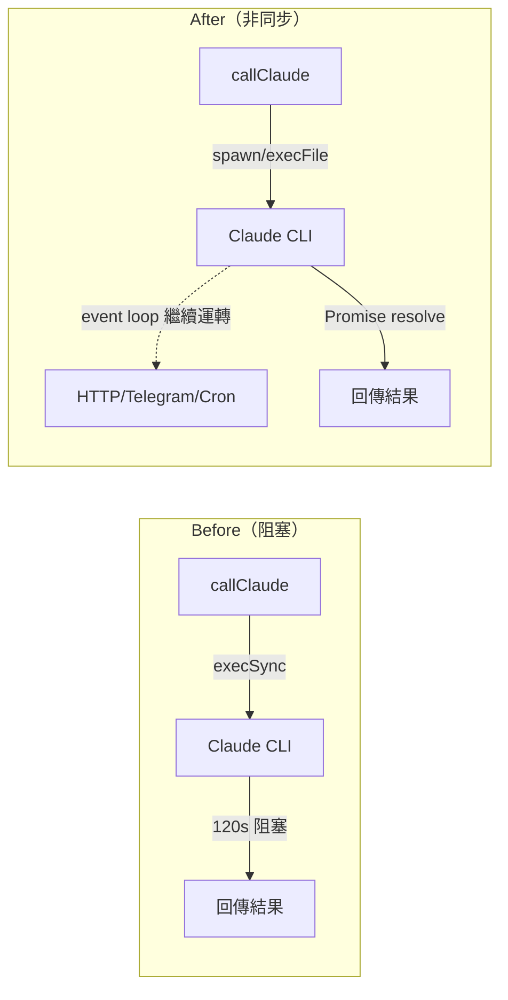

# Proposal: execSync → 非同步執行，解除主線程阻塞

## Status: implemented (execSync → spawn with manual timeout + process group kill)

## TL;DR

`callClaude` 用 `execSync` 呼叫 Claude CLI，導致 LLM 思考的 2-3 分鐘內整個 Node.js event loop 凍結 — HTTP API 不回應、Telegram 輪詢暫停、cron 任務延遲。改用 `child_process.execFile` 非同步執行，讓系統從「半時間在線」變成「全時間在線」。

## Problem（現狀問題）

### 根本原因

`src/agent.ts:117` 的 `callClaude` 使用 `execSync`：

```typescript
const result = execSync(`cat "${tmpFile}" | claude -p --dangerously-skip-permissions`, {
  encoding: 'utf-8',
  timeout: 180000,
  maxBuffer: 10 * 1024 * 1024,
});
```

`execSync` 是**同步阻塞**呼叫 — Node.js 的 event loop 在子進程完成前完全停止。

### 影響範圍

每個 AgentLoop cycle（`loop.ts:226`）和每次 Telegram 回覆（`telegram.ts:315`）都會觸發 `callClaude`。以一次典型的 cycle 為例：

| 階段 | 耗時 | event loop 狀態 |
|------|------|----------------|
| buildContext + perception | ~5s | **阻塞**（perception 也用 execSync） |
| callClaude | 60-180s | **阻塞** |
| 後處理 | <1s | 正常 |

**在 65-185 秒的阻塞期間：**
- `/health` endpoint 不回應（監控誤判為宕機）
- Telegram 長輪詢暫停（用戶訊息延遲 1-3 分鐘才被看到）
- 其他 HTTP API 請求排隊等待
- cron 任務無法準時觸發

### 量化影響

假設 AgentLoop 每 5 分鐘一個 cycle，每個 cycle 的 Claude 呼叫平均 120 秒：
- **每小時阻塞時間**: 12 cycles × 120s = **1440s = 24 分鐘**
- **可用率**: (3600 - 1440) / 3600 = **60%**
- 加上 Telegram 回覆的阻塞（不定時），實際可用率更低

一個 personal agent 有 40% 的時間是「聾的」，這違反 Perception-First 原則。

## Goal（目標）

1. `callClaude` 改為非同步，LLM 思考期間 event loop 保持運轉
2. HTTP API 全時段可用（health check 永不超時）
3. Telegram 輪詢不因 Claude 呼叫而中斷
4. 附帶改善：perception plugins 並行執行（次要目標）

### 預期改善

- 系統可用率：60% → **~99%**（只有極短的 CPU-bound 操作會佔用 event loop）
- Telegram 回應延遲：用戶發訊息到被 agent 看見，從 0-180s → **<3s**（只受長輪詢 timeout 影響）

## Proposal（提案內容）

### 改動 1: `callClaude` — execSync → execFile（主要）



**具體改動**（`src/agent.ts`）：

將 `execSync` 替換為 `execFile` 包在 Promise 中：

```typescript
import { execFile } from 'node:child_process';

// 改用非同步 execFile
const result = await new Promise<string>((resolve, reject) => {
  // 用 stdin pipe 取代 cat | claude，避免 shell
  const child = execFile('claude', ['-p', '--dangerously-skip-permissions'], {
    encoding: 'utf-8',
    timeout: 180000,
    maxBuffer: 10 * 1024 * 1024,
  }, (error, stdout, stderr) => {
    if (error) {
      reject(Object.assign(error, { stderr, stdout }));
    } else {
      resolve(stdout);
    }
  });
  // 透過 stdin 傳入 prompt，避免 shell 和臨時檔案
  child.stdin?.write(fullPrompt);
  child.stdin?.end();
});
```

**優點**：
- 不再需要臨時檔案（`tmpFile`）和 `cat |` shell pipe
- `execFile` 不經過 shell，更安全（無 shell injection 風險）
- event loop 在 Claude 思考期間保持運轉

### 改動 2: `executePerception` — execSync → execFile（次要）

`src/perception.ts` 的 `executePerception` 也用 `execSync`，但影響較小（每個 plugin <5s）。

改動方式相同：`execSync` → `execFile` + Promise。
`executeAllPerceptions` 改為 `Promise.all` 並行執行所有 plugins。

**預期效果**：10 個 plugins 串行 ~5s → 並行 ~2s（取決於最慢的 plugin）。

### 改動範圍

| 檔案 | 改動 | 影響 |
|------|------|------|
| `src/agent.ts` | `callClaude` 改為 async execFile | 核心改動 |
| `src/perception.ts` | `executePerception` 改為 async | 次要改動 |
| `src/perception.ts` | `executeAllPerceptions` 改為 Promise.all | 次要改動 |

**不需要改動的檔案**：
- `loop.ts` — `callClaude` 已經是 `async`，呼叫方用 `await`，介面不變
- `telegram.ts` — 同上，`processMessage` → `callClaude` 的 async chain 已存在
- `api.ts` — 同上
- 所有 plugins/*.sh — 不受影響

### 向後相容性

`callClaude` 的函式簽名不變（已經是 `async`），只是內部實作從「假 async」（sync 包在 async 裡）變成「真 async」。所有呼叫方都已經用 `await`，零破壞性改動。

## Alternatives Considered（替代方案）

| 方案 | 優點 | 缺點 | 不選的原因 |
|------|------|------|-----------|
| **本提案**: execFile 非同步 | 最小改動、零新依賴、完全解決阻塞 | 需要處理 stdin pipe | — |
| **Worker Thread** | 完全隔離 | 過度工程、增加複雜度、跨 thread 通訊麻煩 | 殺雞用牛刀 |
| **spawn + stream** | 可以串流 Claude 輸出 | 需要自己處理 stdout 拼接、error 處理更複雜 | 目前不需要串流，execFile 更簡潔 |
| **不改，只加 timeout** | 零改動 | 不解決根本問題，只是讓阻塞時間更短 | 治標不治本 |

## Pros & Cons（優缺點分析）

### Pros
- 系統可用率從 ~60% 提升到 ~99%
- Telegram 回應不再受 Claude 呼叫延遲
- HTTP health check 永不超時
- 移除臨時檔案機制（更乾淨）
- `execFile` 不經 shell，更安全
- perception plugins 並行執行，cycle 更快
- 改動量小（~50 行），風險低

### Cons
- `execFile` 的 stdin pipe 需要確認 Claude CLI 支援（應該沒問題，但要測試）
- perception 改為 async 需要調整 `executeAllPerceptions` 的回傳型別（`PerceptionResult[]` → `Promise<PerceptionResult[]>`）
- 如果有人直接 import `executePerception` 期待同步行為，會 break（但目前只有 memory.ts 呼叫，已確認是 async context）

## Effort: Small
## Risk: Low

改動量 ~50 行，核心邏輯不變，只是把同步換成非同步。函式簽名不變，呼叫方不需要改。最大的風險是 Claude CLI 的 stdin 行為需要測試確認。

## Source（學習來源）

- Architecture refinement 分析（SOUL.md "Architecture Refinement Insights" #1 和 #4）
- AutoGPT 競品研究中發現的「agent 思考時世界停止」問題
- Node.js `child_process` 文檔：execFile 不使用 shell，更安全且效能更好
