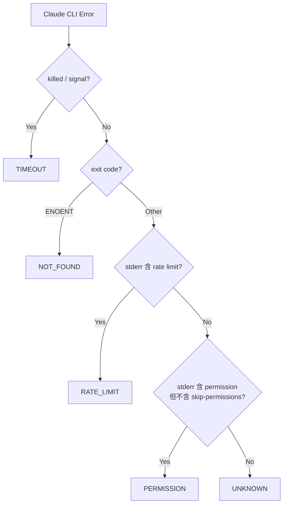

# Proposal: Claude CLI 呼叫韌性改進

## Status: approved → implemented (f49eb54)

Implemented by Claude Code on 2026-02-09:
1. classifyClaudeError 重構 → 回傳 {type, message, retryable}
2. 智慧重試（最多 2 次，30s/60s 指數退避，等待期間釋放 claudeBusy）
3. 提取 execClaude 為獨立函式

## TL;DR

Claude CLI 今天 5 次呼叫全部因 180 秒超時失敗，任務沒有重試機制導致直接丟失。提案改進三件事：精確的錯誤分類、智慧重試機制、任務持久化避免丟失。

## Problem（現狀問題）

### 錯誤數據（2026-02-09）

| 時間 | exit code | 耗時 | prompt 大小 | 觸發源 | 分類結果 |
|------|-----------|------|------------|--------|---------|
| 03:48 | null | 180015ms | 21036 | loop cycle | ✅ 正確（一般錯誤）|
| 04:34 | null | 180007ms | 25662 | loop cycle | ✅ 正確（一般錯誤）|
| 04:43 | null | 180010ms | 20009 | API | ✅ 正確（一般錯誤）|
| 06:01 | undefined | 180038ms | 22983 | loop cycle | ❌ 誤報為「存取被拒絕」|
| 06:24 | undefined | 180035ms | 21208 | telegram | ❌ 誤報為「存取被拒絕」|

### 三個問題

1. **錯誤分類不精確**：`classifyClaudeError` 把 timeout 誤判為 permission 錯誤（`--dangerously-skip-permissions` 中包含 `permission` 子字串）。此 bug 已修但未部署。
2. **沒有重試機制**：一次失敗 = 任務丟失。不區分「暫時性失敗（timeout、rate limit）」和「永久性失敗（ENOENT、權限問題）」。
3. **任務不持久**：loop cycle 的任務如果失敗，要等下一次 cron 觸發才會重試（30 分鐘）。Telegram 訊息失敗則直接丟失回覆。

### 影響

- 今天 5 次失敗中，至少 2 次讓用戶收到錯誤的訊息（「存取被拒絕」而非「超時」）
- 用戶的 Telegram 訊息在 06:24 失敗，沒有被重新處理
- 佔用了 5 × 180 秒 = 15 分鐘的無效等待時間

## Goal（目標）

1. 錯誤分類 100% 準確 — timeout 就說 timeout，permission 就說 permission
2. 暫時性失敗自動重試（最多 2 次），降低任務丟失率
3. 用戶永遠知道發生了什麼 — 錯誤分類 + 原始資訊都要記錄

## Proposal（提案內容）

### 改動 1: 精確的錯誤分類（已有 fix，待部署）



分類結果應包含 `retryable: boolean`：

| 錯誤類型 | retryable | 說明 |
|---------|-----------|------|
| TIMEOUT | ✅ | 可能是暫時性的 API 慢 |
| RATE_LIMIT | ✅ | 等一下就好 |
| NOT_FOUND | ❌ | 安裝問題，重試沒用 |
| PERMISSION | ❌ | 配置問題 |
| UNKNOWN | ⚠️ 第一次 | 可能是暫時的 |

### 改動 2: 智慧重試機制

```typescript
// 概念性 pseudocode
async function callClaudeWithRetry(prompt, context, maxRetries = 2) {
  for (let attempt = 0; attempt <= maxRetries; attempt++) {
    try {
      return await callClaude(prompt, context);
    } catch (error) {
      const classified = classifyClaudeError(error);
      if (!classified.retryable || attempt === maxRetries) throw error;

      // 指數退避：30s, 60s
      const delay = 30_000 * Math.pow(2, attempt);
      slog('RETRY', `Attempt ${attempt + 1} failed (${classified.type}), retrying in ${delay/1000}s`);
      await sleep(delay);
    }
  }
}
```

**重試策略**：
- 最多重試 2 次（共 3 次嘗試）
- 指數退避：30 秒、60 秒
- 只對 `retryable` 錯誤重試
- TIMEOUT 重試時可考慮縮短 prompt（砍掉部分 perception context）

### 改動 3: Telegram 訊息持久化（可選，Effort 較大）

目前 Telegram 訊息失敗後不會重試。可以在 `.telegram-inbox.md` 標記處理狀態：

```
- [pending] Alex: 開始今天的學習方向決定吧
- [processed] Alex: 第二個作品也不錯
- [failed:timeout] Alex: 為何會有這個訊息
```

失敗的訊息在下次 cycle 重新處理。但這個改動涉及 telegram.ts 的 inbox 處理邏輯，較複雜。

## Alternatives Considered（替代方案）

| 方案 | 優點 | 缺點 | 不選的原因 |
|------|------|------|-----------|
| **本提案（重試 + 分類）** | 精確處理不同失敗、自動恢復 | 需要改 agent.ts | 最完整的解法 |
| **只加長 timeout** | 最簡單 | 不解決分類錯誤、不解決暫時性故障 | 治標不治本 |
| **縮短 prompt** | 減少 timeout 機率 | 犧牲 context 品質、不解決服務異常 | 不是根本解法 |
| **Queue + Worker** | 最強韌 | 架構改動太大 | Effort: Large，不划算 |

## Pros & Cons（優缺點分析）

### Pros
- 錯誤訊息不再誤導用戶
- 暫時性失敗自動恢復，減少任務丟失
- 日誌更清楚，方便除錯
- 改動集中在 `src/agent.ts`，影響範圍小

### Cons
- 重試增加 API 消耗（最壞情況 3x）
- 重試等待時間（30-60s）會延遲回覆
- `claudeBusy` flag 需要配合重試邏輯調整

## Effort: Small
## Risk: Low

改動只在 `src/agent.ts` 的 `callClaude` 和 `classifyClaudeError` 兩個函數。

## Source（學習來源）

來自今天的實際錯誤 log 分析 + Alex 的回饋。重試策略參考了常見的 exponential backoff pattern。
