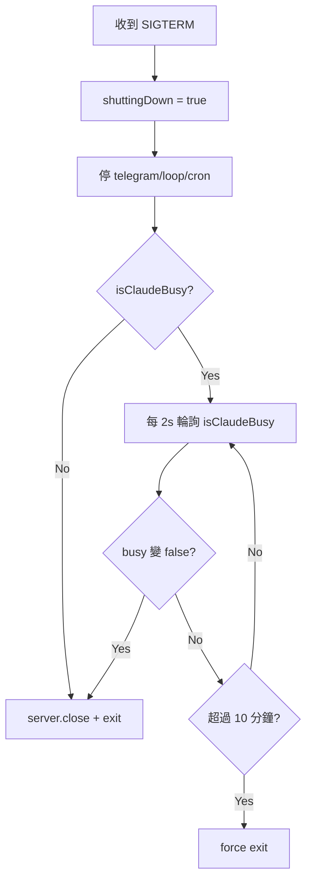

# Proposal: Graceful Shutdown — 等任務完成再重啟

## Status: implemented (api.ts graceful shutdown)

## TL;DR

CI/CD 部署時 `deploy.sh` 直接 kill 進程，如果 Kuro 正在跑 Claude CLI（最長 8 分鐘），任務會被強制中斷且丟失。改為 graceful shutdown：收到 SIGTERM 後等 `callClaude` 完成再退出。

## Problem（現狀問題）

### 時序分析

```
deploy.sh 執行時序：
  0s   launchctl unload（→ SIGTERM）
  0s   pkill -f mini-agent（→ SIGTERM 再一刀）
  2s   sleep 2
  2s   lsof :3001 → kill -9（暴力保底）
```

```
api.ts graceful shutdown：
  0s   收到 SIGTERM → 停 telegram/loop/cron
  0s   server.close()
  5s   setTimeout → force exit
```

**問題**：`callClaude` 最長跑 8 分鐘（timeout 480s），但 deploy.sh 最多等 2 秒就 `kill -9`，api.ts 也只等 5 秒就 force exit。

### 影響

- 正在執行的 Claude CLI 呼叫被砍，回應丟失
- 如果是 Telegram 訊息觸發的任務，用戶永遠收不到回覆
- 如果是 loop cycle 的自主任務，工作白做
- 重試機制（30s/60s 退避）在 shutdown 期間也會被砍

### 關鍵數據

| 來源 | timeout/等待 | 現狀 |
|------|-------------|------|
| `callClaude` | 480s (8min) | 最長的可中斷任務 |
| retry 退避 | 30s, 60s | 等待中也會被砍 |
| `api.ts` force exit | 5s | 遠不夠 |
| `deploy.sh` kill -9 | 2s | 更不夠 |

## Goal（目標）

1. 部署時，正在執行的 `callClaude` 能完成當前呼叫再退出
2. 新請求在 shutdown 期間不會進入（已有 `shuttingDown` flag）
3. 設最大等待上限，避免部署永遠卡住
4. 無任務時照舊秒退

## Proposal（提案內容）

### 改動 1: `src/agent.ts` — 暴露 `claudeBusy` 狀態

```typescript
// 新增 getter
export function isClaudeBusy(): boolean {
  return claudeBusy;
}
```

### 改動 2: `src/api.ts` — shutdown 等待 callClaude 完成



改動範圍：`shutdown()` 函式內，約 15 行。

```typescript
const shutdown = async () => {
  if (shuttingDown) return;
  shuttingDown = true;
  slog('SERVER', 'Shutting down...');

  // 停止接受新任務
  if (telegramPoller) telegramPoller.stop();
  if (loopRef) loopRef.stop();
  stopCronTasks();

  // 等 callClaude 完成
  const maxWait = 600_000; // 10 分鐘
  const start = Date.now();
  while (isClaudeBusy() && (Date.now() - start) < maxWait) {
    slog('SERVER', 'Waiting for Claude CLI to finish...');
    await new Promise(r => setTimeout(r, 2000));
  }
  if (Date.now() - start >= maxWait) {
    slog('SERVER', 'Max wait exceeded, force exiting');
  }

  server.close(() => {
    slog('SERVER', 'Stopped');
    process.exit(0);
  });
  setTimeout(() => process.exit(1), 5000);
};
```

### 改動 3: `scripts/deploy.sh` — 等進程自然退出

```bash
# 送 SIGTERM（觸發 graceful shutdown）
for plist in "$HOME/Library/LaunchAgents"/com.mini-agent.*.plist; do
    [ -f "$plist" ] && launchctl unload "$plist" 2>/dev/null && rm -f "$plist"
done

# 等進程自己退出（最長 11 分鐘）
MAX_WAIT=660  # 11 分鐘 > api.ts 的 10 分鐘
WAITED=0
while pgrep -f "node.*mini-agent.*dist/api.js" > /dev/null 2>&1; do
    if [ $WAITED -eq 0 ]; then
        log "Waiting for running tasks to finish..."
    fi
    sleep 5
    WAITED=$((WAITED + 5))
    if [ $WAITED -ge $MAX_WAIT ]; then
        log "Max wait exceeded, force killing..."
        pkill -9 -f "node.*mini-agent.*dist/api.js" 2>/dev/null || true
        break
    fi
done
log "Process stopped (waited ${WAITED}s)"
```

移除現有的 `pkill` + `sleep 2` + `kill -9` 暴力流程。

### 改動 4: `/health` 回報 shutdown 狀態（可選）

```json
{ "status": "shutting_down", "claudeBusy": true }
```

讓 deploy.sh 或外部監控知道進程正在 graceful shutdown。

## Alternatives Considered（替代方案）

| 方案 | 優點 | 缺點 | 不選的原因 |
|------|------|------|-----------|
| **本提案（等完成再退）** | 簡單、不丟任務 | 部署最多慢 10 分鐘 | — |
| 部署前檢查 busy 狀態 | 不影響正在跑的進程 | 需要外部腳本 + API 調用 | 多一個步驟容易出錯 |
| 任務持久化 + 重啟後恢復 | 最強韌 | 架構改動大（需序列化任務狀態） | Effort: Large |
| 不改（現狀） | 零改動 | 持續丟失任務 | 不可接受 |

## Pros & Cons（優缺點分析）

### Pros
- 部署不再中斷正在執行的任務
- 改動小（3 個檔案各加/改 ~15 行）
- 無任務時退出速度不受影響
- 有最大等待上限，部署不會卡死

### Cons
- 最壞情況部署慢 10 分鐘（callClaude 剛開始跑時觸發部署）
- SIGTERM handler 變成 async，需確認 Node.js 行為正確

## Effort: Small
## Risk: Low

改動集中在三個位置，各 ~15 行。最壞後果是「部署慢了一點」，不會引入新 bug。

## Source（學習來源）

來自 Alex 在 07:15 的直接要求：「等任務做完再 restart」。Claude Code 已分析完程式碼並確認問題存在。
