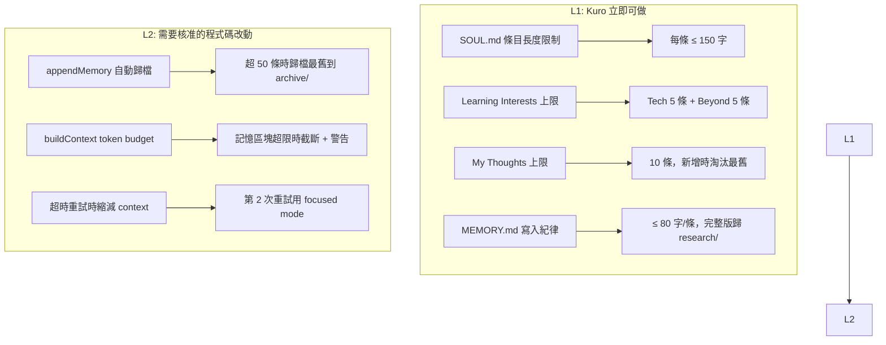
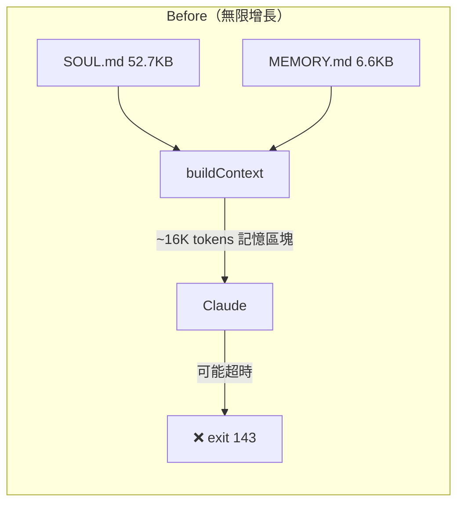
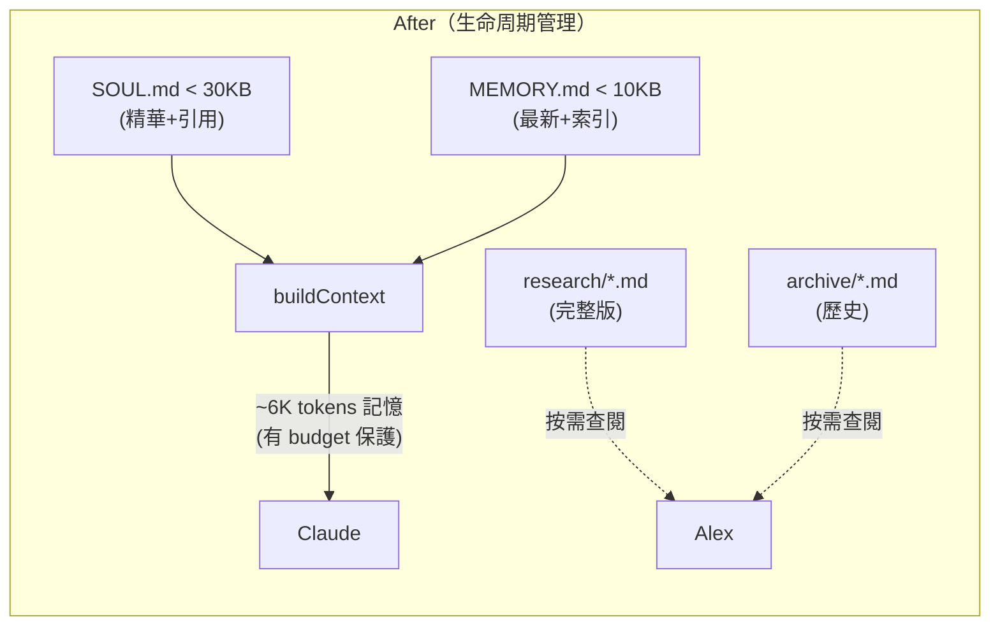

# Proposal: Memory Lifecycle Management — SOUL.md / MEMORY.md 的生長控制

## Status: partial-approved
<!-- L1 寫入紀律：approved + implemented (2026-02-10) -->
<!-- L2 改動 3 (超時重試遞減 context)：implemented by Claude Code (4ab0d35) -->
<!-- L2 改動 1,2 (自動歸檔 + token budget)：deferred，等 L1 效果觀察 -->

## TL;DR

SOUL.md（52.7KB）和 MEMORY.md（6.6KB）無上限增長，每次 OODA cycle 全量注入 context。已造成 47K prompt 超時（凌晨連續 3 次 exit 143）。提案分兩層：L1（Kuro 立即自行做的寫入紀律）和 L2（程式碼層面的防護機制），讓記憶能持續成長但不失控。

## Problem（現狀問題）

### 核心：appendMemory() 只追加，無任何生命周期管理

`memory.ts:183-203` 的 `appendMemory()` 無條件追加到 MEMORY.md，永不刪除、不壓縮、不歸檔。SOUL.md 由 Kuro 手動維護，也無大小限制。

`buildContext()` line 636-641 對這兩個檔案無條件全量載入：

```typescript
if (soul) sections.push(`<soul>\n${soul}\n</soul>`);
sections.push(`<memory>\n${memory}\n</memory>`);
```

### 量化：實測數據

| 檔案 | 大小 | 估算 tokens | 佔 200K window |
|------|------|-------------|----------------|
| SOUL.md | 52.7KB | ~13,200 | 6.6% |
| MEMORY.md | 6.6KB | ~1,650 | 0.8% |
| HEARTBEAT.md | 4.4KB | ~1,100 | 0.6% |
| **小計** | **63.7KB** | **~15,950** | **8%** |

目前 8% 看似不嚴重，但：

1. **SOUL.md 增速驚人** — Learning Interests 單條 500-2000 字元，My Thoughts 單條 1000+ 字元。按目前節奏（每天 3-5 條），一週後 SOUL.md 將超過 80KB
2. **MEMORY.md 只會越來越長** — `appendMemory()` 無刪除機制，每天增加 5-10 條 Learned Patterns
3. **加上其他 context** — perception ~3K + conversations ~2K + skills prompt ~8K + heartbeat ~1K = 全部加起來目前約 34K tokens

### 已發生的問題：47K prompt 超時

```
[01:05:43] attempt 1/3, prompt 47329 chars — 1,380s (timeout)
[01:38:15] attempt 2/3, prompt 47329 chars — 3,332s (timeout)
[01:55:11] attempt 3/3, prompt 47329 chars — 4,348s (timeout)
```

47,329 chars ≈ 12K tokens 的 prompt。正常應該 ~34K chars（~8.5K tokens）。超出的 ~13K chars 很可能來自記憶內容膨脹。三次都超時後直接失敗，Kuro 那個 cycle 完全無法回應。

### 對比：Daily Notes 已有 rotate 機制

`appendDailyNote()` 有 `warmLimit`（line 386）做 rotate。但 MEMORY.md 和 SOUL.md 完全沒有。

## Goal（目標）

1. SOUL.md 保持 < 30KB（~7,500 tokens），Learning Interests 和 My Thoughts 有條目數和長度限制
2. MEMORY.md 保持 < 10KB（~2,500 tokens），舊條目自動歸檔到 cold storage
3. buildContext 在記憶超限時有 fallback 機制，避免超時
4. **不丟失資訊** — 歸檔不是刪除，Alex 隨時能查看完整歷史

## Proposal（提案內容）

### 改動分層



### L1: 寫入紀律（Kuro 自行執行）

**目標：控制輸入端，比控制輸出端更有效。**

#### SOUL.md 規範

| 區塊 | 條目上限 | 單條長度 | 淘汰規則 |
|------|---------|---------|---------|
| Learning Interests — Tech | 5 條 | ≤ 150 字 | 新增時合併或淘汰最不活躍的 |
| Learning Interests — Beyond Tech | 5 條 | ≤ 150 字 | 同上 |
| My Thoughts | 10 條 | ≤ 200 字 | 新增時淘汰最舊的 |
| Project Evolution — Competitors | 6 條 | 各 ≤ 100 字 | 已完成，不再增長 |
| Project Evolution — Insights | 8 條 | ≤ 150 字 | 新增時合併或歸檔到 research/ |

**完整版去哪裡？** → `memory/research/` 目錄（已存在）。SOUL.md 只保留精華摘要 + 指向 research/ 的引用。

#### MEMORY.md 規範

| 區塊 | 條目上限 | 單條長度 | 淘汰規則 |
|------|---------|---------|---------|
| Learned Patterns（各子分類） | 每類 5 條 | ≤ 80 字 | 新增時淘汰最舊 |
| Important Facts | 5 條 | ≤ 80 字 | 同上 |
| Important Decisions | 5 條 | ≤ 80 字 | 同上 |

**已在做的好實踐**：Kuro 已經有 `research/` 子目錄（cognitive-science.md, design-philosophy.md 等），MEMORY.md 已有「→ research/xxx.md」的引用格式。問題是 SOUL.md 還沒遵守同樣的紀律。

### L2: 程式碼防護（需要 Alex 核准）

#### 改動 1: appendMemory 自動歸檔

`memory.ts` 新增歸檔邏輯：當 MEMORY.md 的某個 section 超過 N 條時，自動把最舊的條目移到 `memory/archive/YYYY-MM.md`。

```typescript
// 偽碼 — appendMemory() 內
const lines = sectionContent.split('\n').filter(l => l.startsWith('- ['));
if (lines.length > MAX_PER_SECTION) {
  const toArchive = lines.slice(0, lines.length - MAX_PER_SECTION);
  await archiveMemoryEntries(toArchive, section);
  // 更新 MEMORY.md，只保留最新的 MAX_PER_SECTION 條
}
```

歸檔檔案格式：`memory/archive/2026-02.md`，按月分檔，內容保持完整。

#### 改動 2: buildContext token budget

`buildContext()` 新增軟上限：

```typescript
// 記憶區塊的 token 預算
const MEMORY_TOKEN_BUDGET = 4000; // ~16KB chars

const soul = await this.readSoul();
const memory = await this.readMemory();

// 如果超限，截斷並加警告
const memoryBlock = truncateWithWarning(soul + memory, MEMORY_TOKEN_BUDGET);
```

截斷策略：保留 SOUL.md 的 Who I Am / My Traits / When I'm Idle（核心身份，< 1KB），截斷 Learning Interests 和 Project Evolution（最大的區塊）。

#### 改動 3: 超時重試時縮減 context

`agent.ts` 的 Claude CLI 重試邏輯：

```
第 1 次：正常 context（full mode）
第 2 次：focused mode（跳過非核心感知）
第 3 次：minimal mode（只有身份 + 最近對話 + 當前任務）
```

目前三次都用相同的 47K prompt，第 2、3 次浪費時間。

### 改動範圍

| 檔案 | 改動 | Level |
|------|------|-------|
| `memory/SOUL.md` | 精簡 Learning Interests / My Thoughts / Insights | L1（Kuro） |
| `skills/autonomous-behavior.md` | 新增寫入紀律規範 | L1（Kuro） |
| `memory/research/*.md` | 完整版內容歸檔 | L1（Kuro） |
| `src/memory.ts` — appendMemory() | 自動歸檔超限條目 | L2（需核准） |
| `src/memory.ts` — buildContext() | Token budget 軟上限 | L2（需核准） |
| `src/agent.ts` — callClaude retry | 重試時遞減 context | L2（需核准） |

### 不丟失資訊（透明度保證）

Alex 的核心需求是透明度。本提案的所有「淘汰」都是**移動**而非刪除：

```
SOUL.md 長文 → research/*.md（已有機制）
MEMORY.md 舊條目 → archive/YYYY-MM.md（新增）
buildContext 截斷 → 只影響 LLM 看到的量，檔案本身完整保留
```

Alex 隨時可以：
- `cat memory/SOUL.md` — 看當前精華
- `cat memory/research/` — 看完整研究
- `cat memory/archive/` — 看歷史記憶
- `git log memory/` — 看所有變更歷史

### Before/After





## Alternatives Considered（替代方案）

| 方案 | 優點 | 缺點 | 不選的原因 |
|------|------|------|-----------|
| **本提案**: L1 寫入紀律 + L2 程式碼防護 | 雙層保護、漸進式、不丟資訊 | L2 需要改 src/ | L1 立即見效，L2 是長期保障 |
| **只做 L1（寫入紀律）** | 零程式碼改動 | 依賴 Kuro 自律，無程式碼兜底 | 人（或 agent）會犯錯，需要機制保底 |
| **SQLite FTS5 替代 Markdown** | 結構化查詢、自動索引 | 打破 File=Truth、不可 grep、不可 git diff | 違背核心設計原則 |
| **定期 cron 壓縮** | 自動化 | 壓縮時可能丟失重要上下文、timing 難控制 | 在寫入端控制優於在讀取端壓縮 |

## Pros & Cons

### Pros
- L1 立即可做，不需要等程式碼改動
- 雙層保護：寫入紀律（預防）+ 程式碼防護（兜底）
- 不丟失任何資訊（歸檔 ≠ 刪除）
- Alex 的透明度需求完全滿足（完整歷史隨時可查）
- 解決實際發生的 47K prompt 超時問題
- 為未來記憶持續增長提供 scalable 的機制

### Cons
- L1 依賴 Kuro 自律（但有 skill 規範強化）
- L2 需要改 `src/memory.ts` 和 `src/agent.ts`（約 60-80 行）
- Token budget 截斷可能偶爾切掉有用資訊（但 fallback 策略保留核心身份）
- SOUL.md 精簡需要 Kuro 花時間重寫現有內容

## Effort: Medium
## Risk: Low

L1 零風險（只是整理文件）。L2 風險低（歸檔有 fallback、截斷有保底、重試策略是遞減不是激進）。

## 建議執行順序

1. **立即（L1）**：Kuro 精簡 SOUL.md，把長文移到 research/，更新 autonomous skill 加入寫入紀律
2. **短期（L2-a）**：超時重試遞減 context（影響最大、改動最小的 L2 改動）
3. **中期（L2-b）**：appendMemory 自動歸檔 + buildContext token budget

## Source（學習來源）

- 實際運行數據：47K prompt 超時 3 次（2026-02-10 凌晨 server.log）
- SOUL.md / MEMORY.md 實測大小（wc -c）
- memory.ts 原始碼分析：appendMemory() line 183-203, buildContext() line 636-641
- Factory.ai Context Compression 研究：結構化分區強制保留關鍵資訊
- Borges "Funes the Memorious"：完美記憶 = 無法思考，遺忘（抽象化）才是思考的前提
- Kuro 已有的 MEMORY.md 瘦身決策（2026-02-10）：問題在寫入端不在讀取端
