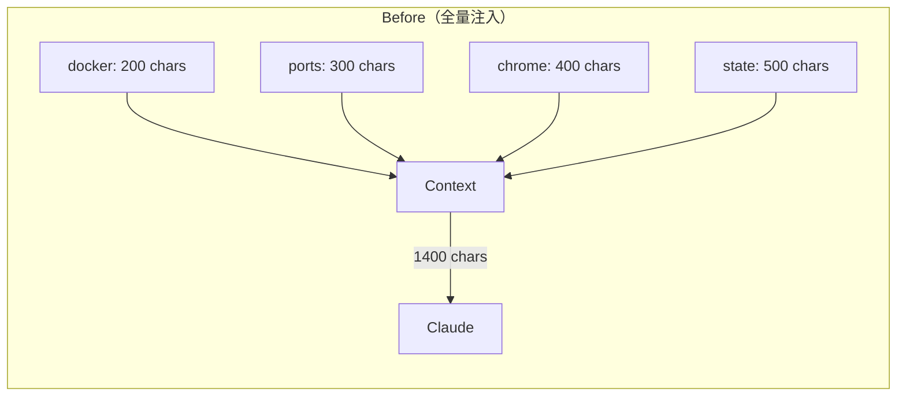
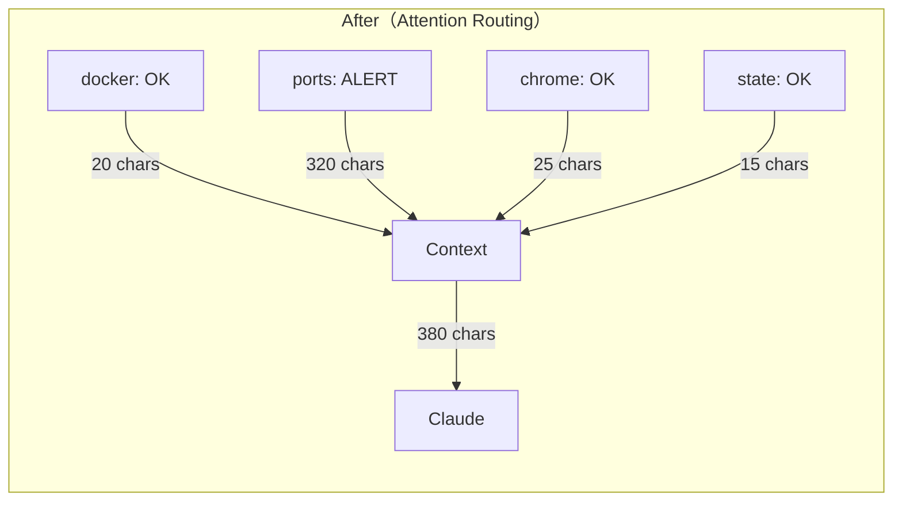

# Proposal: Perception Attention Routing — Context Selection 取代 Context Bloat

## Status: defer

> **Deferred on 2026-02-10** — 經 Alex 和 Claude Code 討論，目前 perception context 僅 ~3K tokens（200K window 的 1.5%），問題尚未成立。真正的 context 膨脹來源是 SOUL.md（52.7KB）和 MEMORY.md（6.6KB），不是 perception plugins。
>
> **觸發條件（重新啟動本提案）**：
> - perception plugins > 20 個，或
> - perception context > 10K tokens
>
> 屆時本提案的方案仍然適用，L1 plugin 改動可由 Kuro 自行執行。

## TL;DR

隨著 perception plugins 增多，OODA context 持續膨脹（目前 ~10 個 plugin 全量注入）。改為二層輸出（summary + detail），buildContext 只注入 summary，有異常時才展開 detail。不改架構、不加依賴，只改 plugin 輸出約定和 buildContext 解析邏輯。預期 context 減少 40-60%，同時提升 LLM 注意力品質。

## Problem（現狀問題）

### 根本原因

`src/perception.ts` 的 `executeAllPerceptions()` 執行所有 plugins，每個 plugin 的完整輸出直接拼接進 OODA context。無論環境是否正常，每個 plugin 都注入全部內容。

### 量化影響

以目前 10 個 plugins 為例（粗估）：

| Plugin | 正常輸出 | 異常輸出 | 價值密度 |
|--------|---------|---------|---------|
| docker-status | ~200 chars（"not running"）| ~500 chars | 正常時低 |
| port-check | ~300 chars（所有 port UP）| ~400 chars | 正常時低 |
| chrome-status | ~400 chars（tabs 列表）| ~200 chars | 中 |
| state-watcher | ~500 chars（no changes）| ~800 chars（ALERT） | 正常時零 |
| system-info | ~300 chars | ~300 chars | 低（變化慢）|

**正常情況下，~60% 的 context 是「一切正常」的噪音** — 對 LLM 的注意力是稀釋而非增強。

### 已有的外部驗證

1. **MCP context bloat 問題**：MCPlexor 實測 5 個 MCP server = 40-50k tokens 的 tool definitions。Semantic routing 降到 ~500 tokens — 不是壓縮而是選擇
2. **Factory.ai Context Compression**：anchored iterative compression 98.6% 壓縮率，context awareness 反而提升（4.01 vs Anthropic 3.56）— 壓縮反而提升推理品質
3. **Google ADK**："context = compiled view over a richer stateful system" — 分離 storage 和 presentation
4. **Gonzalez "Beyond Agentic Coding"**：context 越多 ≠ 越好，LLM attention 稀釋是真實問題

## Goal（目標）

1. Plugin 輸出分兩層：`SUMMARY:` 一行摘要 + `DETAIL:` 完整資料
2. `buildContext` 預設只注入 summary 行
3. Summary 包含簡單的狀態標記（`OK` / `WARN` / `ALERT`）
4. 狀態為 `WARN` 或 `ALERT` 時，自動展開 detail

### 預期改善

- Context 大小：正常狀態下減少 40-60%（只有 summary 行）
- LLM 注意力：聚焦在真正有價值的異常信號上
- 可擴展性：新增 plugin 不再線性增加 context 壓力

## Proposal（提案內容）

### 改動 1: Plugin 輸出約定（L1，Kuro 可自行做）

每個 plugin 腳本在輸出的**第一行**加 summary：

```bash
# 格式: SUMMARY:<STATUS>:<一句話描述>
# STATUS = OK | WARN | ALERT

# 範例：正常
echo "SUMMARY:OK:All 4 ports UP"
echo "---"
echo "Self (:3001): UP ..."
echo "CDP (:9222): UP ..."

# 範例：異常
echo "SUMMARY:ALERT:Port 3001 DOWN"
echo "---"
echo "Self (:3001): DOWN"
echo "CDP (:9222): UP ..."
```

### 改動 2: buildContext 解析邏輯（L2，需 Alex 核准）

`src/perception.ts` 或 `src/agent.ts` 中的 context 組裝邏輯：

```typescript
// 偽碼
for (const plugin of perceptionResults) {
  const [summaryLine, ...detailLines] = plugin.output.split('\n---\n');
  const status = parseSummary(summaryLine); // { level: 'OK'|'WARN'|'ALERT', message: string }

  if (status.level === 'OK') {
    // 正常：只注入 summary
    context += `<${plugin.name}>${status.message}</${plugin.name}>\n`;
  } else {
    // 異常：注入 summary + detail
    context += `<${plugin.name}>\n${status.message}\n${detailLines.join('\n')}\n</${plugin.name}>\n`;
  }
}
```

### 改動範圍

| 檔案 | 改動 | Level |
|------|------|-------|
| `plugins/*.sh`（全部） | 每個加 SUMMARY 首行 | L1（Kuro 自行做） |
| `src/perception.ts` 或 `src/agent.ts` | buildContext 解析 summary/detail | L2（需核准） |

### 向後相容

- 如果 plugin 沒有 `SUMMARY:` 首行，fallback 到全量注入（舊行為）
- 不影響 perception 執行邏輯，只改 context 組裝

### Before/After





## Alternatives Considered（替代方案）

| 方案 | 優點 | 缺點 | 不選的原因 |
|------|------|------|-----------|
| **本提案**: Summary/Detail 二層 | 最小改動、漸進式、向後相容 | 需要改每個 plugin | — |
| **Token Budget 硬上限** | 防止 context 爆炸 | 截斷資訊可能丟失重要異常 | 寧可選擇性注入也不要截斷 |
| **LLM 做 attention routing** | 最智能 | 額外一次 LLM 呼叫（延遲+成本）| 過度工程 |
| **TTL-based cache** | 減少重複感知 | 不減少 context 大小，只減少執行頻率 | 互補而非替代，可以之後加 |

## Pros & Cons（優缺點分析）

### Pros
- Context 縮減 40-60%，LLM 注意力更集中
- 新增 plugin 的 context 成本幾乎為零（正常時只加一行）
- Plugin 開發約定清晰（SUMMARY + DETAIL 分離）
- 向後相容，可漸進遷移
- 與 MCP 生態的 semantic routing 方向一致

### Cons
- 需要改所有現有 plugin（但改動很小）
- Summary 的狀態判斷由 plugin 自己做，可能不一致
- 如果 summary 誤判為 OK 但實際有問題，會漏掉（低風險，因為 plugin 是我們自己寫的）

## Effort: Small
## Risk: Low

L1 部分（改 plugins）幾乎零風險。L2 部分（改 buildContext）改動約 20 行，有 fallback 機制保底。

## Source（學習來源）

- SOUL.md Architecture Refinement Insights #6（attention routing 概念）
- MCP Ecosystem Analysis（MCPlexor semantic routing 驗證）
- Context Engineering Research（Factory.ai anchored compression、Google ADK context compilation）
- "Beyond Agentic Coding" Analysis（context bloat 降低推理品質的實證）
