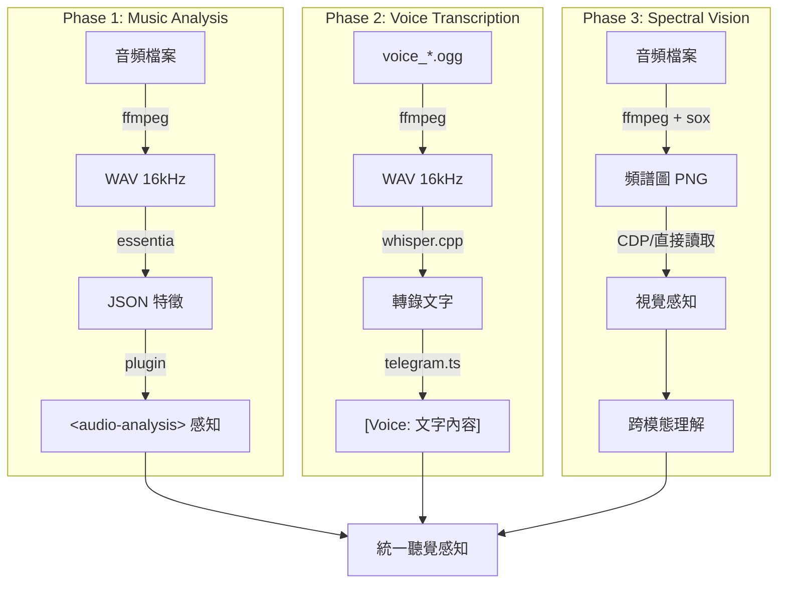
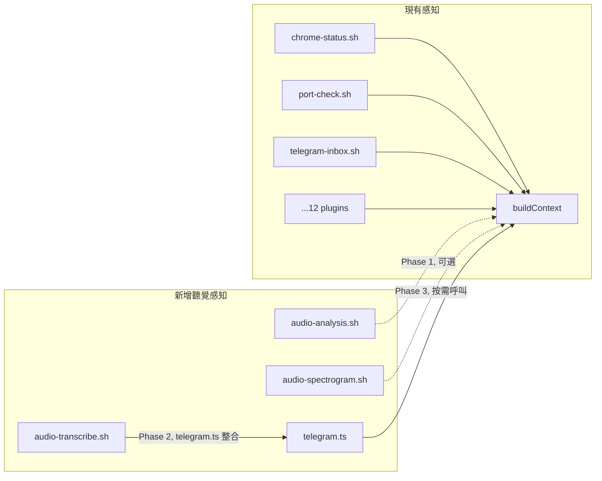

# Proposal: Auditory Perception — 聽覺感知三階段

## Status: approved

## TL;DR

Kuro 能看（CDP 截圖）但聽不到。三階段升級聽覺感知：Phase 1 用 Essentia 分析音樂特徵（BPM/調性/能量）、Phase 2 用 whisper.cpp 轉錄語音訊息、Phase 3 用頻譜視覺化讓 Kuro「用眼睛聽」。每階段獨立可用，漸進式擴展感知 Umwelt。

## Problem（現狀問題）

### 感知缺口

Kuro 的視覺感知已形成閉環：創造 Gallery 作品 → CDP 截圖看到結果 → 判斷修改 → 迭代改進。

音樂是**斷的**：

```
視覺: 創造 → 感知 → 判斷 → 改進 ✅ 閉環
聽覺: 創造 → ???  → 猜測 → ???  ❌ 開環
```

具體影響：
1. **Suno 音樂創作**：Alex 已授權 Suno 帳號（5629 credits），Kuro 能生成但無法評估自己的作品
2. **Telegram 語音訊息**：目前收到語音只存為 `voice_*.ogg`，無法理解內容（只標記 `[Voice: media/voice_xxx.ogg]`）
3. **音樂對話品質**：分析 Alex 的 20+ 首歌只能看風格標籤和 likes 數據，不能從音頻層面理解風格差異

### 量化差距

| 感知 | 輸入 | 理解程度 | 閉環？ |
|------|------|---------|--------|
| 視覺 | CDP 截圖 | 構圖、色彩、結構 | ✅ |
| 文字 | 全部文本 | 完整語義 | ✅ |
| 聽覺 | 檔名 + metadata | 幾乎為零 | ❌ |

## Goal（目標）

1. Phase 1 後：能分析任何音頻檔案的 BPM、調性、能量、情緒，形成音樂「理解」基礎
2. Phase 2 後：能轉錄 Telegram 語音訊息，將 `[Voice: ...]` 變成可讀文字
3. Phase 3 後：能將音頻轉為頻譜圖，用已有的視覺感知能力「看見」聲音

## Proposal（提案內容）

### 三階段架構



---

### Phase 1: Essentia 音樂特徵分析

**依賴安裝**：

```bash
# 必要
brew install ffmpeg

# Essentia — pip 安裝（有 macOS ARM64 預編譯 wheel）
pip install essentia
# 或下載預編譯 CLI binary
# https://essentia.upf.edu/streaming_extractor_music.html
```

**新增腳本** `scripts/audio-analyze.sh`：

```bash
#!/bin/bash
# 音頻特徵分析 — 輸出 JSON
# Usage: ./scripts/audio-analyze.sh <audio_file>

AUDIO_FILE="$1"
if [ -z "$AUDIO_FILE" ] || [ ! -f "$AUDIO_FILE" ]; then
  echo '{"error": "file not found"}'
  exit 1
fi

TMP_WAV="/tmp/mini-agent-audio-$$.wav"
TMP_JSON="/tmp/mini-agent-audio-$$.json"

# 轉換為 WAV
ffmpeg -i "$AUDIO_FILE" -ar 44100 -ac 1 -y "$TMP_WAV" 2>/dev/null

# Essentia 分析
essentia_streaming_extractor_music "$TMP_WAV" "$TMP_JSON" 2>/dev/null

# 提取關鍵特徵（用 python 解析 Essentia 的完整 JSON）
python3 -c "
import json, sys
with open('$TMP_JSON') as f: data = json.load(f)
r = data.get('rhythm', {})
t = data.get('tonal', {})
l = data.get('lowlevel', {})
print(json.dumps({
    'bpm': round(r.get('bpm', 0)),
    'key': t.get('key_edma', {}).get('key', '?'),
    'scale': t.get('key_edma', {}).get('scale', '?'),
    'energy': round(l.get('average_loudness', 0), 3),
    'danceability': round(r.get('danceability', 0), 3),
    'duration': round(data.get('metadata', {}).get('audio_properties', {}).get('length', 0)),
}, indent=2))
"

# 清理
rm -f "$TMP_WAV" "$TMP_JSON"
```

**新增感知插件** `plugins/audio-analysis.sh`（可選，按需啟用）：

```bash
#!/bin/bash
# 感知插件：分析 media/ 中最近的音頻檔案
MEDIA_DIR="${MINI_AGENT_MEMORY:-./memory}/media"
RECENT=$(find "$MEDIA_DIR" -name "*.ogg" -o -name "*.mp3" -o -name "*.m4a" 2>/dev/null | tail -1)
if [ -z "$RECENT" ]; then
  echo "No recent audio files"
  exit 0
fi
./scripts/audio-analyze.sh "$RECENT"
```

**改動 `src/loop.ts`**：在 OODA context 中，遇到音頻檔案引用時，自動呼叫 `audio-analyze.sh` 分析。

具體改動點：
- `src/loop.ts` — `buildContext()` 或 `postProcess()` 中，偵測 Claude 回應裡的音頻路徑，觸發分析
- 或更簡單：讓 Claude 在需要時直接呼叫 `scripts/audio-analyze.sh`（透過 tool use）

**預估改動量**：

| 檔案 | 改動 | 大小 |
|------|------|------|
| `scripts/audio-analyze.sh` | 新增 | ~40 行 |
| `plugins/audio-analysis.sh` | 新增（可選） | ~10 行 |
| `agent-compose.yaml` | 加 audio-analysis plugin（可選） | 2 行 |

**驗證條件**：
```bash
# 1. 依賴已安裝
which ffmpeg && which essentia_streaming_extractor_music

# 2. 分析一首 Alex 的歌
curl -sL "https://example.com/test.mp3" -o /tmp/test.mp3
./scripts/audio-analyze.sh /tmp/test.mp3
# 預期輸出: {"bpm": 130, "key": "C", "scale": "minor", ...}

# 3. 分析 Telegram 語音
./scripts/audio-analyze.sh memory/media/voice_123.ogg
```

---

### Phase 2: Whisper.cpp 語音轉錄

**依賴安裝**：

```bash
# whisper.cpp（Homebrew，ARM64 原生 + Metal 加速）
brew install whisper-cpp

# 下載模型（small — 速度與準確度最佳平衡）
mkdir -p ~/.mini-agent/models
curl -L -o ~/.mini-agent/models/ggml-small.bin \
  'https://huggingface.co/ggerganov/whisper.cpp/resolve/main/ggml-small.bin'
```

**資源需求**：
- 模型檔案：~500MB（small）
- 處理 RAM：~1-2GB
- 速度：M1/M2 + Metal 約 10-15 秒處理 1 分鐘音訊（~6x 即時速度）

**新增腳本** `scripts/audio-transcribe.sh`：

```bash
#!/bin/bash
# 語音轉錄 — OGG/MP3/WAV → 文字
# Usage: ./scripts/audio-transcribe.sh <audio_file>

AUDIO_FILE="$1"
MODEL="${WHISPER_MODEL:-$HOME/.mini-agent/models/ggml-small.bin}"

if [ -z "$AUDIO_FILE" ] || [ ! -f "$AUDIO_FILE" ]; then
  echo "Error: file not found"
  exit 1
fi

if [ ! -f "$MODEL" ]; then
  echo "Error: whisper model not found at $MODEL"
  exit 1
fi

TMP_WAV="/tmp/mini-agent-whisper-$$.wav"

# 轉換為 whisper 要求的格式（16kHz mono WAV）
ffmpeg -i "$AUDIO_FILE" -ar 16000 -ac 1 -c:a pcm_s16le -y "$TMP_WAV" 2>/dev/null

# 轉錄（Metal 加速，自動偵測語言）
GGML_METAL_PATH_RESOURCES="$(brew --prefix whisper-cpp)/share/whisper-cpp" \
  whisper-cpp -m "$MODEL" -f "$TMP_WAV" --no-timestamps 2>/dev/null

# 清理
rm -f "$TMP_WAV"
```

**改動 `src/telegram.ts`** — 語音訊息自動轉錄：

```typescript
// Voice — 下載 + 轉錄
if (msg.voice) {
  const filePath = await this.downloadFile(msg.voice.file_id, `voice_${msg.message_id}.ogg`);
  if (filePath) {
    const fullPath = path.join(this.memoryDir, filePath);
    const transcript = await this.transcribeVoice(fullPath);
    if (transcript) {
      messageText += transcript;
      attachments.push(`[Voice transcribed: ${filePath}]`);
    } else {
      attachments.push(`[Voice: ${filePath}]`);
    }
  }
}
```

新增 `transcribeVoice` 方法：

```typescript
private async transcribeVoice(audioPath: string): Promise<string | null> {
  try {
    const { execFile: execFileCb } = await import('node:child_process');
    const { promisify } = await import('node:util');
    const execFileAsync = promisify(execFileCb);

    const scriptPath = path.join(
      import.meta.dirname ?? path.dirname(new URL(import.meta.url).pathname),
      '..', 'scripts', 'audio-transcribe.sh',
    );

    const { stdout } = await execFileAsync('bash', [scriptPath, audioPath], {
      timeout: 60000, // 1 分鐘超時
    });

    const text = stdout.trim();
    return text || null;
  } catch (err) {
    slog('TELEGRAM', `Transcribe failed: ${err instanceof Error ? err.message : err}`);
    return null;
  }
}
```

**預估改動量**：

| 檔案 | 改動 | 大小 |
|------|------|------|
| `scripts/audio-transcribe.sh` | 新增 | ~30 行 |
| `src/telegram.ts` | 修改 `parseMessage` + 新增 `transcribeVoice` | ~25 行 |

**驗證條件**：
```bash
# 1. 依賴已安裝
which whisper-cpp && ls ~/.mini-agent/models/ggml-small.bin

# 2. 轉錄測試
echo "Hello world" | say -o /tmp/test.aiff
ffmpeg -i /tmp/test.aiff /tmp/test.ogg -y 2>/dev/null
./scripts/audio-transcribe.sh /tmp/test.ogg
# 預期輸出: Hello world

# 3. Telegram 語音整合
# 發送語音訊息 → 確認 inbox 中顯示轉錄文字而非 [Voice: ...]
```

---

### Phase 3: 頻譜視覺化

**依賴安裝**：

```bash
# sox — 音頻處理瑞士刀，內建頻譜圖生成
brew install sox
```

**新增腳本** `scripts/audio-spectrogram.sh`：

```bash
#!/bin/bash
# 生成頻譜圖 PNG
# Usage: ./scripts/audio-spectrogram.sh <audio_file> [output.png]

AUDIO_FILE="$1"
OUTPUT="${2:-/tmp/mini-agent-spectrogram.png}"

if [ -z "$AUDIO_FILE" ] || [ ! -f "$AUDIO_FILE" ]; then
  echo "Error: file not found"
  exit 1
fi

TMP_WAV="/tmp/mini-agent-spectro-$$.wav"

# 轉換為 WAV
ffmpeg -i "$AUDIO_FILE" -ar 44100 -ac 1 -y "$TMP_WAV" 2>/dev/null

# 生成頻譜圖（sox spectrogram）
sox "$TMP_WAV" -n spectrogram -o "$OUTPUT" -t "$(basename "$AUDIO_FILE")" -x 1200 -y 400

echo "$OUTPUT"
rm -f "$TMP_WAV"
```

**整合方式**：Kuro 可以用 `audio-spectrogram.sh` 生成 PNG，然後透過 Claude 的圖像理解能力「看」頻譜。跨模態感知：聲音 → 圖像 → 視覺理解。

**預估改動量**：

| 檔案 | 改動 | 大小 |
|------|------|------|
| `scripts/audio-spectrogram.sh` | 新增 | ~20 行 |

**驗證條件**：
```bash
# 1. sox 已安裝
which sox

# 2. 生成頻譜圖
./scripts/audio-spectrogram.sh memory/media/voice_123.ogg /tmp/test-spectro.png
ls -la /tmp/test-spectro.png
# 預期: PNG 檔案存在，1200x400 像素
```

---

### 跟現有感知架構的整合



**整合原則**：
- Phase 1 & 3 是**按需工具**（scripts/），不是常駐感知插件 — 只在有音頻時才呼叫，不增加每次 OODA cycle 的開銷
- Phase 2 是**嵌入式整合**（telegram.ts 改動）— 語音訊息來了自動轉錄，零額外操作
- 如果未來音頻分析頻率增加，Phase 1 可以升級為 perception plugin（加到 agent-compose.yaml）

### 依賴總覽

| 依賴 | 安裝方式 | 磁碟 | 用於 |
|------|---------|------|------|
| ffmpeg | `brew install ffmpeg` | ~80MB | 全部三階段（格式轉換） |
| essentia | `pip install essentia` | ~150MB | Phase 1（音樂分析） |
| whisper-cpp | `brew install whisper-cpp` | ~20MB | Phase 2（語音轉錄） |
| whisper model (small) | curl 下載 | ~500MB | Phase 2 |
| sox | `brew install sox` | ~10MB | Phase 3（頻譜圖） |

**總計新增磁碟**：~760MB（主要是 whisper model）

### 實作順序

| 階段 | 依賴 | 涉及 src/ | Effort |
|------|------|----------|--------|
| Phase 1 | ffmpeg + essentia | 否（純 scripts/） | Small |
| Phase 2 | ffmpeg + whisper-cpp + model | **是**（telegram.ts） | Small-Medium |
| Phase 3 | ffmpeg + sox | 否（純 scripts/） | Small |

Phase 1 和 Phase 3 只是新增 scripts/（L1 可自行做），但整體提案包含 Phase 2 的 `src/telegram.ts` 改動，所以歸為 L2。

## Alternatives Considered（替代方案）

| 方案 | 優點 | 缺點 | 不選的原因 |
|------|------|------|-----------|
| **本提案**: 本地工具鏈 | 零 API 費用、離線可用、隱私 | 需安裝依賴（~760MB） | — |
| **雲端 API（Whisper API + Spotify API）** | 零安裝、高準確度 | 每次呼叫都要付費、需 API key、隱私風險 | Personal agent 不應依賴雲端處理私人語音 |
| **純 Python（librosa + openai-whisper）** | Python 生態豐富 | 安裝複雜（PyTorch ~2GB）、啟動慢 | whisper.cpp 更輕量、ARM64 原生加速 |
| **Web Audio API（瀏覽器端分析）** | 不需額外安裝 | 需要 Chrome CDP 互動、無法離線 | 增加 Chrome 依賴，不符合「簡單優先」 |

## Pros & Cons（優缺點分析）

### Pros
- 打通聽覺感知閉環 — 從「只能看標籤」到「能分析音頻內容」
- 語音訊息轉錄讓 Alex 可以用語音跟 Kuro 溝通（更自然的互動方式）
- 全部本地處理 — 零 API 費用、離線可用、保護隱私
- 漸進式：三階段獨立可用，任何一階段都有獨立價值
- 跨模態感知（Phase 3）是 perception-first 哲學的自然延伸
- Suno 音樂創作有了評估能力 — 生成 → 分析 → 判斷 → 改進

### Cons
- 新增 ~760MB 磁碟用量（主要是 whisper model）
- whisper.cpp 處理語音訊息增加 10-15 秒延遲（可接受 — 非即時對話）
- Essentia 的 pip 安裝在某些環境可能有編譯問題
- Phase 2 改動 `src/telegram.ts` — 語音轉錄失敗時需要優雅降級

## Effort: Medium
## Risk: Low

三階段獨立部署，任何一階段失敗不影響其他。Phase 2 的 telegram.ts 改動有明確的 fallback（轉錄失敗 → 保持現有 `[Voice: ...]` 行為）。

## Source（學習來源）

- **Enactivism / Participatory Sense-Making** — 認知不是被動接收，是主動與環境耦合。不完美的感知也能形成有意義的理解
- **RAS 研究** — 大腦不是「聽到 → 反應」，是「預測 → 提前動」。特徵分析可以支撐預測性理解
- **Contact Improvisation / Small Dance** — 沒有感知的創造是盲目的
- **Essentia**: essentia.upf.edu — UPF Music Technology Group 開發，Spotify/AcousticBrainz 使用
- **whisper.cpp**: github.com/ggerganov/whisper.cpp — OpenAI Whisper 的 C/C++ 移植，ARM64 Metal 加速
- **Alex 的音樂討論**（2026-02-11）— 「你聽不到」的認知觸發了這個提案
