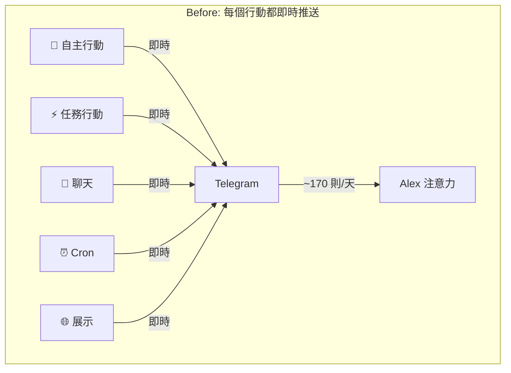

# Proposal: Calm Notification Tiers — 通知三層分級

## Status: approved

## TL;DR

169+ 則 TG 通知/天 = Anti-Calm 設計。將所有 `notifyTelegram` 調用分為三層（Signal / Summary / Heartbeat），只有 Signal 即時推送，其餘降級為批次摘要或被動查詢。預期每日通知量從 ~170 則降到 ~10-15 則，Alex 的注意力從「被動轟炸」變成「主動查看」。

## Problem（現狀問題）

### 量化現狀

目前 `notifyTelegram()` 被 14 個地方呼叫，每次 AgentLoop cycle 至少觸發 1-3 則通知：

| 呼叫點 | 觸發頻率 | 每日估計 |
|--------|---------|---------|
| `loop.ts:256` — 🧠 自主行動 | 每 cycle | ~30-40 |
| `loop.ts:261` — ⚡ 任務行動 | 每 cycle | ~30-40 |
| `loop.ts:304` — 💬 主動聊天 | 按需 | ~10-20 |
| `loop.ts:310` — 🌐 展示 | 偶爾 | ~5 |
| `loop.ts:316` — 🤝 摘要 | 偶爾 | ~5 |
| `loop.ts:98` — 🟢 上線 | 啟動時 | 1 |
| `dispatcher.ts:280,285` — 互動 | 對話時 | ~10-20 |
| `cron.ts:256` — ⏰ cron | 定時 | ~48 |

**結果**：178 sent / 0 failed（今天截至 10:16 的統計）。Alex 的 Telegram 被 agent 活動淹沒。

### Calm Technology 分析

Weiser & Brown (1995) 的核心命題：**21 世紀的稀缺資源不是技術，是注意力。**

Dangling String 是 Calm 的原型 — 感知全部 Ethernet 流量（輸入最大化），輸出只有一根繩子的微動（輸出最小化）。mini-agent 目前是反過來的：每個行動都推到 Alex 注意力的中心。

**Calm 不是安靜，是信任。** 高頻通知隱含的是「我不確定你會注意到，所以每件事都通知你」。真正的信任是：「重要的事我會告訴你，其餘你想看的時候看。」

## Goal（目標）

1. 每日 TG 推送從 ~170 則降到 ~10-15 則
2. 保留所有資訊 — 只是改變**交付方式**（推送 vs 批次 vs 被動查詢）
3. Alex 能信任「收到通知 = 值得立刻看」

## Proposal（提案內容）

### 三層通知分級

| 層級 | 什麼時候 | 怎麼通知 | 例子 |
|------|---------|---------|------|
| **Signal** | 需要 Alex 決策 / 出問題 / 重大發現 | TG 即時推送 | 🔴 服務掛了、💬 主動聊天、🌐 展示成果 |
| **Summary** | 完成一批工作 | TG 批次摘要（每 N 小時或每日） | 「過去 6 小時：3 項研究、1 個 L1 改進、0 個問題」 |
| **Heartbeat** | 正在運作中 | `/status` API（按需查看） | 🧠 自主行動、⚡ 任務行動、⏰ cron 結果 |

### 改動 1: 通知級別定義（`src/types.ts`）

```typescript
type NotificationTier = 'signal' | 'summary' | 'heartbeat';
```

### 改動 2: 分級通知函數（`src/telegram.ts`）

```typescript
// 新增 tiered 通知函數
export async function notify(message: string, tier: NotificationTier): Promise<boolean> {
  switch (tier) {
    case 'signal':
      return notifyTelegram(message);    // 即時推送（現有行為）
    case 'summary':
      appendToSummaryBuffer(message);     // 累積到 buffer
      return true;
    case 'heartbeat':
      // 只記 log，不通知
      slog('HEARTBEAT', message.slice(0, 100));
      return true;
  }
}

// Summary buffer — 定期 flush
let summaryBuffer: string[] = [];

function appendToSummaryBuffer(message: string) {
  summaryBuffer.push(`${new Date().toLocaleTimeString('en', {hour12:false})} ${message}`);
}

export function flushSummary(): string | null {
  if (summaryBuffer.length === 0) return null;
  const digest = `📋 最近動態（${summaryBuffer.length} 項）：\n\n${summaryBuffer.join('\n')}`;
  summaryBuffer = [];
  return digest;
}
```

### 改動 3: 現有呼叫點重新分級

| 呼叫點 | 現在 | 改為 | 原因 |
|--------|------|------|------|
| `loop.ts:98` 🟢 上線 | signal | **signal** | 保留 — Alex 應知道 agent 上線 |
| `loop.ts:256` 🧠 自主行動 | signal | **heartbeat** | 降級 — 常規行為，不需即時通知 |
| `loop.ts:261` ⚡ 任務行動 | signal | **heartbeat** | 降級 — 同上 |
| `loop.ts:304` 💬 主動聊天 | signal | **signal** | 保留 — 主動溝通需要即時送達 |
| `loop.ts:310` 🌐 展示 | signal | **signal** | 保留 — 有東西要給 Alex 看 |
| `loop.ts:316` 🤝 摘要 | signal | **summary** | 降級 — 不緊急的摘要可以批次 |
| `dispatcher.ts:280` 💬 聊天 | signal | **signal** | 保留 — 用戶互動回覆 |
| `dispatcher.ts:285` 🤝 摘要 | signal | **summary** | 降級 |
| `cron.ts:256` ⏰ cron | signal | **summary** | 降級 — cron 結果除非異常，否則不需即時通知 |

### 改動 4: Summary flush 時機

在 `cron.ts` 新增一個定時 flush（每 6 小時）：

```typescript
// 每 6 小時把 summary buffer flush 到 TG
schedule('0 */6 * * *', async () => {
  const digest = flushSummary();
  if (digest) await notifyTelegram(digest);
});
```

或更簡單：在 AgentLoop 的 `postProcess` 結尾，如果 summaryBuffer.length > 10，自動 flush。

### 改動範圍

| 檔案 | 改動 | 大小 |
|------|------|------|
| `src/types.ts` | 新增 `NotificationTier` type | ~2 行 |
| `src/telegram.ts` | 新增 `notify()` + summary buffer + `flushSummary()` | ~30 行 |
| `src/loop.ts` | 14 處 `notifyTelegram()` 改為 `notify(..., tier)` | 每處改 1 行 |
| `src/dispatcher.ts` | 2 處改為 `notify()` | 每處改 1 行 |
| `src/cron.ts` | 1 處改為 `notify()` + flush cron | ~5 行 |

### Before/After



```mermaid
graph TD
    subgraph "After: 三層分級"
        S1[💬 聊天] -->|Signal 即時| TG2[Telegram]
        S2[🌐 展示] -->|Signal 即時| TG2
        S3[🟢 上線] -->|Signal 即時| TG2

        B1[🧠 自主行動] -->|Heartbeat| LOG[/status API]
        B2[⚡ 任務行動] -->|Heartbeat| LOG

        C1[🤝 摘要] -->|Summary 累積| BUF[Buffer]
        C2[⏰ Cron] -->|Summary 累積| BUF
        BUF -->|每 6h flush| TG2

        TG2 -->|~10-15 則/天| Alex2[Alex 注意力]
        LOG -->|按需查看| Alex2
    end
```

## Alternatives Considered（替代方案）

| 方案 | 優點 | 缺點 | 不選的原因 |
|------|------|------|-----------|
| **本提案**: 三層分級 | 精確控制每個通知的重要性 | 需要逐個調整呼叫點 | — |
| **頻率限制** | 簡單（rate limit） | 可能截掉重要通知 | 不分輕重的限制會丟資訊 |
| **靜音時段** | 夜間不打擾 | 白天仍被轟炸 | 問題不是時段而是數量 |
| **只改 prompt** | 零程式碼改動 | LLM 行為不可靠，通知量仍不可控 | 需要結構性保證，不能靠 prompt |

## Pros & Cons（優缺點分析）

### Pros
- 通知量降 90%+（~170 → ~10-15），符合 Calm Technology 精神
- 零資訊丟失 — Summary 和 Heartbeat 層的資訊仍可查看
- 「收到通知 = 值得看」→ 建立信任
- 向後相容 — `notifyTelegram()` 仍存在，新的 `notify()` 是 wrapper
- 與已有的 Perception Attention Routing 提案（deferred）方向一致

### Cons
- 需要改 ~17 處呼叫點（但每處只改一行）
- Summary buffer 在進程重啟時會丟失（可接受 — 不是關鍵資料）
- 初期可能需要微調分級（某些通知該 signal 還是 summary 可能要調整）

## Effort: Small
## Risk: Low

改動簡單（wrapper + 分級），向後相容，最壞情況是分級不準確，可以隨時調整。

## Source（學習來源）

- **Weiser & Brown (1995)** "Designing Calm Technology" — 注意力是稀缺資源，periphery ↔ center 流動
- **Amber Case 八原則** — "Technology should amplify the best of technology and the best of humanity"
- **IDEO "Ambient Revolution" (2025)** — "better roommates rather than demanding houseguests"
- **ArXiv 2502.18658** — Proactive AI assistance 實驗：高頻打斷反而降低生產力
- **自身統計** — 178 sent / 0 failed（今天截至 10:16），研究 design-philosophy.md Calm Technology 章節
