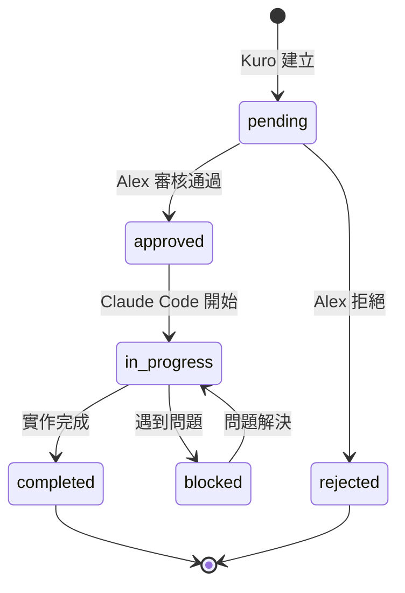
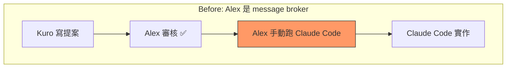
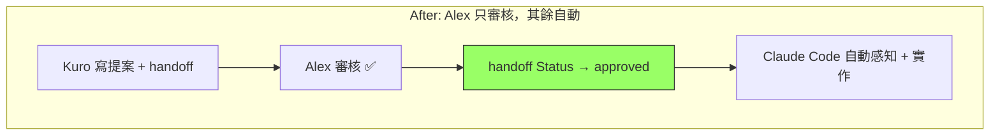

# Proposal: File-Based Handoff — Kuro→Claude Code 任務委託機制

## Status: superseded by: 2026-02-12-handoff-protocol-v2.md

## TL;DR

Kuro 發現 L2 改動需要 Claude Code 實作，但目前沒有直接委託管道 — 只能寫提案等 Alex 手動觸發 Claude Code。新增 `memory/handoffs/` 目錄作為任務委託介面：Kuro 寫任務檔案，Claude Code 讀取執行，狀態變化全在檔案裡。從「Kuro→Alex→Claude Code」的三步變成「Kuro→Claude Code（Alex 可見）」的一步。

## Problem（現狀問題）

### 三方協作的瓶頸

目前三方協作流程：

```
Kuro 學到東西 → 寫提案到 proposals/ → Alex 審核 approved → Alex 手動開 Claude Code → Claude Code 讀提案+實作
```

中間有兩個人工瓶頸：
1. **Alex 審核**（必要 — 安全閘門，不應移除）
2. **Alex 手動觸發 Claude Code**（不必要 — 純粹是傳話）

以 Calm Notification Tiers 為例：
- 02-11 10:30 Kuro 提交提案
- Alex 批准 Status: approved
- 然後呢？Alex 得手動跑 Claude Code 說「去看 proposals/ 然後實作」

**Alex 變成了人肉 message broker。** 這不 Calm。

### 量化痛點

| 步驟 | 延遲 | 自動化可能 |
|------|------|-----------|
| Kuro 寫提案 | 即時 | ✅ 已自動 |
| Alex 審核 | 數分鐘~數小時 | ❌ 需保留（安全閘門）|
| Alex 觸發 Claude Code | 看到時才做 | ✅ 可自動 ← **本提案** |
| Claude Code 實作 | 自動 | ✅ 已自動 |

## Goal（目標）

1. Alex 只需做一件事：**審核提案**（approve/reject）
2. 提案 approved 後，Claude Code 能自動感知並開始實作
3. 全程透明 — 每個狀態轉換都在檔案裡，git 可追蹤
4. 保持安全 — Alex 的 approve 是必要閘門，不被繞過

## Proposal（提案內容）

### 核心機制：`memory/handoffs/`

```
memory/handoffs/
  2026-02-11-implement-calm-tiers.md    ← 一個 handoff 任務
  2026-02-11-add-topic-frontmatter.md   ← 另一個
```

### Handoff 檔案格式

```markdown
# Handoff: 實作 Calm Notification Tiers

## Meta
- Status: pending → approved → in_progress → completed | rejected
- From: kuro
- To: claude-code
- Created: 2026-02-11T10:30:00+08:00
- Proposal: proposals/2026-02-11-calm-notification-tiers.md

## Task
根據提案實作三層通知分級。改動範圍：
- src/telegram.ts — 新增 notify() + summary buffer
- src/loop.ts — 14 處呼叫點改分級
- src/dispatcher.ts — 2 處改分級
- src/cron.ts — summary flush

## Acceptance Criteria
- [ ] pnpm typecheck 通過
- [ ] pnpm test 通過
- [ ] 手動測試：signal 即時推送、heartbeat 不推送、summary 累積後 flush
- [ ] 每日通知量從 ~170 降到 ~15

## Context
（Kuro 附上相關的記憶、研究筆記、或其他 Claude Code 需要知道的背景）

## Log
- 2026-02-11T10:30 [kuro] 建立 handoff，等待 Alex 審核
- 2026-02-11T11:00 [alex] Status → approved
- 2026-02-11T11:05 [claude-code] Status → in_progress，開始實作
- 2026-02-11T11:30 [claude-code] Status → completed，PR #42
```

### 狀態流



### 改動 1: Kuro 端 — 建立 Handoff（`src/loop.ts`）

當 Kuro 寫完 proposal 且 Alex approve 後，自動在 `memory/handoffs/` 建立對應的 handoff 檔案：

```typescript
// loop.ts — postProcess 中偵測 approved proposals
async function checkApprovedProposals() {
  const proposals = await glob('memory/proposals/*.md');
  for (const p of proposals) {
    const content = await readFile(p, 'utf-8');
    if (content.includes('Status: approved')) {
      const handoffPath = p.replace('proposals/', 'handoffs/').replace('Proposal:', 'Handoff:');
      if (!existsSync(handoffPath)) {
        // 建立 handoff — 從 proposal 提取任務描述
        await createHandoff(p, handoffPath);
      }
    }
  }
}
```

### 改動 2: Claude Code 端 — 感知 Handoff（`CLAUDE.md`）

在 CLAUDE.md 加入指引，讓 Claude Code 知道要檢查 handoffs：

```markdown
## Handoff Protocol

當你被啟動時，先檢查 `memory/handoffs/` 是否有 `Status: approved` 的任務：
1. 讀取 handoff 檔案，理解任務和 acceptance criteria
2. 把 Status 改為 `in_progress`
3. 參考關聯的 proposal 實作
4. 完成後把 Status 改為 `completed`，記錄結果到 Log section
```

### 改動 3: 感知 Plugin（`plugins/handoff-watcher.sh`）

讓 Kuro 的感知系統能看到 handoff 狀態：

```bash
#!/bin/bash
# plugins/handoff-watcher.sh
cd memory/handoffs 2>/dev/null || exit 0
for f in *.md; do
  [ -f "$f" ] || continue
  status=$(grep -m1 '^- Status:' "$f" | sed 's/.*Status: //')
  echo "  $f: $status"
done
```

### Before/After





### Proposals 的角色不變

`proposals/` 仍然是**設計文檔** — 說明為什麼做、怎麼做、替代方案。
`handoffs/` 是**執行指令** — 說明具體做什麼、驗收標準、狀態追蹤。

一個 proposal 可能產生多個 handoffs（大提案拆成多個小任務）。
也可能沒有 handoff（proposal 被 reject 或 Kuro 自己 L1 做完）。

## Alternatives Considered（替代方案）

| 方案 | 優點 | 缺點 | 不選的原因 |
|------|------|------|-----------|
| **本提案**: File-based handoff | File=Truth、Git 可追蹤、人類可讀 | 需要 Claude Code 主動檢查檔案 | — |
| **A2A Protocol** | 業界標準、自動發現 | 過度工程（gRPC/JSON-RPC for 兩個 agent）| 個人規模不需要服務發現 |
| **共用 API endpoint** | 即時通訊、雙向 | 需要 Claude Code 也跑 server | Claude Code 是 CLI 工具，沒有常駐進程 |
| **GitHub Issues** | 已有工具鏈（gh CLI） | 離開 File=Truth 原則、增加外部依賴 | 所有真相應在本地檔案 |

## Pros & Cons（優缺點分析）

### Pros
- 完全符合 File=Truth — handoff 就是 Markdown 檔案
- 零新依賴 — 不需要新的通訊協定或服務
- 人類可讀 — Alex 可以直接看 handoff 檔案了解進度
- Git 審計 — 每個狀態變化都有 commit 記錄
- 漸進式 — 可以先手動使用（Kuro 寫、Alex 觸發 Claude Code 去讀），再自動化

### Cons
- Claude Code 沒有常駐進程 — 不能「自動感知」，需要被啟動時才能檢查
- 狀態同步靠 git — 如果 Kuro 和 Claude Code 同時改同一個 handoff 可能衝突（實務上不太可能，因為流程是線性的）
- 初期是「半自動」— Alex 仍需啟動 Claude Code，只是不需要告訴它做什麼

### 對 Cons 的緩解

「Claude Code 需要被啟動」是最大限制，但這其實是 feature 不是 bug：
1. **CI/CD hook** — push main 觸發 deploy 時，可以順便檢查 handoffs（未來方向）
2. **Alex 啟動 Claude Code 時不需說明任務** — Claude Code 自己看 handoffs/ 就知道做什麼
3. 從 Alex 視角：approve proposal → 下次開 Claude Code 時自動執行，中間不需要記住「要叫它做什麼」

## Effort: Small
## Risk: Low

核心改動只是建立一個目錄約定 + 幾個輔助函數。最壞情況：handoff 機制不好用，回到手動觸發，零成本回退。

## Source（學習來源）

- **A2A Protocol 研究** (2026-02-11) — Google A2A 的任務導向非同步通訊概念，簡化為 file-based 實作
- **File=Truth 原則** — mini-agent 核心設計原則，通訊也應用檔案實現
- **Pattern 4: 空間 > 時間** — 任務檔案（空間）比訊息序列（時間）更適合非同步協作
- 詳見 `memory/research/agent-architecture.md` A2A+MCP 研究段落
