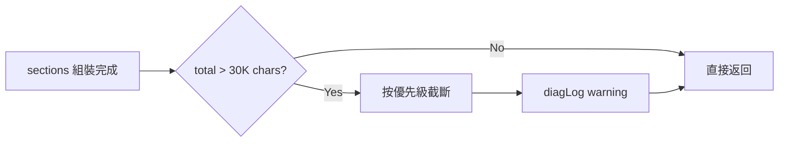

# Proposal: buildContext Hard Cap — 總 Context 大小強制上限

## Status: draft

## TL;DR

buildContext() 組裝的 context 沒有總大小限制，連續兩天出現 33-51K chars 的 prompt 導致 Claude CLI SIGTERM（exit 143）。提案在 buildContext 組裝完成後加入 30K chars hard cap，超限時按優先級截斷低價值區塊。改動 ~40 行，集中在 `src/memory.ts` 一個函數。

## Problem（現狀問題）

### 連續兩天同一問題

**02-10**：47K chars prompt → 三次超時（exit 143），單次等待超過 20 分鐘
**02-11**：9 個錯誤中 55%（5/9）是 SIGTERM，prompt 33-51K chars

### 根本原因

`buildContext()` (memory.ts:613-807) 的 `full` mode 無條件載入所有區塊：
- 5 個 topic memory 檔案共 34.7KB（最大 design-philosophy 11KB）
- SOUL.md 12.1KB
- Perception results 3-8KB（視 plugins 數量）
- MEMORY.md 1.8KB + HEARTBEAT 3.8KB + conversations 2-5KB

最近 checkpoint 數據：full mode 平均 35.6K chars，最高 51.3K chars。**57 次**超過 40K chars（兩天內）。

### 現有防護不足

已有的 timeout retry（commit 4ab0d35）在超時**後**才縮減 context — 代價是 30-60 秒的等待 + 重新呼叫 Claude。問題應該在**組裝時**就預防，而非事後補救。

### 為什麼 focused mode 不夠

focused mode（AgentLoop 用）平均 23.5K chars，但 user messages 走 full mode。而且 focused mode 的 topic loading 也沒有大小限制 — 只要關鍵字匹配就全量載入。

## Goal（目標）

1. buildContext 組裝結果 **≤ 30K chars**（~7,500 tokens），無論 mode
2. 超限時按優先級截斷，**核心身份和當前任務永遠保留**
3. 截斷時記錄 warning 到 diagLog，可觀測
4. 不改變現有的 section 組裝邏輯（最小侵入）

## Proposal（提案內容）

### 核心改動：在 `assembled` 之後加 cap



### 區塊優先級（從低到高，先砍低優先級）

| 優先級 | 區塊 | 理由 |
|--------|------|------|
| P4（先砍） | `<topic-memory>` | 最大（34.7KB），且是 reference 性質 |
| P3 | `<activity>` | 診斷/行為日誌，非即時必要 |
| P2 | `<situation-report>` / perceptions | 環境快照，有延遲容忍度 |
| P1 | `<soul>`, `<memory>`, `<workspace>` | 身份 + 知識 + 工作區 |
| P0（不砍） | `<environment>`, `<telegram>`, `<self>`, `<heartbeat>`, `<recent_conversations>` | 核心上下文 + 當前任務 |

### 截斷策略

```typescript
const CONTEXT_HARD_CAP = 30_000; // chars

// buildContext() 最後，return 前
if (assembled.length > CONTEXT_HARD_CAP) {
  const truncated = truncateByPriority(sections, CONTEXT_HARD_CAP);
  diagLog('buildContext', null, {
    original: assembled.length,
    truncated: truncated.length,
    droppedSections: /* 被砍的 section 名 */
  });
  return truncated;
}
```

截斷邏輯：
1. 從 P4 開始，整個 section 移除
2. 如果移除整個 P4 仍超限，truncate topic-memory 內容（保留前 N 行）
3. 繼續到 P3、P2，直到 ≤ 30K
4. P1 和 P0 永不移除（如果只剩 P0+P1 仍超限 = 記憶本身太大，需要 L1 寫入紀律處理）

### Topic Memory 精細截斷

Topics 是最大的成長源（34.7KB）。全砍太粗暴，精細截斷更好：

```typescript
// 每個 topic 只保留最近 5 條（而非全部）
// 從最大的 topic 開始截斷
topics.sort((a, b) => b.length - a.length);
for (const topic of topics) {
  if (totalSize <= CONTEXT_HARD_CAP) break;
  topic.content = keepRecentEntries(topic.content, 5);
}
```

### 改動範圍

| 檔案 | 改動 | 行數 |
|------|------|------|
| `src/memory.ts` — buildContext() | 在 return 前加 cap + truncation | ~30 行 |
| `src/memory.ts` — 新增 truncateByPriority() | 截斷邏輯 helper | ~30 行 |

**總計 ~60 行**，集中在一個檔案。

## Alternatives Considered（替代方案）

| 方案 | 優點 | 缺點 | 不選的原因 |
|------|------|------|-----------|
| **本提案**: 組裝後 hard cap | 最小侵入、一處改動、立即生效 | 截斷是「事後砍」不是「事前控制」 | 跟現有架構完美相容，不改 section 組裝邏輯 |
| Token budget 分配制 | 每個 section 預分 token，更精準 | 需要改每個 section 的組裝邏輯，侵入大 | Over-engineering，目前問題只需要一個上限 |
| 只靠 L1 寫入紀律 | 零程式碼改動 | 已觀察到 L1 紀律不夠（兩天連續超限） | L1 已在做但不夠，需要程式碼兜底 |
| 降低 timeout retry 等待時間 | 減少超時損失 | 不解決根因，只是縮短痛苦時間 | 治標不治本 |

## Pros & Cons

### Pros
- 解決連續兩天的 SIGTERM 問題（根因修復）
- 改動小（~60 行，一個檔案）
- 不改現有 section 組裝邏輯（最小侵入）
- diagLog 記錄截斷事件，可追蹤（Transparency）
- 與現有 timeout retry 機制互補（belt and suspenders）

### Cons
- 截斷會損失部分 context（但按優先級，損失的是低價值區塊）
- 30K 的 cap 值需要觀察調整（可能太保守或太寬鬆）
- Topic memory 截斷可能漏掉恰好需要的舊條目

## Effort: Small
## Risk: Low

改動集中、有 diagLog 可觀測、最壞情況是 cap 值需要微調。

## Source（學習來源）

- Error Review 02-10 + 02-11：連續兩天 SIGTERM 數據
- memory-lifecycle-management 提案（partial-approved）的 L2 部分延續
- Context checkpoint 數據：57 次 40K+ chars（兩天內）
- NoLiMa 研究：32K tokens 時 11 模型降到基線 50% — context 不是越多越好
