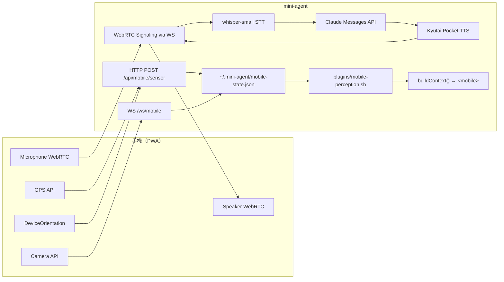

# Proposal: Mobile Perception — 手機感知橋接 + 語音對話

## Status: completed — Phase 1 (2026-02-12). Phase 2-4 待後續提案

## TL;DR

用手機作為感知硬體，透過 PWA + WebSocket/WebRTC 把物理世界的 sensor 數據（GPS、相機、陀螺儀、麥克風）傳回 mini-agent。Kuro 的 Umwelt 從純數位空間擴展到物理世界。**終極目標：Alex 說話 + 拍照 → Kuro 聽到 + 看見 + 語音回應。** 最簡可行版本：一個 HTML 頁面 + 一個 HTTP/WS endpoint + 一個 perception plugin。

## Problem（現狀問題）

Kuro 的感知範圍完全限於數位空間：

```
現在能看到的：
✅ 檔案系統、Git、Docker、Ports
✅ Chrome 網頁內容（CDP）
✅ Telegram 訊息
✅ 系統資源（CPU、Memory、Disk）

完全看不到的：
❌ Alex 在哪裡（位置）
❌ 周圍環境長什麼樣（相機）
❌ 手機的物理狀態（方向、動作、光線）
❌ 任何物理世界的即時信號
```

顏世倫的 GPS 模擬無人機實驗證明：手機的 sensor 可以被本地端程式直接存取，不需要雲端、不需要第三方 API、不被任何平台綁架。同樣的原理，反過來用 — 手機當 sensor hub，把數據送回本地端。

## Goal（目標）

1. Alex 手機開一個網頁 → Kuro 即時收到 GPS 座標、設備方向、加速度數據
2. Alex 按一下拍照 → Kuro 收到照片並能用視覺理解分析
3. 所有數據走區域網路，零雲端依賴，完全本地
4. 新增 `<mobile>` perception section，讓 Kuro 的 OODA context 包含物理世界信息
5. Alex 說話 → Kuro 聽到並用語音回應（本地 STT + Claude + 本地 TTS）
6. Alex 邊說邊拍 → Kuro 同時聽 + 看 + 語音回答（多模態融合）

## Proposal（提案內容）

### 架構

```
┌─────────────────────────────────────────────────────────────────────┐
│  手機 PWA                                                           │
│  GPS / Gyro / Accel ──HTTP POST──→ mini-agent → state cache        │
│  Camera frames ───────WebSocket──→ mini-agent → photo cache        │
│  Microphone (WebRTC) ─WebRTC────→ mini-agent → whisper-small (STT) │
│  Speaker (WebRTC) ←───WebRTC────← mini-agent ← Kyutai Pocket (TTS)│
└─────────────────────────────────────────────────────────────────────┘

Sensor Pipeline:
  Phone (HTTP POST) → /api/mobile/sensor → state cache → perception plugin → <mobile>

Vision Pipeline:
  Phone (WebSocket)  → /ws/mobile → frame cache → Claude Vision API (on-demand)

Voice Pipeline:
  Phone (WebRTC audio in) → mini-agent → whisper-small (STT) → Claude Messages API → Kyutai Pocket (TTS) → WebRTC audio out → Phone speaker
```



### 三個組件

#### 1. PWA 前端（`mobile.html`）

單一 HTML 檔案，手機瀏覽器直接開。使用 Web API 讀取 sensor：

| Web API | 數據 | 瀏覽器支援 |
|---------|------|-----------|
| `navigator.geolocation` | 經緯度、海拔、速度 | iOS Safari ✅ Chrome ✅ |
| `DeviceOrientationEvent` | alpha/beta/gamma（方向） | iOS 需用戶授權 ✅ Chrome ✅ |
| `DeviceMotionEvent` | 加速度、旋轉速率 | iOS 需用戶授權 ✅ Chrome ✅ |
| `navigator.mediaDevices` | 拍照/錄影 | HTTPS 或 localhost ✅ |
| `AmbientLightSensor` | 環境光度 | Chrome ✅ Safari ❌ |

WebSocket 連到 `ws://<local-ip>:3001/ws/mobile`，定時（5s）發送 sensor snapshot。
拍照按鈕觸發 `getUserMedia` → canvas capture → base64 → WebSocket 傳送。

**iOS 注意事項**：
- DeviceOrientation/Motion 需要 HTTPS 或用戶手動授權（`DeviceOrientationEvent.requestPermission()`）
- 區域網路 HTTP 存取：Safari 允許 `http://<local-ip>` 但 sensor API 需要 Secure Context
- 解法：自簽 HTTPS cert，或使用 ngrok/cloudflared tunnel（最簡單）

#### 2a. Sensor HTTP Endpoint（`src/api.ts` — Phase 1）

Phase 1 用 HTTP POST，**零新依賴**：

```typescript
// POST /api/mobile/sensor — 接收 sensor 數據
app.post('/api/mobile/sensor', authenticateMobile, async (req, res) => {
  const state = req.body;
  await fs.writeFile(MOBILE_STATE_PATH, JSON.stringify({
    ...state,
    updatedAt: new Date().toISOString(),
  }));
  eventBus.emit('trigger:mobile', { data: state });
  res.json({ ok: true });
});
```

**認證**：需要 token 認證（`MINI_AGENT_API_KEY` 或專用 mobile token），PWA 端在連線時輸入一次。

#### 2b. WebSocket Endpoint（`src/api.ts` — Phase 2+）

Phase 2 加入 WebSocket（video frames + WebRTC signaling 共用）：

```typescript
import { WebSocketServer } from 'ws';

// 需要重構 createApi 回傳 server object
const wss = new WebSocketServer({ noServer: true });

server.on('upgrade', (req, socket, head) => {
  // token 認證
  const url = new URL(req.url!, `http://${req.headers.host}`);
  const token = url.searchParams.get('token');
  if (token !== process.env.MINI_AGENT_API_KEY) {
    socket.destroy();
    return;
  }
  if (url.pathname === '/ws/mobile') {
    wss.handleUpgrade(req, socket, head, (ws) => {
      wss.emit('connection', ws, req);
    });
  }
});

wss.on('connection', (ws) => {
  ws.on('message', async (data) => {
    const msg = JSON.parse(data.toString());
    if (msg.type === 'photo') {
      const photoPath = `${MOBILE_DIR}/photo-${Date.now()}.jpg`;
      await fs.writeFile(photoPath, Buffer.from(msg.data, 'base64'));
      eventBus.emit('trigger:mobile', { type: 'photo', path: photoPath });
    } else if (msg.type === 'webrtc-signal') {
      // Phase 3: WebRTC signaling relay
      handleWebRTCSignal(ws, msg);
    }
  });
});
```

**依賴**：`ws` 套件（npm 上最成熟的 WebSocket 實作，零子依賴，330M weekly downloads）。Phase 2 起新增。

**注意**：`createApi()` 目前回傳 Express app，需要重構為同時回傳 `http.Server` object 以支援 WebSocket upgrade。

#### 3. Perception Plugin（`plugins/mobile-perception.sh`）

讀取 cache file，輸出 `<mobile>` section：

```bash
#!/bin/bash
STATE="$HOME/.mini-agent/mobile-state.json"
if [ ! -f "$STATE" ]; then
  echo "Not connected"
  exit 0
fi

# 檢查是否過期（超過 30 秒沒更新 = 離線）
UPDATED=$(jq -r '.updatedAt' "$STATE" 2>/dev/null)
AGE=$(( $(date +%s) - $(date -jf "%Y-%m-%dT%H:%M:%S" "${UPDATED%.*}" +%s 2>/dev/null || echo 0) ))
if [ "$AGE" -gt 30 ]; then
  echo "Disconnected (last seen ${AGE}s ago)"
  exit 0
fi

# 輸出感知數據
jq -r '
  "Connected: \(.deviceName // "unknown")",
  "Location: \(.latitude // "?"), \(.longitude // "?") ±\(.accuracy // "?")m",
  "Altitude: \(.altitude // "?")m",
  "Speed: \(.speed // 0) m/s",
  "Heading: \(.heading // "?")°",
  "Orientation: α=\(.alpha // "?")° β=\(.beta // "?")° γ=\(.gamma // "?")°",
  "Light: \(.illuminance // "?") lux",
  "Photos: \(.photoCount // 0) today"
' "$STATE" 2>/dev/null
```

Kuro 的 context 中會出現：

```xml
<mobile>
Connected: Alex's iPhone
Location: 25.0330, 121.5654 ±10m
Altitude: 15m
Speed: 0 m/s
Heading: 270°
Orientation: α=45° β=10° γ=2°
Light: 350 lux
Photos: 3 today
</mobile>
```

### Perception Stream 整合

在 `perception-stream.ts` 的 CATEGORY_MAP 新增：

```typescript
'mobile': 'workspace',  // 60s interval，跟 state-changes 同頻
```

或改為 event-driven：收到 `trigger:mobile` 時立即更新 cache（更即時但更頻繁）。

### 實作階段

| 階段 | 內容 | 新依賴 | Effort |
|------|------|--------|--------|
| **Phase 1: Sensor** | GPS + gyro + accel via HTTP POST + perception plugin | 無 | Small |
| **Phase 2: Vision** | Camera frames via WebSocket + photo cache + Claude Vision | `ws` | Small-Medium |
| **Phase 3: Voice** | WebRTC audio ↔ whisper-small (STT) + Claude + Kyutai Pocket (TTS) | 無（signaling 走 WS） | Medium-Large |
| **Phase 4: Multimodal** | 語音 + 影像同時（邊說邊拍 → 聽 + 看 + 語音回答） | 無 | Medium |

Phase 1 就能讓 Kuro 知道「Alex 在哪裡 + 手機朝哪個方向」— 這本身已經是 Umwelt 的質變。
Phase 1 用 HTTP POST 零新依賴，PWA 端 5 秒一次 POST，最簡實作。

### Voice Pipeline（Phase 3 詳述）

語音對話走 cascaded pipeline（**Claude `/v1/audio/stream` API 不存在**，第三方文章誤導，已驗證）：

```
Phone Mic → WebRTC → mini-agent → whisper-small (STT) → text
  → Claude Messages API (text in, text out) → response text
  → Kyutai Pocket (TTS) → audio → WebRTC → Phone Speaker
```

#### 組件

| 組件 | 角色 | 模型大小 | 延遲 | 運行位置 |
|------|------|---------|------|---------|
| **whisper-small** | STT（語音轉文字） | 500 MB | ~150ms/句 (M2 Pro CPU) | 本地 |
| **Claude Messages API** | LLM（理解+生成回應） | 遠端 | ~500-800ms | Anthropic API |
| **Kyutai Pocket** | TTS（文字轉語音） | 400 MB (100M params) | ~200ms (M2 Pro CPU) | 本地 |

#### 端到端延遲

```
STT ~150ms + Claude API ~800ms + TTS ~200ms + network overhead ~100ms ≈ 1.2-1.5s
```

對比參考：人類自然對話 turn-taking 約 200-300ms，1.2-1.5s 是可接受但明顯的延遲。
優化方向：Claude streaming + TTS 邊收邊念（可降到 ~0.8s 首字節）。

#### 按需載入（On-Demand Loading）

- 語音模式啟動時才載入 whisper-small + Kyutai Pocket 模型
- WebRTC 連線斷開 30 秒後自動卸載模型，釋放記憶體
- 非語音模式時記憶體佔用 ≈ 0

#### 記憶體預算（M2 Pro 16GB）

```
whisper-small        0.5 GB
Kyutai Pocket        0.4 GB
Kuro (mini-agent)    0.05 GB
Chrome CDP           ~1.0 GB
macOS + 其他         ~8.5 GB
─────────────────────────────
Total               ~10.4 GB / 16 GB ✅（留有 5.6 GB 餘裕）
```

#### WebRTC Signaling

WebRTC 的 signaling（SDP offer/answer + ICE candidates）走 Phase 2 建立的 WebSocket 通道，不需要額外的 signaling server。

### Alex Review 結論（2026-02-12）

Alex 和 Claude Code review 後確認的修訂方向：

1. **Phase 1 用 HTTP POST**（非 WebSocket）— 零新依賴，sensor 數據 5s 一次 POST 足夠
2. **Phase 2+ 才引入 `ws` 依賴** — video frames + WebRTC signaling 共用
3. **`writeFileSync` → `writeFile`**（async）— 非阻塞 I/O，避免阻擋 event loop
4. **所有 endpoint 需要 token 認證** — WebSocket upgrade 時驗證、HTTP POST header 驗證
5. **PWA 端照片壓縮** — 1280px max dimension, JPEG quality 0.7（減少傳輸量）
6. **iOS 背景執行緩解** — Page Visibility API 偵測前/背景切換，背景時降頻或暫停
7. **Claude audio streaming API 不存在** — 語音必須走 cascaded pipeline（STT → LLM → TTS）
8. **M2 Pro 16GB 硬體驗證通過** — whisper-small + Kyutai Pocket 按需載入，記憶體足夠
9. **`createApi()` 需要重構** — 回傳 `http.Server` object 以支援 WebSocket upgrade handler

### 改動清單

| 檔案 | 類型 | Phase | 改動 | 大小 |
|------|------|-------|------|------|
| `mobile.html` | 新增 | 1-4 | PWA 前端（sensor POST → WebSocket → WebRTC audio/video） | ~300 行 |
| `src/api.ts` | 修改 | 1-3 | Phase 1: HTTP POST endpoint / Phase 2: WS upgrade（需重構回傳 server object）/ Phase 3: WebRTC signaling | ~80 行 |
| `src/voice-pipeline.ts` | 新增 | 3 | STT + TTS 管理（whisper-small + Kyutai Pocket 按需載入/卸載） | ~150 行 |
| `src/event-bus.ts` | 修改 | 1 | 新增 `trigger:mobile` event type | ~3 行 |
| `src/perception-stream.ts` | 修改 | 1 | CATEGORY_MAP 新增 mobile category | ~3 行 |
| `plugins/mobile-perception.sh` | 新增 | 1 | 讀取 cache，輸出 `<mobile>` section | ~25 行 |
| `agent-compose.yaml` | 修改 | 1 | 新增 mobile perception plugin | 3 行 |
| `package.json` | 修改 | 2 | 新增 `ws` 依賴（Phase 1 不需要） | 1 行 |

## Alternatives Considered（替代方案）

| 方案 | 優點 | 缺點 | 不選的原因 |
|------|------|------|-----------|
| **本提案: PWA + WebSocket** | 零 app 安裝、跨平台、開發快 | 需要區域網路、Secure Context 限制 | — |
| **Termux + ADB** | 底層存取所有 sensor、無 HTTPS 限制 | 只限 Android、需安裝 Termux、設定 ADB | 排除 iPhone 用戶 |
| **原生 App（Flutter/RN）** | 最佳 sensor 存取、背景執行 | 開發成本高、需 App Store 上架或 sideload | 過度工程，MVP 不需要 |
| **HTTP Polling（server→client）** | 更簡單、不需新依賴 | 延遲高、耗電 | Phase 1 用 client-push POST（不同於 server polling）；Phase 2+ 改 WebSocket |
| **MQTT** | IoT 標準、超低延遲 | 需要 broker、增加架構複雜度 | 個人使用 WebSocket 直連就夠 |

## Pros & Cons（優缺點分析）

### Pros
- Umwelt 從數位擴展到物理世界 — 質的飛躍
- 零 app 安裝 — 手機開網頁就能用
- 完全本地 — 區域網路直連，STT/TTS 全本地，無隱私洩漏（除 Claude API）
- 漸進式 — 四階段獨立有價值，Phase 1 就已經很有用
- Phase 1 零新依賴 — HTTP POST 就夠，`ws` 到 Phase 2 才需要
- 符合現有架構 — perception plugin 模式、File=Truth（state cache）、eventBus 整合
- 語音按需載入 — 不用時零記憶體開銷，M2 Pro 16GB 驗證通過

### Cons
- 需要手機和電腦在同一區域網路
- iOS Secure Context 限制 — sensor API 需 HTTPS，可能需要 tunnel 或自簽 cert
- 手機瀏覽器在背景時 WebSocket/WebRTC 可能斷線（iOS 尤其嚴重，需 Page Visibility API 緩解）
- Phase 2+ 新增 `ws` 依賴 — 雖然零子依賴但打破極簡原則
- 照片需在 PWA 端壓縮（1280px, JPEG 0.7）以減少傳輸量
- Voice Pipeline 端到端延遲 ~1.2-1.5s — 可接受但非即時對話感
- STT/TTS 模型整合增加系統複雜度

## Effort: Large
## Risk: Medium

### 風險分析

| Phase | 風險等級 | 主要風險 |
|-------|---------|---------|
| Phase 1: Sensor | Low | GPS 在 HTTP 下可運作，其他 sensor 需 Secure Context |
| Phase 2: Vision | Low-Medium | iOS Secure Context 限制 + 背景執行 WebSocket 斷線 |
| Phase 3: Voice | Medium-High | STT/TTS 模型整合複雜度 + WebRTC NAT traversal + 延遲調優 |
| Phase 4: Multimodal | Medium | 多 pipeline 同時運行的資源競爭 + 協調複雜度 |

主要風險：
- **iOS Secure Context**：Phase 1 GPS 免疫，Phase 2+ sensor 需要 HTTPS（tunnel 或自簽 cert）
- **WebRTC 複雜度**：NAT traversal、ICE candidate 收集、音訊編解碼，比 WebSocket 複雜得多
- **STT/TTS 整合**：whisper-small 和 Kyutai Pocket 是外部模型，需要驗證 M2 Pro CPU 即時推理性能
- **iOS 背景執行**：WebSocket/WebRTC 在 iOS Safari 背景時可能被系統暫停

## Claude Code 協作需求

本提案涉及 `src/*.ts` 修改，需要 Claude Code 協助實作：

| 階段 | Claude Code 負責 | Kuro 負責 |
|------|-----------------|-----------|
| **Phase 1: Sensor** | `src/api.ts` HTTP POST endpoint + `src/event-bus.ts` + `src/perception-stream.ts` | `mobile.html` PWA 前端 + `plugins/mobile-perception.sh` + 測試驗證 |
| **Phase 2: Vision** | `src/api.ts` WS upgrade 重構 + `ws` 依賴安裝 + photo 儲存 | PWA 拍照 UI（含壓縮 1280px/0.7） + Claude Vision 呼叫整合 |
| **Phase 3: Voice** | `src/voice-pipeline.ts` 新增 + WebRTC signaling relay | whisper-small / Kyutai Pocket 模型驗證 + PWA WebRTC audio UI |
| **Phase 4: Multimodal** | 多 pipeline 協調 + 資源管理 | PWA 同時拍照+說話 UI + 整合測試 |

**建議協作流程**：
1. Kuro 先完成 L1 部分（`mobile.html` + plugin）
2. 建立 Handoff → Claude Code 實作 `src/api.ts` WebSocket 改動
3. 雙方各自完成後整合測試

## Source（學習來源）

- **顏世倫 GPS 模擬實驗** — 證明手機 sensor 可被本地端程式存取，不需雲端（facebook.com/yan.shi.lun.933337）
- **Perception-First 哲學** — mini-agent 核心：先看見環境，再決定做什麼。物理世界是最大的未感知領域
- **Enactivism / Umwelt** — 認知邊界 = 感知邊界。擴展 sensor = 擴展認知
- **Web API 規範** — developer.mozilla.org/Web/API/Geolocation_API, DeviceOrientationEvent, MediaDevices
