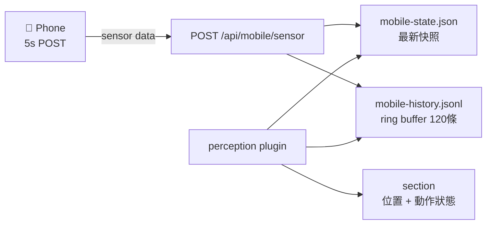

# Proposal: Mobile Sensor History — Ring Buffer + 動作辨識

## Status: approved
GitHub-Issue: #29

## TL;DR
手機 sensor 目前只保留最新一筆快照，無法感知「連續行為」（走路、站起來、搖晃）。加入 60 秒 ring buffer + 基礎動作辨識，讓 Kuro 從「知道你在哪」升級到「感受你在做什麼」。

## Problem（現狀問題）
Alex 今天（2/12）測試 mobile perception 時直接問：「你能感受到我剛剛手機的連續運動行為嗎？」— 答案是不能。

- 每次 POST `/api/mobile/sensor` 都覆寫 `mobile-state.json`，歷史消失
- 加速度計的走路 pattern（~2Hz 週期性波動）在單一快照中看不出來
- 「站起來」是一個 z 軸加速度峰值 → 無歷史就無法偵測
- Alex 的反應暗示這是他對 mobile perception 的核心期待之一

## Goal（目標）
1. Server 保留最近 60 秒的 sensor 數據（ring buffer）
2. Perception plugin 讀取歷史，輸出簡單的動作狀態（stationary / walking / active）
3. 不增加外部依賴、不大幅增加記憶體用量

## Proposal（提案內容）

### 改動 1: `src/api.ts` — Ring Buffer
```
POST /api/mobile/sensor 改動：
- 現有：writeFile('mobile-state.json', newData)
- 新增：追加到 mobile-history.jsonl（每行一筆 {timestamp, accel, gyro, gps}）
- 保留策略：只保留最近 120 條（5s interval × 120 = 10 分鐘）
- 實作：讀取 → 保留最後 119 條 → 追加新的 → 寫回
```

### 改動 2: `plugins/mobile-perception.sh` — 動作辨識（L1，Kuro 可自己做）
```
讀取 mobile-history.jsonl 最近 12 條（60 秒）
計算加速度變化量（magnitude variance）
- variance < 0.5: stationary
- variance 0.5~3.0: walking（附週期性檢測）
- variance > 3.0: active movement
輸出到 <mobile> section
```

### 改動 3: `GET /api/mobile/history` — 可選的查詢端點
讓前端或 debug 用途可以查看歷史數據。



## Alternatives Considered

| 方案 | 優點 | 缺點 | 不選的原因 |
|------|------|------|-----------|
| 本提案（JSONL ring buffer） | 簡單、檔案可讀、零依賴 | 每次寫入需讀+截斷+寫回 | — |
| In-memory ring buffer | 更快、無 I/O | 重啟後消失、需改 src 更多 | 感知連續性在重啟後也有用 |
| SQLite | 查詢靈活 | 違反 No Database 原則 | 架構衝突 |

## Pros & Cons
### Pros
- Alex 直接要求的功能（「連續運動行為」）
- 從「點」升級到「線」— 感知維度質的提升
- 10 分鐘歷史 × 每條 ~200 bytes ≈ 24KB，記憶體/磁碟影響微小

### Cons
- 每次 POST 多一次 read-truncate-write（但 5s interval 很低頻）
- 動作辨識可能需要調參（閾值）
- 手機背景化斷線時歷史有空洞

## Effort: Small
## Risk: Low

## Source
- Alex 2026-02-12 對話：「你能感受到我剛剛手機的連續運動行為嗎？」「我剛剛從座位上站起來走動」
- Perception-First 設計理念：從快照式升級到流式感知
