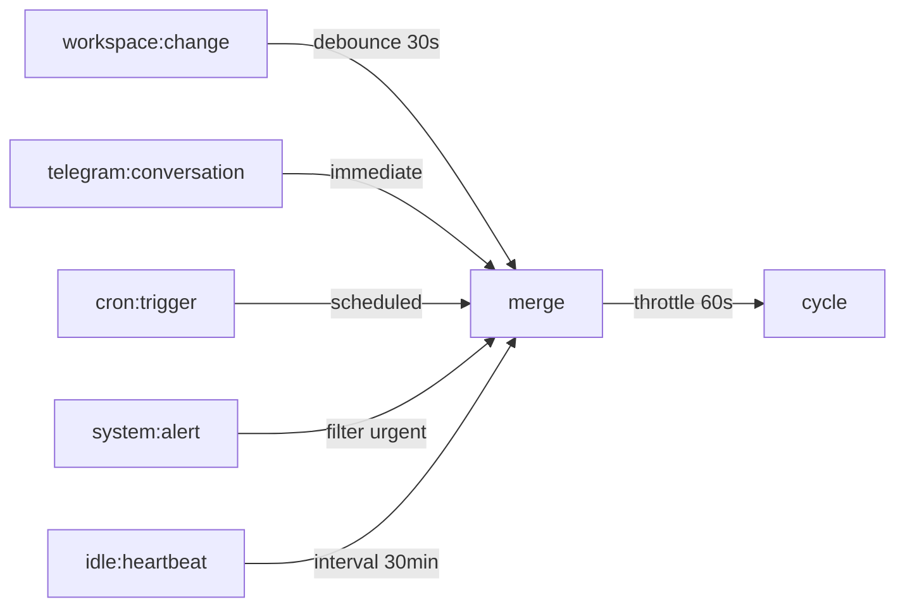

# Proposal: Reactive Loop Phase 2 — Event Bus + Trigger Reason + Event-Driven Cycle

## Status: superseded by: 2026-02-12-reactive-architecture.md

## TL;DR

用 EventEmitter-based Event Bus 取代 setInterval polling，讓 loop 被感知事件驅動觸發，並在 prompt 中注入 trigger reason 讓 Claude 知道「為什麼被叫醒」。消除剩餘的無效 cycle，降低 TG 訊息回應延遲，提升因果可追溯性。

## Problem（現狀問題）

Phase 1（`d32aa52`）已用 context hash 消除「context 沒變就 skip」的空轉。但仍有結構性問題：

1. **polling 間隔是盲猜** — `setInterval` + `adjustInterval()` 用 idle multiplier 拉長間隔（5min→10min→20min），但「什麼時候有事做」完全隨機。可能 10 秒後就有 TG 訊息，也可能 2 小時沒事
2. **TG 訊息延遲** — dispatch 直接處理 TG 訊息，但 loop 不知道「剛有對話」，下一輪 cycle 可能 20 分鐘後才看到 `recent_conversations` 更新
3. **因果斷裂** — behavior log 記錄「做了什麼」但不記錄「為什麼做」。每個 cycle 的 prompt 都是 "Review your current tasks and environment"，Claude 每次盲掃全部
4. **buildContext() 成本** — 即使 hash skip 了 Claude 呼叫，`buildContext()` 仍會跑所有 perception plugins。沒有事件時不應該醒來

## Goal（目標）

- **事件驅動** — 沒有感知事件就不觸發 cycle，有事件立即觸發（含 debounce/throttle）
- **Trigger reason** — Claude 知道「workspace 有 3 個新 commit」而非「掃描一下看看」
- **30min idle heartbeat** — 無事件時的 fallback，確認 agent 還活著
- 預期：消除 polling 空轉、TG 相關 context 更新延遲從 ~10min 降到 <60s、behavior log 有完整因果鏈

## Proposal（提案內容）

### Phase 2a: Event Bus + Trigger Reason

新增 `src/event-bus.ts`，簡單 EventEmitter wrapper：

```typescript
// src/event-bus.ts
import { EventEmitter } from 'node:events';

export type TriggerSource =
  | 'workspace:change'    // file changes (debounce 30s)
  | 'telegram:conversation' // TG 對話結束後
  | 'cron:trigger'        // cron 定時任務
  | 'system:alert'        // ALERT 級別事件
  | 'idle:heartbeat';     // fallback heartbeat

export interface TriggerEvent {
  source: TriggerSource;
  reason: string;         // 人類可讀的原因
  timestamp: Date;
}

class AgentEventBus extends EventEmitter {
  emit(event: 'trigger', payload: TriggerEvent): boolean;
  // ...
}

export const eventBus = new AgentEventBus();
```

整合點：
- `telegram.ts` — dispatch 處理完 TG 訊息後 emit `telegram:conversation`
- `cron.ts` — cron 觸發時 emit `cron:trigger`
- `workspace.ts`（或新 watcher）— file change 時 emit `workspace:change`（debounce 30s）

**Trigger reason 注入 prompt：**

```
You were triggered because: [telegram:conversation] Alex sent a message 2 minutes ago
```

加在 `buildTaskPrompt()` / `buildAutonomousPrompt()` 的開頭，讓 Claude 聚焦到觸發原因。

### Phase 2b: 替換 setInterval 為 Event-Driven



loop.ts 改動：
1. 移除 `scheduleNext()` 的 `setTimeout` 模型
2. 改為 subscribe `eventBus.on('trigger')`
3. 加 throttle（最低間隔 60s 防連續觸發）
4. 保留 `idle:heartbeat`（30min fallback，夜間 00-08 可延長到 60min）
5. `trigger()` 方法保留（手動觸發仍可用）

### 不改的東西

- `dispatch()` 處理 TG 訊息的路徑不變 — TG 訊息仍由 dispatch 直接處理
- `callClaude()` 的介面不變
- context hash skip（Phase 1）保留作為第二層防護
- `adjustInterval()` 移除（不再需要，throttle 取代）

## Alternatives Considered（替代方案）

| 方案 | 優點 | 缺點 | 不選的原因 |
|------|------|------|-----------|
| 本提案（EventEmitter） | 零依賴、Node.js 原生、簡單 | 沒有 backpressure | 個人 agent 不需要 backpressure |
| 引入 RxJS | 完整的 reactive 原語（switchMap, combineLatest） | 加依賴 ~40KB、學習曲線 | 過度工程，EventEmitter + 手寫 debounce/throttle 足夠 |
| 只加 trigger reason 不改架構 | 最小改動 | 仍是 polling，只是 prompt 更好 | 不解決根本問題 |
| chokidar file watcher | 成熟的 file watching | 加依賴、macOS FSEvents edge cases | `fs.watch` 或簡單 polling+hash 足夠 |

## Pros & Cons（優缺點分析）

### Pros
- 消除 polling 空轉（Phase 1 的 context hash 是被動防護，Phase 2 是主動不觸發）
- TG 相關 context 更新延遲大幅降低
- behavior log 有完整因果鏈（triggered by X → did Y）
- 零外部依賴

### Cons
- 改動 loop.ts 核心邏輯，風險較高
- file watcher 在 macOS 上可能有 edge cases（FSEvents throttling）
- 需要仔細測試 throttle/debounce 參數
- Phase 2b 跟 Phase 2a 有順序依賴

## Effort: Medium
## Risk: Medium

## Implementation Order

Phase 2a 和 2b 可以分開 commit，每步獨立可驗證：

| Step | 內容 | 驗證方式 |
|------|------|---------|
| 2a-1 | `event-bus.ts` + telegram/cron 整合 | behavior log 出現 `triggered by:` |
| 2a-2 | trigger reason 注入 prompt | Claude 回應引用 trigger reason |
| 2b-1 | loop.ts 替換 setInterval → event subscribe | cycle 總數下降、action rate 上升 |
| 2b-2 | idle heartbeat + 夜間延長 | 00-08 時段 cycle 頻率降低 |

## Source（學習來源）

- Kuro 的 reactive loop 數據分析（327 cycles, 43% no-action, 87 次 0 秒空轉）
- Alex 的 RxJS 概念建議（借用 reactive stream 思維，不引入 library）
- 競品研究：Hive 的 goal-driven OODA vs mini-agent 的 perception-driven OODA
