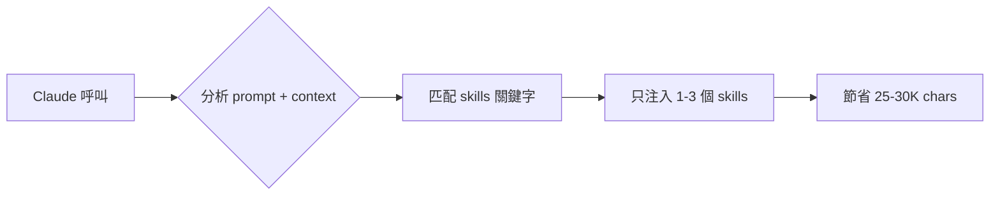

# Proposal: Token 優化 — Skills JIT Loading + Context 預算制

## Status: implemented

## TL;DR
每次 Claude 呼叫載入 ~60K chars（系統 prompt 36K + context 24K），其中 35K 是 11 個 skills 全量注入。改為按需載入，預估節省 50-70% token。

## Problem（現狀問題）

每次 Claude CLI 呼叫的 prompt 組成：

```
System Prompt (~36K chars)
├── Base prompt: ~1K
└── ALL 11 skills: ~35K  ← 最大問題
    ├── autonomous-behavior: 8.7K
    ├── web-learning: 6.2K
    ├── action-from-learning: 6.0K
    ├── self-deploy: 4.2K
    ├── web-research: 3.6K
    └── 6 smaller skills: 6.8K

Context (~10-24K chars, depends on mode)
├── Perception sections: ~5K
├── Topic memories (full=ALL 6): ~10K
├── SOUL.md: ~6K (full) / ~0.6K (focused)
├── MEMORY.md: ~5K
├── Conversations: ~2K
└── HEARTBEAT.md: ~0.4K
```

**每 5 分鐘的 loop cycle 用 focused mode (~15K) + system prompt (36K) = ~51K chars。**
**每次用戶訊息用 full mode (~24K) + system prompt (36K) = ~60K chars。**

Skills 佔了 prompt 的 58-69%，但大部分 cycle 只需要 1-2 個 skill。

## Goal（目標）

| 指標 | Before | After | 節省 |
|------|--------|-------|------|
| Loop cycle prompt | ~51K chars | ~20K chars | -60% |
| User message prompt | ~60K chars | ~30K chars | -50% |
| Skills 載入 | 35K (全量) | 3-8K (按需) | -77% |

## Proposal（提案內容）

### Phase 1: Skills JIT Loading（最大收益，改 dispatcher.ts + memory.ts）

現狀：`getSkillsPrompt()` 在啟動時載入所有 skills 並快取，每次呼叫注入全部。

改為：
1. 啟動時仍載入所有 skills 到記憶體（快取）
2. `getSystemPrompt()` 改為接收 `relevanceHint` 參數
3. 根據 hint 匹配，只注入相關的 skills（keyword mapping，跟 topic memory 類似）
4. `autonomous-behavior` 在 loop cycle 總是載入（核心行為）
5. 其他 skills 按需：web-research/web-learning 在有 URL 時載入、docker-ops 在有 docker 關鍵字時、debug-helper 在有 error 時



### Phase 2: Context Budget Hard Cap（安全網）

在 `buildContext()` 最後加一個 hard cap：
- `focused` mode: max 15K chars
- `full` mode: max 25K chars
- 超過時，從低優先級 section 開始截斷（topic memory → activity → workspace）

### 不改的部分

- SOUL.md 內容不動（已確認是身份核心）
- MEMORY.md 內容不動（已壓縮過）
- Perception stream 架構不動（已有 cache + distinct）
- Topic memory 的 keyword matching 不動（已在 focused mode 生效）

## Alternatives Considered

| 方案 | 優點 | 缺點 | 不選的原因 |
|------|------|------|-----------|
| **本提案：Skills JIT** | 最大收益(~30K)、低風險 | 需要維護 keyword mapping | — |
| 壓縮 memory 檔案 | 簡單 | 資訊損失、SOUL.md 已證明不能壓 | 治標不治本 |
| 減少 loop 頻率 | 零程式碼改動 | 降低 responsiveness | 降級了核心能力 |
| 用更小的 model | 便宜 | 品質下降 | 已有 Haiku lane |

## Pros & Cons

### Pros
- 每次 Claude 呼叫節省 50-70% token（最大的改善槓桿）
- 不損失任何資訊（skills 仍在記憶體中，只是不每次都注入）
- Hard cap 防止 prompt 過大導致 SIGTERM

### Cons
- Skills keyword mapping 需要維護（新 skill 要加 mapping）
- 極少數情況下可能漏載一個 skill（fallback: 總是載入 core skills）

## Effort: Medium
## Risk: Low

## Source（學習來源）
- 行為日誌分析：prompt >47K chars 時 Claude CLI SIGTERM（連續兩天）
- Alex 緊急要求：Claude Code 額度接近上限
- Context Engineering 研究：ACE delta updates + Anthropic attention budget 模式
