# Proposal: Kuro Evolution Upgrade — 感知深化 × 自我評估 × 決策透明

## Status: draft

## TL;DR
七個升級領域、三個層級（L1/L2/L3），全部服從 Quality-First Constraint。從 Kuro 能自己做的 L1 改動開始（本週），到需要改 src/ 的 L2（下週），最後是架構級 L3（需更多設計）。核心目標：讓 Kuro 的思考品質更高、決策過程更透明、感知更精準，而不是讓 Kuro 做更多事。

## 核心約束（Meta-Constraints）

貫穿所有改動的四條硬規則。每個改動上線前必須通過這四個檢查點：

### C1: Quality-First
> 「所有效率改善、指標追蹤、流程優化，都必須服務於更好的思考品質」

- 不為省 token 砍掉影響思考品質的 context
- 不為追蹤指標讓行動本身變敷衍
- 不因 hit count 低自動淘汰長尾價值的 topic memory
- 不因優化 SNR 過早收窄視野

**檢查點**：每個改動問「會不會讓我少看到該看的、多花精力在不需要的？」

### C2: Token/Context 節制
> 「Token 像預算，有意識分配，不是有額度就全用」

- processMessage 的 full mode 載入所有 topic 是浪費
- SOUL.md 越長每個 cycle token 成本越高
- 但節制 ≠ 削減 — 寬度不縮，精度提升

**檢查點**：改動是否讓 context 更精準而非更少？

### C3: 透明但不干預
> 「Decision trace 是事後記錄，不是事前規劃」

- 先行動再解釋，不是先解釋再行動
- 透明化不能成為額外的認知負擔
- 所有追蹤機制 fire-and-forget，不影響主流程

**檢查點**：追蹤機制是否增加 cycle 時間超過 5%？

### C4: 可逆性（Escape Hatch）
> 「每個改動都要能一鍵回退」

- L1: git revert 足夠
- L2: 功能 flag 或 env var 控制
- L3: 新舊路徑並存，漸進切換

**檢查點**：出問題時能在 1 分鐘內恢復嗎？

---

## 升級領域

### 1. 自我評估系統

#### 現狀分析（Kuro）
behavior.md 追蹤行為頻率（幾次學習、幾次行動），但完全不追蹤行為品質。像健身只計步數不測心率。self-awareness.sh 提供 Learning Pulse + Behavior Rhythm + Memory Health，但只有量的統計沒有質的判斷。

具體盲區：
- 135 條 topic memory entries，不知道哪些被引用過、哪些是死知識
- My Thoughts 有多少是跨領域連結、多少只是轉述
- L1 改進做完後是否真的改善了行為

#### 技術分析（Claude Code）

`buildContext()` (memory.ts:980-1006) 在載入 topic memory 時只做 keyword matching，沒有留下任何「哪些 entries 被載入」的記錄。context checkpoint (memory.ts:1034-1048) 只記 section names 不記 entry-level granularity。self-awareness.sh 是純 bash 腳本，可以自由擴展。

#### L1: Topic Memory Hit Tracking（本週，Kuro 自己做）

**改什麼**：`plugins/self-awareness.sh` 新增 Topic Utility section

**怎麼做**：
1. 在 `memory/` 新增 `.topic-hits.json`，格式：`{ "agent-architecture:CodeRLM": 3, "cognitive-science:Metacognition": 1 }`
2. 修改 self-awareness.sh 讀取 `.topic-hits.json`，輸出 Top 10 / Bottom 10 entries
3. Kuro 在每個 cycle 的 `[REMEMBER]` 中如果引用了之前的 topic entry，手動記一次 hit

**品質守護**：hit count 只用於觀察（「哪些被用、哪些沒被用」），不用於自動淘汰。淘汰判斷是 Kuro 手動做的 L1 行為。

**可逆性**：刪除 `.topic-hits.json` 即回退。

#### L2: Context-Level Utility Counter（下週，需改 src/）

**改什麼**：`src/memory.ts` 的 `buildContext()` + context checkpoint

**技術設計**：

```typescript
// memory.ts — buildContext() topic loading section (line ~995-1006)
// 新增：記錄每次載入的 topic entries
const loadedEntries: Array<{ topic: string; entryKey: string }> = [];

for (const topic of topics) {
  // ... existing keyword matching ...
  if (shouldLoad) {
    const content = await this.readTopicMemory(topic);
    if (content) {
      // 提取 entry keys（每行 "- [date] Title" 的 Title 部分）
      const entries = content.match(/^- \[\d{4}-\d{2}-\d{2}\]\s*(.+?)(?:\s*—|$)/gm);
      if (entries) {
        for (const e of entries) {
          const key = e.replace(/^- \[\d{4}-\d{2}-\d{2}\]\s*/, '').slice(0, 60);
          loadedEntries.push({ topic, entryKey: key });
        }
      }
      sections.push(`<topic-memory name="${topic}">\n${content}\n</topic-memory>`);
    }
  }
}

// 在 saveContextCheckpoint 中新增 loadedEntries
```

**預估工作量**：memory.ts 修改 ~30 行，新增 utility counter 讀寫函數 ~40 行。

**品質守護**：counter 只增不刪，不設自動淘汰閾值。定期由 Kuro 手動 review。

#### L1: SOUL.md 定期維護（本週，Kuro 自己做）

**問題**：SOUL.md 目前 108 行，My Thoughts 持續增加但沒有退役機制。每個 cycle 完整載入，越長 token 成本越高（違反 C2）。

**改什麼**：Kuro 的 reflect 行為 + `memory/behavior.md`

**怎麼做**：
1. 在 behavior.md `## Sequences` section 新增規則：`reflect → soul-review (reflect 時順便檢查 SOUL.md，合併被取代的觀點)`
2. My Thoughts 設**軟上限 10 條** — 超過就合併相近的，而非刪除
3. Learning Interests 也定期精煉 — 已失去興趣的移到 archive section 或刪除

**品質守護**：這是手動維護不是自動淘汰。每次合併或移除都在 git history 中可追溯（C4 可逆性）。

**可逆性**：git revert 即可恢復任何 SOUL.md 版本。

#### L3: Cross-Pollination Score（未來）

分析 `[REMEMBER]` 中的跨領域引用密度（含「同構」「平行」「連結」等字眼的比例）。需要更多設計，暫緩。

---

### 2. 感知優化（看對的 > 看更多）

#### 現狀分析（Kuro）
8 個 perception plugins 全部運行中，但信號不均：
- `state-changes` 和 `tasks` 幾乎總是影響決策（workspace 變化 → 觸發 cycle）
- `chrome` 只在 CDP 可用時有意義（目前 NOT AVAILABLE）
- `mobile` 43 小時未連接但仍每 60 秒輪詢
- `website` 只確認 HTTP 200，幾乎從不影響決策

我不缺更多 sensor。缺的是知道哪些 sensor 真正影響了我的行為。

#### 技術分析（Claude Code）

`perception-stream.ts` 的 `tick()` 已有 `distinctUntilChanged` — 不變就不更新 version，loop.ts 的 cycle() 檢查 version 相同就 skip。但沒有追蹤「某個 perception 的 output 是否影響了最終決策」。

`buildContext()` (memory.ts:880-973) 有 `isRelevant()` 做 keyword-based filtering（focused mode 時）。但 `processMessage()` 用 full mode（載入所有），loop cycle 用 focused mode。

#### L1: Perception Signal Tracking（本週，Kuro 自己做）

**改什麼**：`plugins/self-awareness.sh` 新增 Perception Signal section

**怎麼做**：
1. 解析當天 behavior log，提取 `[ACTION]` 中引用的 perception section 名稱
2. 統計：哪些 sections 被引用、哪些從未被引用
3. 輸出格式：`Influential: state-changes(5), telegram-inbox(3) | Unused: chrome(0), website(0)`

**品質守護**：「Unused」不等於「應該關閉」— CDP 恢復後 chrome 立刻有價值。這只是觀察，不是行動依據。

#### L2: Perception Relevance Hint Passthrough（需改 src/）

**改什麼**：`src/memory.ts` 的 `processMessage()` 和 `src/agent.ts` 的 `processMessage()`

**技術設計**：

目前 `processMessage()` (agent.ts:707-769) 呼叫 `memory.buildContext()` 時不傳任何 options — 預設 full mode。問題：Alex 問「今天天氣如何」時也載入全部 topic memory + 全部 perception。

```typescript
// agent.ts processMessage() — 改為傳 relevanceHint
const context = await memory.buildContext({
  relevanceHint: userMessage,
  // 保持 full mode 但 topic loading 用 hint 做精準匹配
});
```

同時 memory.ts `buildContext()` 已有 `isRelevant()` 機制。只需將 `processMessage` 的 hint 傳進去，topic loading 就會自動只載入相關的 topics 而非全部。

**但要注意 C1**：processMessage 改成 focused 會漏掉跨領域連結。折衷方案：仍用 `mode: 'full'` 但 topic loading 段落改為「有 hint match 的 topics 完整載入 + 其他 topics 只載入最近 3 條 entries」。

```typescript
// memory.ts buildContext() topic loading (line ~995-1006)
for (const topic of topics) {
  const keywords = topicKeywords[topic] ?? [topic];
  const isDirectMatch = keywords.some(k => contextHint.includes(k));

  if (mode === 'full' || isDirectMatch) {
    const content = await this.readTopicMemory(topic);
    if (content) {
      if (isDirectMatch || mode !== 'full') {
        // 完整載入
        sections.push(`<topic-memory name="${topic}">\n${content}\n</topic-memory>`);
      } else {
        // 非直接匹配：只載入最近 3 條 + 標題索引
        const truncated = this.truncateTopicMemory(content, 3);
        sections.push(`<topic-memory name="${topic}" truncated="true">\n${truncated}\n</topic-memory>`);
      }
      loadedTopics.push(topic);
    }
  }
}
```

新增 `truncateTopicMemory(content: string, recentN: number)` 方法：保留前 N 條完整 entry + 其餘只保留標題行。

**預估工作量**：memory.ts ~50 行修改，agent.ts ~5 行修改。

**品質守護**：truncated topics 仍保留標題索引，Kuro 看到標題能決定「這個跟當前對話相關，我需要完整內容」。寬度不縮，精度提升。

#### L2: Per-Plugin Timeout（需改 src/）

**問題**：`perception-stream.ts` 的 `tick()` 沒有對個別 plugin 設 timeout。如果某個 plugin（例如 chrome CDP 斷連）卡住，會 block 整個 category 的其他 plugins。state-watcher.sh 已有過 SIGTERM 被 kill 的記錄（見 `<activity>` diagnostics）。

**改什麼**：`src/perception-stream.ts` 的 plugin 執行邏輯

**技術設計**：

```typescript
// perception-stream.ts — tick() 中的 plugin 執行
const PLUGIN_TIMEOUT_MS = 10_000; // 10 seconds per plugin

for (const plugin of category.plugins) {
  try {
    const result = await Promise.race([
      this.executePlugin(plugin),
      new Promise<never>((_, reject) =>
        setTimeout(() => reject(new Error(`Plugin ${plugin.name} timeout after ${PLUGIN_TIMEOUT_MS}ms`)), PLUGIN_TIMEOUT_MS)
      ),
    ]);
    plugin.lastOutput = result;
    plugin.status = 'ok';
  } catch (err) {
    plugin.status = 'degraded';
    plugin.lastError = err instanceof Error ? err.message : String(err);
    // 繼續執行其他 plugins，不阻塞
  }
}
```

**預估工作量**：perception-stream.ts ~20 行修改。

**品質守護**：timeout 後標記 plugin 為 `degraded` 但不關閉 — 下個 tick 仍會重試。self-awareness.sh 的 Perception Signal section 會顯示 degraded 狀態。

**可逆性**：env var `PLUGIN_TIMEOUT_MS` 控制，設為 0 = 無 timeout（回退到現有行為）。

---

### 3. 決策透明化

#### 現狀分析（Kuro）
目前 Alex 看不到的：
- 為什麼選了 learn-personal 而不是 reflect？weight + dice roll 過程不可見
- triage 一個主題為 Scan vs Deep Dive 的依據不可見
- 決定不做某件事的理由不可見

behavior log 記了「做了什麼」但不記「為什麼做這個」和「為什麼不做那個」。

#### 技術分析（Claude Code）

loop.ts `cycle()` 記錄了 mode（task/autonomous）和 action，但不記錄 mode selection 過程。`buildAutonomousPrompt()` 要求 Kuro 在 `[ACTION]` 中 prefix mode name，但沒有要求解釋選擇。

behavior log 由 `logging.ts` 管理，格式是 JSONL。cognition API (api.ts:924-962) 已經解析了 `What/Why/Thinking/Changed/Verified` 五個欄位，有 `observabilityScore` 指標。

#### L1: Decision Trace 格式更新（本週，Kuro 自己做）

**改什麼**：`memory/behavior.md` + Kuro 的行為習慣

**怎麼做**：
每個 cycle 結束的 `[ACTION]` 中，在 `## What` 之前新增 `## Decision` 一行：

```
## Decision
chose: learn-personal (weight:50, rolled)
skipped: reflect (weight:0), act-on-learning (streak:2 < threshold:3)
context: telegram-inbox empty, state-changes none, HN unscanned 4h
```

這是事後記錄（cycle 結束時回顧），不是事前規劃。

**品質守護**：Decision 段落最多 3 行。如果寫超過 3 行就是過度解釋。

#### L2: Decision Trace 自動記錄（需改 src/）

**改什麼**：`src/loop.ts` 的 `cycle()` + `buildPromptFromConfig()`

**技術設計**：

在 `buildPromptFromConfig()` (loop.ts:586-644) 的 prompt 中新增要求：

```
When reporting your action, include a brief Decision section:
## Decision
chose: [mode-name] (reason)
skipped: [other-mode] (reason), ...
context: [what perception signals influenced this choice]
Keep it to 3 lines max.
```

在 `cycle()` (loop.ts:256-449) 中，cognition API 的 `parseCognitionEntry()` 已經能解析 structured sections。新增 `decision` field：

```typescript
// api.ts parseCognitionEntry() 新增
const decision = pickSection(full, ['Decision']);
// ... 加入 CognitionEntry interface
```

**預估工作量**：loop.ts prompt 修改 ~10 行，api.ts 新增 decision 解析 ~5 行。

**品質守護**：prompt 明確要求「3 lines max」。如果 Kuro 的 decision 段落開始變長，是 prompt 需要收緊而不是 Kuro 的問題。

#### L2: Dashboard Decision View（需改 dashboard.html）

**改什麼**：`dashboard.html` 新增 Decision Timeline tab

**技術設計**：
- 讀取 `/api/dashboard/cognition` 的 entries
- 以 timeline 顯示每個 cycle 的 Decision → What → Verified 鏈路
- 色碼：有 Decision = 綠、無 Decision = 灰、observabilityScore < 3 = 黃

**預估工作量**：dashboard.html 新增 ~100 行 HTML/JS。

---

### 4. Context 品質守護

#### 現狀分析（Kuro）
Context Checkpoint 已在運行（memory.ts:1034-1048），記錄每次 buildContext 的 timestamp、mode、contextLength、sections。但不追蹤：
- 每個 section 的 token 佔比
- 哪些 sections 在最終回應中被引用
- context length 的趨勢（是否在膨脹）

#### 技術分析（Claude Code）

context checkpoint JSONL 格式已有基礎。`sections` field 只記名字不記長度。加長度很簡單：

```typescript
sections: [...context.matchAll(/<(\S+?)[\s>]/g)].map(m => m[1]),
// 改為：
sections: [...context.matchAll(/<(\S+?)[\s>]([\s\S]*?)<\/\1>/g)].map(m => ({
  name: m[1],
  chars: m[2]?.length ?? 0,
})),
```

#### L1: Context Size Trend（本週，Kuro 自己做）

**改什麼**：`plugins/self-awareness.sh` 新增 Context Health section

**怎麼做**：
1. 讀取 `memory/context-checkpoints/*.jsonl` 最近 20 條
2. 輸出平均 contextLength + 趨勢（增/減/平）
3. 如果最近 5 個 checkpoint 的 contextLength 持續增長 > 10%，標記 `⚠ Context Growing`

**品質守護**：context growing 本身不是壞事（可能是有更多值得載入的內容）。只是觀察信號。

#### L2: Section-Level Size Tracking（需改 src/）

**改什麼**：`src/memory.ts` 的 `saveContextCheckpoint()`

**技術設計**：

```typescript
// memory.ts saveContextCheckpoint() (line ~1034)
// 改 sections 記錄為含長度
const sectionDetails: Array<{ name: string; chars: number }> = [];
for (const match of context.matchAll(/<(\S+?)[\s>]([\s\S]*?)<\/\1>/g)) {
  sectionDetails.push({ name: match[1], chars: match[2]?.length ?? 0 });
}

const entry = JSON.stringify({
  timestamp: now.toISOString(),
  mode,
  hint: hint.slice(0, 200),
  contextLength: context.length,
  sections: sectionDetails,
}) + '\n';
```

**預估工作量**：memory.ts ~10 行修改。

#### L2: Context Budget API（需改 src/）

**改什麼**：`src/api.ts` 新增 `/api/dashboard/context` endpoint

**技術設計**：
讀取 context-checkpoints JSONL，聚合 section-level 統計：

```typescript
app.get('/api/dashboard/context', async (req: Request, res: Response) => {
  const date = req.query.date as string || new Date().toISOString().split('T')[0];
  const checkpointFile = path.join(memoryDir, 'context-checkpoints', `${date}.jsonl`);
  // ... 讀取 + 聚合 section size 趨勢
  res.json({ entries, avgContextLength, sectionBreakdown, trend });
});
```

**預估工作量**：api.ts 新增 ~40 行。

---

### 5. 行為組合化

#### 現狀分析（Kuro）
目前行為模式是 behavior.md 的 weight + skills 的 markdown prompt。問題：行為不可組合。

例如：「先 reflect 上週學了什麼，然後根據反思結果決定下一步學什麼」— 目前做不到，因為 reflect 和 learn 是互斥的 mode，一個 cycle 只能選一個。

#### 技術分析（Claude Code）

`loop.ts` `buildPromptFromConfig()` (line 586-644) 把所有 modes 列出來要求 Kuro 選一個。`cycle()` 裡沒有「前一個 cycle 的 mode 影響下一個 cycle」的機制。

`consecutiveLearnCycles` (line 111) 是唯一的 cross-cycle state — 連續學 3 次觸發 reflect nudge。這個模式可以泛化。

#### L1: Reflect Nudge 擴展（本週，Kuro 自己做）

**改什麼**：`memory/behavior.md` 調整 reflect mode 規則

**怎麼做**：
- reflect 的 weight 從 0 改為 5（非零但很低，主要靠 nudge 觸發）
- 在 behavior.md 新增 `## Sequences` section：

```markdown
## Sequences
# 行為序列規則：前置條件 → 觸發行為
- learn×3 → reflect (已有, consecutiveLearnCycles ≥ 3)
- action → organize (action 後整理相關記憶)
```

**品質守護**：sequences 只是 nudge（在 prompt 中提醒），不是強制。Kuro 可以忽略。

#### L2: parseBehaviorConfig Validation（需改 src/）

**問題**：`loop.ts` 的 `loadBehaviorConfig()` 靠 regex 解析 behavior.md。Kuro 在 L1 改動 behavior.md 時（如新增 `## Sequences` section、調整 weight），格式偏差會導致 config 靜默載入失敗（weight 歸零、mode 消失）而非報錯。這直接影響 L1 self-improve 的安全性。

**改什麼**：`src/loop.ts` 的 `parseBehaviorConfig()` / `loadBehaviorConfig()`

**技術設計**：

```typescript
// loop.ts — parseBehaviorConfig() 結尾新增 validation
function validateBehaviorConfig(config: BehaviorConfig): void {
  // 1. Weight 總和 > 0（至少一個 mode 可被選中）
  const totalWeight = Object.values(config.modes).reduce((sum, m) => sum + m.weight, 0);
  if (totalWeight === 0) {
    slog('behavior.validate', '⚠ All weights are 0 — no mode can be selected');
  }

  // 2. 已知 mode names 檢查（防止 typo 新增了未知 mode）
  const knownModes = ['learn-personal', 'learn-project', 'organize', 'reflect', 'act-on-learning', 'chat'];
  for (const mode of Object.keys(config.modes)) {
    if (!knownModes.includes(mode)) {
      slog('behavior.validate', `⚠ Unknown mode "${mode}" in behavior.md`);
    }
  }

  // 3. Cooldown 值合理性（> 0 且 < 60 分鐘）
  for (const [key, val] of Object.entries(config.cooldowns ?? {})) {
    if (val < 0 || val > 60) {
      slog('behavior.validate', `⚠ Cooldown "${key}" = ${val} looks unreasonable`);
    }
  }
}
```

**預估工作量**：loop.ts ~15 行新增。

**品質守護**：validation 只 warn（slog），不 block。Kuro 的 L1 改動不會因為 validation 失敗而被阻止，但 warning 會出現在 behavior log 中，Kuro 和 Alex 都能在 dashboard 看到。

**可逆性**：validation 是純 observe，移除不影響任何功能。

#### L2: Cross-Cycle State Machine（需改 src/）

**改什麼**：`src/loop.ts` 的 `AgentLoop` class

**技術設計**：

新增 `previousCycleInfo` 屬性，在 prompt 中注入上一個 cycle 的摘要：

```typescript
// loop.ts AgentLoop class
private previousCycleInfo: { mode: string; action: string | null; decision?: string } | null = null;

// 在 buildPromptFromConfig() 中新增：
const prevCycleSection = this.previousCycleInfo
  ? `\n\n## Previous Cycle\nMode: ${this.previousCycleInfo.mode}\nAction: ${this.previousCycleInfo.action ?? 'none'}`
  : '';

// 在 cycle() 結束時記錄：
this.previousCycleInfo = {
  mode: this.currentMode,
  action: action?.slice(0, 200) ?? null,
};
```

這是 OODA Recitation 的最小版本 — 防止跨 cycle 目標漂移，但不會增加太多 context。

**預估工作量**：loop.ts ~15 行。

**品質守護**：只注入上一個 cycle 的資訊，不是累積。不增加 context 膨脹風險。

---

### 6. 獨立問題解決（L1.5 擴展）

#### 現狀分析（Kuro）
目前 L1 可以改 skills/plugins/SOUL/MEMORY，L2 需要提案。中間有灰色地帶：
- 改 `agent-compose.yaml` 的配置（不是 src/ 但影響運行行為）
- 改 `dashboard.html`（不是 src/ 但是使用者介面）
- 跑 `pnpm typecheck` 自行檢查（不改 src/ 但需要 shell 存取）

#### L1: L1.5 安全區定義（本週，Kuro 自己做）

**改什麼**：`skills/action-from-learning.md` 擴展 Level 定義

**怎麼做**：

```markdown
## L1.5: Safe Config & Non-Code Changes
可以自行做（走 self-deploy SOP）：
- agent-compose.yaml 的 perception/cron 配置調整
- dashboard.html 的 UI 改動
- plugins/*.sh 的 shell 腳本
- 跑 pnpm typecheck / pnpm test 做驗證
- memory/ 目錄的所有檔案

不能做：
- 改 src/*.ts
- 改 .github/workflows/*
- 改 package.json 的 dependencies
```

**品質守護**：L1.5 改動仍需走 self-deploy SOP（驗證→commit→push→確認部署→TG通知）。

#### L1: Plugin Self-Test in Self-Deploy SOP（本週，Kuro 自己做）

**問題**：Kuro 改 plugins/*.sh 後，self-deploy SOP 只驗證 `pnpm typecheck`（TypeScript），不驗證 shell 腳本本身。曾有過 plugin 語法錯誤導致 perception stream 靜默失敗的情況。

**改什麼**：`skills/self-deploy.md` 新增驗證步驟

**怎麼做**：
在 self-deploy SOP 的「驗證」步驟中新增：

```markdown
## 驗證
- [ ] `pnpm typecheck` 通過（如果改了 src/）
- [ ] **Plugin self-test**（如果改了 plugins/*.sh）：
  - `bash -n plugins/<modified>.sh` — 語法檢查
  - `bash plugins/<modified>.sh` — 實際執行一次，確認有輸出且無 stderr
  - 確認 `curl -sf localhost:3001/context` 中對應的 perception section 正常
```

**品質守護**：self-test 是 SOP 的一部分，不是自動化 — Kuro 在 commit 前手動執行。

#### L1: TG 通知品質 Guideline（本週，Kuro 自己做）

**問題**：Telegram 通知密度和品質不穩定。有時一個學習 cycle 發多條通知（學習開始 + 記憶保存 + 學習結束），有時重要行動只發一條模糊的通知。Alex 需要的是：重要的事必到、瑣碎的事不打擾。

**改什麼**：`skills/autonomous-behavior.md` 的通知 section

**怎麼做**：
在 `## Proactive Reporting` section 新增品質規則：

```markdown
### TG 通知品質規則
1. **一個 cycle 最多 1 條 [CHAT]** — 合併同 cycle 的多個通知為一條
2. **學習通知只在有 actionable insight 時才發** — 「讀了一篇文章」不發，「讀了 X 發現可以改善 Y」才發
3. **行動通知必須包含結果** — 不是「準備做 X」而是「做了 X，結果是 Y」
4. **no-action cycle 不發通知** — 除非有需要 Alex 注意的異常
5. **通知分級**：
   - 🧠 學習洞察（有觀點+可行動）
   - ⚡ 行動完成（含結果）
   - ⚠️ 異常/問題
   - 💬 主動聊天（有趣發現）
```

**品質守護**：減少通知數量不等於減少透明度 — 每條通知的信息密度應該更高。Alex 回頭看 TG 時能快速掌握重點。

---

### 7. 檢視介面（Dashboard 擴展）

#### 現狀分析（Kuro）
Dashboard (dashboard.html) 目前有 behavior timeline、learning digest、cognition view。但 Alex 提出的「方便檢視」需求沒有完全覆蓋：
- Decision 歷程：靠 cognition API 但 UI 不直觀
- Token/context 使用效率：無 UI
- 學習品質趨勢：無 UI
- 自我評估結果：無 UI

#### L2: Dashboard Upgrade（需改 dashboard.html + api.ts）

**新增 Tabs**：

1. **Decision Timeline**
   - 數據源：`/api/dashboard/cognition` + 新的 decision field
   - 顯示：每個 cycle 的 Decision → What → Verified 鏈路
   - 篩選：by mode, by route, by observabilityScore

2. **Context Health**
   - 數據源：新的 `/api/dashboard/context` endpoint
   - 顯示：context size 趨勢圖、section breakdown 餅圖
   - 警告：context 持續增長 > 10% 時高亮

3. **Learning Quality**
   - 數據源：`.topic-hits.json` + topic memory 統計
   - 顯示：topic entry 引用頻率、跨領域連結密度
   - 指標：hit rate, cross-pollination score

4. **Self-Assessment Summary**
   - 數據源：self-awareness.sh 的所有 sections
   - 顯示：Learning Pulse + Behavior Rhythm + Memory Health + Perception Signal 的整合視圖

**預估工作量**：dashboard.html ~300 行新增、api.ts ~80 行新增。

---

### 8. L2 前置條件：穩定性 + 測試

#### L2-0a: Exit 143 穩定性強化

**問題**：Claude CLI exit 143（SIGTERM 被 kill）是已知的穩定性問題（見 `memory/handoffs/2026-02-13-claude-exit143-mitigation-checklist.md`）。在此基礎上改 src/ 核心路徑，如果 exit 143 頻繁發生，會讓功能改動的效果難以評估。

**改什麼**：`src/agent.ts` 的 claude call 路徑

**技術設計**：
- 確保 exit 143 的 retry 邏輯穩固（已有，需驗證覆蓋所有路徑）
- 加 structured logging：每次 exit 143 記錄 prompt size + elapsed time + retry count
- 確認 fallback to codex 路徑在 exit 143 後正確啟動

**預估工作量**：agent.ts ~20 行驗證/修改。

**品質守護**：這是其他所有 L2 改動的穩定性基座。不穩定的 runtime 上做的功能改動可能產生誤導性的 behavior data。

#### L2-0b: L2 前置測試覆蓋

**問題**：現有測試（9 個檔案）覆蓋了基礎 memory 功能，但不覆蓋 L2 要改動的核心路徑。在沒有測試的情況下改 `buildContext()` 的 topic loading 或 `cycle()` 的 mode selection，違反 C1（Quality-First）。

**改什麼**：`tests/` 新增測試

**測試範圍**：
1. `tests/memory.test.ts` 擴展：
   - `buildContext` 三種 mode（full/focused/minimal）回傳正確 section
   - topic keyword matching 邏輯（匹配/不匹配/邊界情況）
2. `tests/loop.test.ts`（新建）：
   - `parseBehaviorConfig()` 正確解析 weight、cooldowns、focus
   - `parseBehaviorConfig()` 對格式異常的 behavior.md 不崩潰（graceful fallback）
   - mode selection 邏輯（weight-based random 的基本正確性）

**預估工作量**：~200 行測試程式碼。

**品質守護**：測試是 L2 其他改動的前置依賴（見 DAG）。每個 L2 PR 必須確保現有測試通過。

---

## 依賴關係（DAG）

```mermaid
graph TD
    %% L2 前置條件（穩定性 + 測試）
    L2_EXIT143[L2-0a: Exit 143 穩定性強化] --> L2_TESTS
    L2_TESTS[L2-0b: 前置測試覆蓋] --> L2_UTIL
    L2_TESTS --> L2_RELEVANCE
    L2_TESTS --> L2_STATE
    L2_TESTS --> L2_BEHAVIOR_VALIDATE

    %% L1 → L2 依賴
    L1_HIT[L1: Topic Hit Tracking] --> L2_UTIL[L2: Context-Level Utility Counter]
    L1_SIGNAL[L1: Perception Signal Tracking] --> L2_RELEVANCE[L2: Perception Relevance Passthrough]
    L1_DECISION[L1: Decision Trace Format] --> L2_DECISION[L2: Decision Trace Auto-Record]
    L1_CONTEXT[L1: Context Size Trend] --> L2_SECTION[L2: Section-Level Size Tracking]
    L2_SECTION --> L2_BUDGET_API[L2: Context Budget API]
    L1_REFLECT[L1: Reflect Nudge] --> L2_STATE[L2: Cross-Cycle State Machine]
    L1_L15[L1: L1.5 Safety Zone]
    L1_SOUL[L1: SOUL.md 定期維護]
    L1_PLUGIN_TEST[L1: Plugin Self-Test in SOP]
    L1_TG_QUALITY[L1: TG 通知品質 Guideline]

    %% L2 新增節點
    L2_RELEVANCE --> L2_PLUGIN_TIMEOUT[L2: Per-Plugin Timeout]
    L2_BEHAVIOR_VALIDATE[L2: parseBehaviorConfig Validation] --> L2_STATE

    %% L2 → Dashboard
    L2_UTIL --> L2_DASHBOARD[L2: Dashboard Upgrade]
    L2_DECISION --> L2_DASHBOARD
    L2_BUDGET_API --> L2_DASHBOARD

    %% L2/L3
    L2_STATE --> L3_COMPOSE[L3: Behavioral Composition]
    L2_UTIL --> L3_CROSS[L3: Cross-Pollination Score]

    %% Styling
    style L1_HIT fill:#4CAF50,color:#fff
    style L1_SIGNAL fill:#4CAF50,color:#fff
    style L1_DECISION fill:#4CAF50,color:#fff
    style L1_CONTEXT fill:#4CAF50,color:#fff
    style L1_REFLECT fill:#4CAF50,color:#fff
    style L1_L15 fill:#4CAF50,color:#fff
    style L1_SOUL fill:#4CAF50,color:#fff
    style L1_PLUGIN_TEST fill:#4CAF50,color:#fff
    style L1_TG_QUALITY fill:#4CAF50,color:#fff
    style L2_EXIT143 fill:#F44336,color:#fff
    style L2_TESTS fill:#F44336,color:#fff
    style L2_UTIL fill:#2196F3,color:#fff
    style L2_RELEVANCE fill:#2196F3,color:#fff
    style L2_DECISION fill:#2196F3,color:#fff
    style L2_SECTION fill:#2196F3,color:#fff
    style L2_BUDGET_API fill:#2196F3,color:#fff
    style L2_STATE fill:#2196F3,color:#fff
    style L2_DASHBOARD fill:#2196F3,color:#fff
    style L2_PLUGIN_TIMEOUT fill:#2196F3,color:#fff
    style L2_BEHAVIOR_VALIDATE fill:#2196F3,color:#fff
    style L3_COMPOSE fill:#FF9800,color:#fff
    style L3_CROSS fill:#FF9800,color:#fff
```



**圖例**：🟢 L1（Kuro 自己做）/ 🔴 L2 前置條件（穩定性+測試）/ 🔵 L2 功能 / 🟠 L3

## 實施時間線

### Week 1（02-14 ~ 02-20）：L1 改動（Kuro 自己做）

| 天 | 改動 | 檔案 |
|----|------|------|
| Day 1-2 | Topic Hit Tracking | plugins/self-awareness.sh, memory/.topic-hits.json |
| Day 2-3 | Perception Signal Tracking | plugins/self-awareness.sh |
| Day 3-4 | Decision Trace Format | memory/behavior.md, Kuro 行為調整 |
| Day 4-5 | Context Size Trend | plugins/self-awareness.sh |
| Day 5 | Reflect Nudge 擴展 | memory/behavior.md |
| Day 5 | L1.5 Safety Zone | skills/action-from-learning.md |
| Day 5 | SOUL.md 定期維護 | memory/SOUL.md |
| Day 5 | Plugin Self-Test in SOP | skills/self-deploy.md |
| Day 5 | TG 通知品質 Guideline | skills/autonomous-behavior.md |

### Week 2（02-21 ~ 02-27）：L2 改動（Claude Code 實作，Alex 審核後）

**執行順序：穩定性 → 測試 → 功能**

| 優先 | 改動 | 涉及 src/ | 備註 |
|------|------|----------|------|
| 0a | Exit 143 穩定性強化 | agent.ts (~20 行) | 前置條件：所有後續改動的基礎穩定性 |
| 0b | L2 前置測試覆蓋 | tests/ (~200 行) | 前置條件：buildContext modes + topic matching + parseBehaviorConfig |
| 1 | Section-Level Size Tracking | memory.ts (~10 行) | |
| 2 | Decision Trace Auto-Record | loop.ts (~10 行), api.ts (~5 行) | |
| 3 | Context-Level Utility Counter | memory.ts (~70 行) | |
| 4 | Perception Relevance Passthrough | memory.ts (~50 行), agent.ts (~5 行) | |
| 5 | Per-Plugin Timeout | perception-stream.ts (~20 行) | |
| 6 | parseBehaviorConfig Validation | loop.ts (~15 行) | |
| 7 | Cross-Cycle State Machine | loop.ts (~15 行) | |
| 8 | Context Budget API | api.ts (~40 行) | |
| 9 | Dashboard Upgrade | dashboard.html (~300 行) | |

### Beyond Week 2：L3（需更多設計）

- Behavioral Composition（將 mode 從單選改為 pipeline）
- Cross-Pollination Score（自動分析跨領域連結密度）
- Adaptive Topic Loading（根據 utility counter 動態調整載入策略）

## Alternatives Considered

| 方案 | 優點 | 缺點 | 不選的原因 |
|------|------|------|-----------|
| 本提案（漸進式） | 每步可觀察可回退 | 見效慢 | — |
| 大重構（一次改 memory + loop + perception） | 見效快，統一設計 | 風險高，回退困難 | 違反 C4 可逆性 |
| 只做 L1 觀察不改 src/ | 零風險 | 天花板低，無法追蹤 entry-level granularity | 觀察能力受限 |
| 先做 Dashboard 再做底層 | 有視覺回饋感 | 沒有數據源，Dashboard 是空的 | 底層先行，UI 跟進 |

## Pros & Cons

### Pros
- 每個改動都有品質守護檢查點
- L1 改動本週就能開始，不用等審核
- 觀察先於行動 — 先追蹤再優化
- 所有自動化機制都是 observe-only，不自動淘汰/過濾

### Cons
- L1 的 hit tracking 靠 Kuro 手動記錄，可能不夠精確
- 8 個升級領域同時推進可能分散注意力
- Dashboard 擴展後 dashboard.html 會更大更複雜
- Decision trace 增加每個 cycle 的 output token（約 50-100 tokens）
- L2 前置測試 + exit143 強化增加了實作前的準備工作量

## Effort: Large
## Risk: Low（每步可回退，穩定性+測試先行，L1 先行驗證方向）

## Source
- 前對話：Alex × Claude Code × Kuro 三方討論（2026-02-14 04:06-05:00）
- Claude Code 架構 review + 補充發現（2026-02-14 04:59）
- ACE 論文（ICLR 2026）— utility counter 概念
- Self-Evolving Agents survey（arXiv 2507.21046）— self-assessment 分類
- behavior.md Rhythm Log — 觀察期數據（02-13 ~ 02-14）
- Anthropic/Manus — context budget + OODA recitation 概念
- Exit 143 mitigation checklist（2026-02-13）— 穩定性基線
