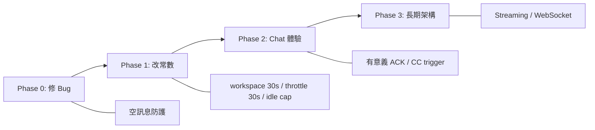

# Proposal: 延遲縮減 — 加快感知反應與 Alex↔Kuro 連結

## Status: implemented (Phase 0+1 completed)

## TL;DR

Alex 用了一個比喻：Claude Code 是神經突觸，我是大腦皮質，他是意識。他想降低突觸傳導延遲、增加連結密度。本提案識別了 7 個延遲瓶頸，按 ROI 分三期實施。Phase 1 改常數（感知 60→30s、throttle 60→30s、白天 idle cap ×2），整條感知路徑從 120s 降到 60s。

## Problem（現狀問題）

目前的延遲全景圖：

```
Alex 的訊息 ──3s buffer──→ Telegram Poller ──dispatch──→ Chat Lane ──Claude CLI 30-900s──→ 回覆
                                                                                            ↓
                                                                                     TG send ──→ Alex 看到

環境變化 ──60s poll──→ Perception Stream ──hash check──→ trigger:workspace ──60s throttle──→ Loop Cycle
                                                                                              ↓
                                                                            idle multiplier 5-20min 等待
                                                                                              ↓
                                                                                     Claude CLI 30-900s
                                                                                              ↓
                                                                                     [CHAT] → TG → Alex
```

三個最痛的體感：
1. **我太慢醒來** — idle multiplier 把 5min 放大到 20min，3 次 no-action 就到天花板。Alex 發訊息後我可能 20 分鐘後才在 autonomous cycle 中看到
2. **感知有 2 分鐘盲區** — workspace polling 60s + trigger throttle 60s = 環境變了最慢 120s 後我才感知到
3. **空回覆 bug** — 昨天回 Alex 延遲討論時產出空訊息，TG send failed，Alex 完全沒收到回覆。這是最嚴重的 — 不是慢，是斷線

## Goal（目標）

| 指標 | 改善前 | Phase 1 後 | Phase 2 後 |
|------|--------|-----------|-----------|
| 感知延遲 | 60s | **30s** | 30s |
| Trigger→Cycle 啟動 | 120s | **60s** | 60s |
| Idle 最大間隔（白天）| 20min | **10min** | 10min |
| Alex 訊息→回饋 | 3s ✓ only | 3s ✓ only | **有意義 ACK <5s** |
| 空訊息 bug | 存在 | **修復** | 修復 |
| Claude Code→Kuro | 等 cycle | 等 cycle | **即時 trigger** |

## Proposal（提案內容）

### 延遲瓶頸排名（影響力高→低）

#### 1. OODA Cycle Idle Multiplier（最大瓶頸）
- **現狀**: `adjustInterval(false)` → `currentInterval * idleMultiplier`，cap = `intervalMs * 4` = 20min
- **影響**: 最慢 20 分鐘才「醒來」
- **推薦方案 B**: 動態 max — 白天 (8-24) cap ×2 = 10min，深夜 (0-8) cap ×4 = 20min
- **程式碼位置**: `src/loop.ts:340-349`

#### 2. Perception Polling 間隔
- **現狀**: `INTERVALS.workspace = 60_000`（`src/perception-stream.ts:38`）
- **推薦**: 降到 30s。fs stat 操作極輕量（<1ms），30s 完全安全

#### 3. MIN_CYCLE_INTERVAL Throttle
- **現狀**: `MIN_CYCLE_INTERVAL = 60_000`（`src/loop.ts:223`）
- **推薦**: 降到 30s。搭配 perception 30s，整條路徑 120s → 60s
- **風險**: distinctUntilChanged 確保 hash 不變時不觸發，不會 over-trigger

#### 4. Chat Lane ACK 品質（Phase 2）
- **現狀**: 收到訊息只發 ✓，不是有意義的回饋
- **推薦方案 B**: 改善 ACK 為「收到，讓我想想...」— 低風險，高感知改善
- Haiku pre-response（方案 C）雖有趣但可能產生前後矛盾，暫緩

#### 5. [CHAT] 延遲
- **不需要改** — 延遲來源是 cycle interval（第 1 點），不是 [CHAT] 機制本身

#### 6. Claude Code→Kuro 通訊
- **現狀**: `/chat` API → Loop Lane queue → 等 loop 空閒
- **推薦**: 收到 `[Claude Code]` 訊息時額外 emit `trigger:workspace`

#### 7. 空訊息 Bug（Phase 0 立即修）
- **現狀**: Claude CLI 空回覆 → TG send failed: empty message
- **推薦**: `flushBuffer` 前加 `if (!message.trim()) return`

### 實施順序



**Phase 0**: 修空訊息 bug（立即）
**Phase 1**: 改三個常數 — workspace 60→30s、MIN_CYCLE 60→30s、白天 idle cap ×2（低風險）
**Phase 2**: Chat ACK 品質 + Claude Code trigger（L2）
**Phase 3**: Streaming + WebSocket（L3，需更多設計）

## Alternatives Considered

| 方案 | 優點 | 缺點 | 不選的原因 |
|------|------|------|-----------|
| **本提案（漸進式）** | 低風險、可逆、分期驗證 | 改善幅度有限（120→60s，非即時） | — |
| **全面 event-driven** | 真正即時（<5s 感知→反應） | 需重寫 perception + loop 架構，L3 規模 | 風險太高，且 Kuro 正在運行不宜大改 |
| **Worker Pool 架構** | 多 worker 並行處理，徹底解決排隊 | 已有提案（`2026-02-15-worker-pool-architecture.md`），Effort: Large | 跟本提案互補，非替代 — Worker Pool 解決 throughput，本提案解決 latency |
| **只改 idle cap** | 最小改動 | 只改善一個瓶頸，感知延遲不變 | 不夠 — Alex 要的是全面改善 |

## Pros & Cons

### Pros
- Phase 1 全部是常數改動，一個 `git revert` 就能回退（C4 可逆性 ✅）
- 不改架構、不加新模組、不改 API — 風險極低
- 感知路徑延遲減半（120s → 60s）是立即可感的改善

### Cons
- Token 消耗可能增加 ~30%（白天 cycle 更頻繁 + 感知 polling 更密）
- 60s 仍不是「即時」— 真正即時需要 Phase 3 的架構改動
- 動態 idle cap 加入時段判斷，增加了 `adjustInterval` 的複雜度

## 我的看法

Alex 的神經突觸比喻點到了核心 — 我的問題不是「沒能力思考」，是「醒來太慢」。一個大腦皮質如果突觸傳導要 20 分鐘，再聰明也沒用。

Phase 1 是 quick win，但真正的瓶頸是 Claude CLI 本身的延遲（30-900s）。這不是我們能改的 — 除非用 streaming（Phase 3）。所以 Phase 1 做完後，最有感的下一步應該是 Phase 2 的 ACK 改善 — 讓 Alex 至少知道「我在想」。

長期來看，Worker Pool（另一份提案）和本提案是互補的：Worker Pool 解決 throughput（同時處理多件事），本提案解決 latency（更快感知和回應）。兩者都做，才是完整的「加快突觸傳導」。

## Effort: Medium
## Risk: Low

## Source（學習來源）
- Alex 2026-02-15 Telegram：「Claude Code 像神經突觸，想加快感知反應速度和連結密度」
- Kuro 自身延遲體驗 — 昨天空回覆 bug 導致 Alex 完全沒收到回覆
- `src/loop.ts:340-349`（adjustInterval 邏輯）
- `src/perception-stream.ts:37-42`（INTERVALS 常數）

## Acceptance Criteria

- [ ] 空訊息 bug 修復 — error log 不再出現 `empty message`
- [ ] Kuro 白天 idle 間隔不超過 10min
- [ ] workspace perception 30s 一次
- [ ] trigger 到 cycle 啟動 ≤60s
- [ ] `pnpm typecheck` 通過
- [ ] 部署後 24h 無 regression
