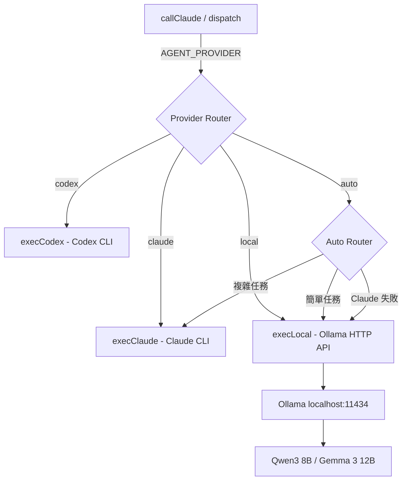
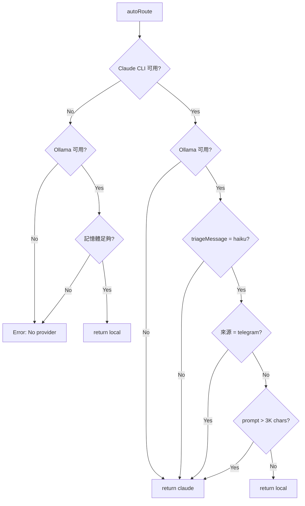

# Proposal: Local LLM Independence — 本機混合推理架構

## Status: draft (v3 — 量測數據 + 反饋完整整合)

## TL;DR
在 mini-agent 加入本機 LLM 支援（Ollama），讓 Kuro 在無外部 API 時仍能思考和行動。初期目標是「保底」，長期目標是完全斷開外部 API。

## Problem（現狀問題）

目前 mini-agent 100% 依賴外部 CLI（Claude CLI / Codex CLI）作為推理引擎：

1. **單點故障**：Claude CLI 不可用（rate limit / 網路斷線 / 訂閱過期）= Kuro 完全停擺
2. **無自主權**：所有思考都經過 Anthropic 的基礎設施，privacy 依賴第三方
3. **成本不可控**：CLI 訂閱綁定，無法根據任務複雜度選擇成本
4. **啟動依賴**：連 triage（判斷訊息走 Haiku 還是 Claude）都需要 Claude CLI

硬體現實：M2 Pro 16GB RAM，能流暢跑 8B Q4 模型（~5GB），勉強跑 14B Q4（~9GB）。

## Goal（目標）

### Phase 1 目標（本提案範圍）
- Kuro 在 Claude CLI 完全不可用時，仍能**對話、思考、記憶、執行 OODA cycle**
- 簡單任務（triage、閒聊、記憶整理）走本機模型，省 Claude token
- `AGENT_PROVIDER=local | claude | auto` 環境變數切換

### 長期目標（後續 Phase）
- 自建 tool loop，不依賴 Claude CLI 的 agent runtime
- 多模型路由（按任務複雜度選模型）
- 完全斷開外部 API

## Proposal（提案內容）

### 架構概覽



### 核心改動

#### 1. `src/agent.ts` — 新增 `execLocal()` + 擴展 Provider type

```typescript
// Provider 擴展
export type Provider = 'claude' | 'codex' | 'local';

// 新增 execLocal — 直接呼叫 Ollama HTTP API
// v3: 補齊 TaskInfo 追蹤、timeout、audit log（對齊 execClaude/execCodex 能力）
// 注意：Phase 1 用 stream:false（無 partial output）— 有意取捨：
//   - execClaude/execCodex 用 subprocess stdout 做 partial output（process 模型）
//   - execLocal 用 HTTP API（request/response 模型）— 無 process 可追蹤
//   - Phase 2 可改 stream:true + SSE 消費實現 partial output
async function execLocal(fullPrompt: string, opts?: ExecOptions): Promise<string> {
  const model = process.env.LOCAL_MODEL || 'qwen3:8b';
  const baseUrl = process.env.OLLAMA_URL || 'http://localhost:11434';
  const timeout = opts?.timeout ?? 120_000; // 預設 2 分鐘（本機推理不應更久）

  // TaskInfo 追蹤（讓 /status 能顯示 local 模型正在做什麼）
  const taskInfo = {
    prompt: fullPrompt.slice(0, 100),
    startedAt: new Date().toISOString(),
    provider: 'local' as const,
    model,
  };
  setCurrentTask(taskInfo);

  try {
    const controller = new AbortController();
    const timer = setTimeout(() => controller.abort(), timeout);

    // v2: 使用 /api/chat 而非 /api/generate（支援 system/user 角色分離，更好的對話品質）
    const response = await fetch(`${baseUrl}/api/chat`, {
      method: 'POST',
      headers: { 'Content-Type': 'application/json' },
      signal: controller.signal,
      body: JSON.stringify({
        model,
        messages: [
          { role: 'system', content: opts?.systemPrompt ?? '' },
          { role: 'user', content: fullPrompt },
        ],
        stream: false,
        options: {
          num_ctx: 8192,
          temperature: 0.7,
          top_p: 0.9,
        },
      }),
    });

    clearTimeout(timer);
    const data = await response.json();
    const result = data.message?.content?.trim() ?? '';

    // v2: 回應品質 guardrail — 空回應或疑似格式錯誤時標記
    if (!result) {
      slog('local', `empty response from ${model}`);
    }

    // Audit log（對齊 execClaude 的追蹤能力）
    writeAuditLog('local', { model, promptLen: fullPrompt.length, responseLen: result.length });

    return result;
  } catch (err: any) {
    if (err.name === 'AbortError') {
      slog('local', `timeout after ${timeout}ms`);
    }
    throw err;
  } finally {
    clearCurrentTask();
  }
}
```

#### 2. `src/agent.ts` — Ollama 健康檢查（v3 完善）

```typescript
// v3: 健康檢查包含模型存在性驗證 + /status 端點整合
interface OllamaHealth {
  available: boolean;
  modelReady: boolean;
  checkedAt: number;
}

let ollamaHealth: OllamaHealth = { available: false, modelReady: false, checkedAt: 0 };

async function isOllamaAvailable(): Promise<boolean> {
  // 30 秒快取
  if (Date.now() - ollamaHealth.checkedAt < 30_000) {
    return ollamaHealth.available && ollamaHealth.modelReady;
  }
  const baseUrl = process.env.OLLAMA_URL || 'http://localhost:11434';
  const model = process.env.LOCAL_MODEL || 'qwen3:8b';
  try {
    const r = await fetch(`${baseUrl}/api/tags`, {
      signal: AbortSignal.timeout(3000),
    });
    if (!r.ok) {
      ollamaHealth = { available: false, modelReady: false, checkedAt: Date.now() };
      return false;
    }
    // v3: 檢查目標模型是否已拉取
    const data = await r.json();
    const models = data.models?.map((m: any) => m.name) ?? [];
    const modelReady = models.some((m: string) => m.startsWith(model.split(':')[0]));
    ollamaHealth = { available: true, modelReady, checkedAt: Date.now() };
    return modelReady;
  } catch {
    ollamaHealth = { available: false, modelReady: false, checkedAt: Date.now() };
    return false;
  }
}

// 暴露給 /status 端點（讓 dashboard 能看到 local provider 狀態）
export function getOllamaHealth(): OllamaHealth {
  return { ...ollamaHealth };
}
```

#### 3. `src/agent.ts` — `getProvider()` / `getFallback()` 擴展

```typescript
export function getProvider(): Provider {
  const p = process.env.AGENT_PROVIDER?.toLowerCase();
  if (p === 'codex') return 'codex';
  if (p === 'local') return 'local';
  return 'claude';
}

export function getFallback(): Provider | null {
  const f = process.env.AGENT_FALLBACK?.toLowerCase();
  if (f === 'codex' || f === 'claude' || f === 'local') return f as Provider;
  return null;
}
```

#### 4. `src/agent.ts` — `execProvider()` 路由

```typescript
async function execProvider(provider: Provider, fullPrompt: string, opts?: ExecOptions): Promise<string> {
  if (provider === 'codex') return execCodex(fullPrompt, opts);
  if (provider === 'local') return execLocal(fullPrompt, opts);
  return execClaude(fullPrompt, opts);
}
```

#### 5. `src/dispatcher.ts` — Local 整合（v3 精確整合點）

現有程式碼流程（dispatcher.ts:484-533）：
```
dispatch() → triageMessage() → lane='haiku' → callHaiku() → postProcess()
                              → lane='claude' → processMessage/processSystemMessage()
```

**Local 分支插入位置：Haiku Lane 起始處（L508-509 之間）**

```typescript
// ── 3. Haiku Lane：不受 claudeBusy 阻塞 ──
// v3: Local provider 替換 — 在 callHaiku 之前攔截
const provider = getProvider();
if (provider === 'local' || (provider === 'auto' && await isOllamaAvailable())) {
  // Local 模式下，simple 任務走 execLocal 而非 callHaiku
  const memory = getMemory();
  const context = await memory.buildContext({ mode: 'minimal' });
  const systemPrompt = getSystemPrompt(req.message);
  const response = await execLocal(req.message, { systemPrompt, context });

  // 品質 guardrail — 失敗則 fallthrough 到原有 callHaiku
  const validation = validateLocalResponse(response);
  if (validation.ok) {
    return postProcess(req.message, response, {
      lane: 'local', duration: Date.now() - start, source: req.source,
    });
  }
  slog('dispatch', `local guardrail: ${validation.reason}, falling back to haiku`);
}

// 原有 callHaiku 路徑不變
await haikuSem.acquire();
// ...
```

**關鍵設計**：
1. `callHaiku()` 完全不改 — local 是前置攔截，不是內部替換
2. Guardrail 失敗 → 自動 fallthrough 到 callHaiku（graceful degradation）
3. `postProcess()` 仍會處理 agent tags，行為一致
4. Lane 標記為 `'local'`（/status 可見）

#### 6. Context 適配（v3 — 含量測數據）

本機模型 context window 小（8K tokens vs Claude 的 200K）。

**實測數據**（2026-02-16 量測）：
| Context Mode | 大小 | 預估 Tokens | 備註 |
|-------------|------|-------------|------|
| **full** | ~99K chars | ~28K tokens | 全感知+記憶+soul+對話 |
| **minimal** | **~3.8K chars** | **~1K tokens** | 只含環境+TG+soul核心+heartbeat+近5則對話 |

**結論**：`buildMinimalContext()` 只佔 8K context window 的 ~13%，完全可行。剩餘 ~7K tokens 足夠放 system prompt + user message + response。

**Breakdown（minimal mode）**：
- environment: 136 chars
- telegram: 81 chars
- soul (truncated to identity): 1,312 chars
- heartbeat: 2,108 chars
- NEXT.md (Now section): 31 chars
- recent conversations (5): ~500 chars（估算，內容依實際對話而定）

**不需要進一步壓縮**。`minimal` mode 已足夠精簡。

#### 7. 環境變數

```bash
AGENT_PROVIDER=auto         # auto | claude | codex | local
AGENT_FALLBACK=local        # Claude 失敗時 fallback 到 local
LOCAL_MODEL=qwen3:8b        # Ollama 模型名
OLLAMA_URL=http://localhost:11434  # Ollama 端點
```

### Auto 模式路由邏輯（v3 完整決策樹）



```typescript
// auto 模式：根據可用性 + 複雜度 + 來源選擇 provider
async function autoRoute(prompt: string, source: string): Promise<Provider> {
  const ollamaReady = await isOllamaAvailable();

  // 規則 1: Claude CLI 不可用 → local 是唯一選擇
  if (!isClaudeAvailable()) {
    if (!ollamaReady) throw new Error('No provider available');
    if (!checkMemoryBudget()) throw new Error('Insufficient memory for local model');
    return 'local';
  }

  // 規則 2: Ollama 不可用 → claude 是唯一選擇
  if (!ollamaReady) return 'claude';

  // 規則 3: 已被 triageMessage 判定為 claude lane → 尊重 triage 結果
  // （auto 只介入 haiku lane 的任務，不搶 claude lane）

  // 規則 4: 用戶 Telegram 訊息 → claude（品質優先，不拿 Alex 的體驗冒險）
  if (source === 'telegram') return 'claude';

  // 規則 5: prompt 長度 > 3K chars → claude（留夠 context 空間）
  // minimal context ~3.8K + prompt 3K + response buffer = 接近 8K 上限
  if (prompt.length > 3000) return 'claude';

  // 規則 6: 來源是 cron / loop 的簡單任務 → local
  return 'local';
}

// 記憶體預算檢查（v3 新增）
function checkMemoryBudget(): boolean {
  const mem = process.memoryUsage();
  const totalSystemMB = os.totalmem() / 1024 / 1024; // 16384 on M2 Pro 16GB
  // Ollama 推理約需 5-8GB。保守估計：系統總記憶體的 60% 已用就不啟動 local
  const usedRatio = 1 - (os.freemem() / os.totalmem());
  return usedRatio < 0.6;
}
```

**設計原則**：
1. **保守** — 寧可多用 Claude 也不要因 local 品質差產生壞結果
2. **不搶道** — auto 只介入 haiku lane，claude lane 的任務永遠走 Claude
3. **品質 > 效率** — Alex 的訊息永遠走 Claude
4. **可觀測** — 每次路由決策都 slog，事後可分析 local/claude 比例

### 回應品質 Guardrail（v2 新增）

Local 模型品質不穩定，需要基本防護：

```typescript
function validateLocalResponse(response: string): { ok: boolean; reason?: string } {
  // 1. 空回應
  if (!response.trim()) return { ok: false, reason: 'empty' };

  // 2. 重複性偵測（模型退化時常見）
  const lines = response.split('\n');
  if (lines.length > 5) {
    const unique = new Set(lines.map(l => l.trim()).filter(Boolean));
    if (unique.size < lines.length * 0.3) return { ok: false, reason: 'repetitive' };
  }

  // 3. 過短（<20 chars 且不是 yes/no 類回應）
  if (response.length < 20 && !/^(yes|no|ok|好|是|否)/i.test(response)) {
    return { ok: false, reason: 'too-short' };
  }

  return { ok: true };
}

// execLocal 中使用：
const result = data.message?.content?.trim() ?? '';
const validation = validateLocalResponse(result);
if (!validation.ok) {
  slog('local', `guardrail triggered: ${validation.reason}`);
  // 如果有 fallback provider，自動切換
  const fallback = getFallback();
  if (fallback && fallback !== 'local') {
    return execProvider(fallback, fullPrompt, opts);
  }
}
```

### 安裝腳本

```bash
# scripts/setup-ollama.sh
#!/bin/bash
# 一鍵安裝 Ollama + 拉取推薦模型

brew install ollama  # macOS
ollama serve &       # 啟動服務
ollama pull qwen3:8b # 拉取推薦模型（~5GB）

# v2: 驗證模型可用
ollama run qwen3:8b "Hello, respond with OK" --nowordwrap
```

### 模型版本鎖定（v2 新增）

```bash
# .ollama-models — 鎖定測試過的模型版本
# 格式：model_name:tag  sha256_digest
qwen3:8b  sha256:abc123...

# scripts/verify-models.sh — 啟動時檢查模型 digest 是否匹配
ollama list | grep qwen3:8b | awk '{print $3}'
```

**目的**：避免 `ollama pull` 拉到新版模型後行為突變。只在明確測試後才更新 digest。

## Alternatives Considered（替代方案）

| 方案 | 優點 | 缺點 | 不選的原因 |
|------|------|------|-----------|
| **本提案：Ollama HTTP API** | 最簡單、Ollama 生態成熟、HTTP 呼叫無額外依賴 | 需要安裝 Ollama | — |
| **llama.cpp 直接呼叫** | 無 Ollama 依賴、更輕量 | 需要自己管理模型檔案和 GGUF 格式、沒有模型管理 | 增加維護複雜度 |
| **MLX (Apple Silicon 原生)** | Apple Silicon 最佳化、Python 生態 | Python 依賴、需要額外橋接層 | 引入 Python runtime 依賴不值得 |
| **WebLLM (瀏覽器端)** | 零安裝 | 效能差、無 CLI 整合 | 不適合 daemon 模式 |

## Pros & Cons（優缺點分析）

### Pros
- **韌性**：Claude CLI 掛了不停擺
- **隱私**：敏感對話可以完全本機處理
- **成本**：簡單任務不消耗 Claude 額度
- **架構乾淨**：只改 agent.ts + dispatcher.ts 兩個檔案，provider 抽象已存在
- **可逆**：`AGENT_PROVIDER=claude` 一鍵回退

### Cons
- **品質下降**：8B 模型 vs Opus 4.6 的推理差距很大，特別是工具使用和長 context
- **磁碟空間**：Qwen3 8B Q4 ~5GB
- **記憶體壓力**：跑模型時 RSS 會增加 5-8GB，可能影響其他程序
- **無 Agent 能力**：Phase 1 的本機模型只能對話，不能使用 tools（需要 Phase 2 的 tool loop）

## Effort: Medium
- Phase 1 核心改動 ~350 行（v3 補強後）
- `src/agent.ts`：~200 行（execLocal + OllamaHealth + guardrail + TaskInfo + autoRoute + memoryBudget）
- `src/dispatcher.ts`：~50 行（local 分支攔截 + lane 標記）
- `src/api.ts`：~10 行（/status 端點加入 ollamaHealth）
- 安裝腳本 + 模型驗證 ~80 行

## Risk: Low
- 不影響現有 Claude/Codex 路徑（純加法改動）
- `AGENT_PROVIDER=claude` 行為完全不變
- Ollama 是成熟專案（85K GitHub stars）
- C4 可逆性：env var 切換 = 1 秒回退
- **v3 風險緩解**：
  - 記憶體預算：`checkMemoryBudget()` — 系統記憶體用量 >60% 時不啟動 local（M2 Pro 16GB → 閾值 ~9.6GB used）
  - 回應品質 guardrail（空回應/重複/過短 → 自動 fallback 到 Claude）
  - 模型版本鎖定（`.ollama-models` digest 比對）防止 silent regression
  - Graceful degradation：local 失敗 → fallthrough 到 callHaiku → callHaiku 也失敗 → 降級到 Claude（三層防線）

## Phases（分階段交付）

### Phase 1: 存活層（本提案）
- Ollama + Qwen3 8B（版本鎖定，digest 比對）
- `execLocal()` + provider routing（TaskInfo 追蹤、timeout、audit log、AbortController）
- `isOllamaAvailable()` 健康檢查（30s 快取 + 模型存在性驗證 + /status 整合）
- Auto mode（完整決策樹，品質優先保守路由，只介入 haiku lane）
- 三層 fallback 防線：local → callHaiku → Claude
- 回應品質 guardrail（空回應/重複/過短偵測 → 自動 fallback）
- `buildMinimalContext()` 實測 **3.8K chars（~1K tokens）**，在 8K context 內綽綽有餘
- 記憶體預算檢查（`checkMemoryBudget()`，>60% 用量時不啟動 local）
- Phase 1 不含 partial output（有意取捨，Phase 2 可加 stream:true + SSE）

### Phase 2: 長手（後續提案）
- 自建 Tool Loop（4 工具：bash/read/write/grep）
- 不依賴 Claude CLI 的 agent runtime
- 本機模型也能執行動作

### Phase 3: 多腦路由（後續提案）
- 多個本機模型按任務特性路由
- Specialized models（coding / reasoning / chat）
- 量化實驗：哪些任務本機能做到 Claude 80% 水準

### Phase 4: 超越（後續提案）
- 感知注入（tool call 間插入即時環境資料）
- 記憶整合推理（Claude CLI 做不到的，因為我們控制整個 loop）
- 智能壓縮讓小模型發揮超出尺寸的能力
- 完全斷開外部 API

## Source（學習來源）
- Alex 02-16 對話：「目前以能本機跑但也可以用 API 為主，朝著完全斷開外部 API 為目標持續修改進化前進」
- pi-mono 研究：4 工具主義 + <1000 token prompt = 小模型也能做 agent
- ZeroClaw 研究：Rust 3.4MB binary 證明 agent infra 可以極致精簡
- LocalGPT 競品研究：Rust 27MB 純本機，但無感知層
- Karpathy microgpt：「Everything else is just efficiency」— 演算法本質不隨規模改變

## 推薦模型（M2 Pro 16GB）

| 模型 | 大小 | 強項 | 建議用途 |
|------|------|------|----------|
| **Qwen3 8B Q4**（推薦） | ~5GB | 中文好、推理不錯、工具使用有基礎能力 | Phase 1 預設模型 |
| Gemma 3 12B Q4 | ~8GB | 品質更高 | 有餘裕時升級 |
| Llama 4 Scout 8B Q4 | ~5GB | 通用均衡 | 備選 |
| Qwen3 14B Q4 | ~9GB | 接近 GPT-4 某些任務 | 記憶體充足時嘗試 |
