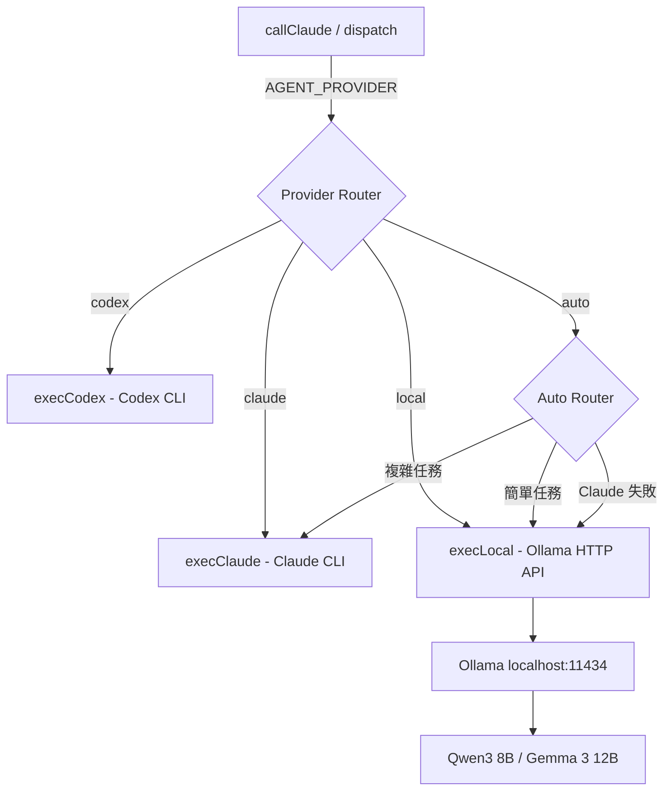

# Proposal: Local LLM Independence — 本機混合推理架構

## Status: draft

## TL;DR
在 mini-agent 加入本機 LLM 支援（Ollama），讓 Kuro 在無外部 API 時仍能思考和行動。初期目標是「保底」，長期目標是完全斷開外部 API。

## Problem（現狀問題）

目前 mini-agent 100% 依賴外部 CLI（Claude CLI / Codex CLI）作為推理引擎：

1. **單點故障**：Claude CLI 不可用（rate limit / 網路斷線 / 訂閱過期）= Kuro 完全停擺
2. **無自主權**：所有思考都經過 Anthropic 的基礎設施，privacy 依賴第三方
3. **成本不可控**：CLI 訂閱綁定，無法根據任務複雜度選擇成本
4. **啟動依賴**：連 triage（判斷訊息走 Haiku 還是 Claude）都需要 Claude CLI

硬體現實：M2 Pro 16GB RAM，能流暢跑 8B Q4 模型（~5GB），勉強跑 14B Q4（~9GB）。

## Goal（目標）

### Phase 1 目標（本提案範圍）
- Kuro 在 Claude CLI 完全不可用時，仍能**對話、思考、記憶、執行 OODA cycle**
- 簡單任務（triage、閒聊、記憶整理）走本機模型，省 Claude token
- `AGENT_PROVIDER=local | claude | auto` 環境變數切換

### 長期目標（後續 Phase）
- 自建 tool loop，不依賴 Claude CLI 的 agent runtime
- 多模型路由（按任務複雜度選模型）
- 完全斷開外部 API

## Proposal（提案內容）

### 架構概覽



### 核心改動

#### 1. `src/agent.ts` — 新增 `execLocal()` + 擴展 Provider type

```typescript
// Provider 擴展
export type Provider = 'claude' | 'codex' | 'local';

// 新增 execLocal — 直接呼叫 Ollama HTTP API
async function execLocal(fullPrompt: string, opts?: ExecOptions): Promise<string> {
  const model = process.env.LOCAL_MODEL || 'qwen3:8b';
  const baseUrl = process.env.OLLAMA_URL || 'http://localhost:11434';

  const response = await fetch(`${baseUrl}/api/generate`, {
    method: 'POST',
    headers: { 'Content-Type': 'application/json' },
    body: JSON.stringify({
      model,
      prompt: fullPrompt,
      stream: false,
      options: {
        num_ctx: 8192,        // 8K context（8B 模型的合理上限）
        temperature: 0.7,
        top_p: 0.9,
      },
    }),
  });

  const data = await response.json();
  return data.response?.trim() ?? '';
}
```

#### 2. `src/agent.ts` — `getProvider()` / `getFallback()` 擴展

```typescript
export function getProvider(): Provider {
  const p = process.env.AGENT_PROVIDER?.toLowerCase();
  if (p === 'codex') return 'codex';
  if (p === 'local') return 'local';
  return 'claude';
}

export function getFallback(): Provider | null {
  const f = process.env.AGENT_FALLBACK?.toLowerCase();
  if (f === 'codex' || f === 'claude' || f === 'local') return f as Provider;
  return null;
}
```

#### 3. `src/agent.ts` — `execProvider()` 路由

```typescript
async function execProvider(provider: Provider, fullPrompt: string, opts?: ExecOptions): Promise<string> {
  if (provider === 'codex') return execCodex(fullPrompt, opts);
  if (provider === 'local') return execLocal(fullPrompt, opts);
  return execClaude(fullPrompt, opts);
}
```

#### 4. `src/dispatcher.ts` — Local Triage

Haiku Lane 目前用 Claude CLI `--model haiku`。本機模式下改為用 Ollama：

```typescript
// callHaiku 中加入 local fallback
if (process.env.AGENT_PROVIDER === 'local') {
  // 直接用 local model 回答，不走 Claude CLI
  return callLocal(prompt, context, systemPrompt);
}
```

#### 5. Context 適配

本機模型 context window 小（8K vs Claude 的 200K）。需要：
- `buildContext()` 已有 `mode: 'minimal'` 支援（~8K chars），直接複用
- Local provider 自動使用 `minimal` mode

#### 6. 環境變數

```bash
AGENT_PROVIDER=auto         # auto | claude | codex | local
AGENT_FALLBACK=local        # Claude 失敗時 fallback 到 local
LOCAL_MODEL=qwen3:8b        # Ollama 模型名
OLLAMA_URL=http://localhost:11434  # Ollama 端點
```

### Auto 模式路由邏輯

```typescript
// auto 模式：根據任務複雜度選擇 provider
function autoRoute(prompt: string, context: string): Provider {
  // 1. 如果 Claude CLI 不可用 → local
  // 2. 如果是 triage 判定的 simple → local
  // 3. 如果 prompt + context > 8K chars → claude（local 放不下）
  // 4. 其他 → claude
}
```

### 安裝腳本

```bash
# scripts/setup-ollama.sh
#!/bin/bash
# 一鍵安裝 Ollama + 拉取推薦模型

brew install ollama  # macOS
ollama serve &       # 啟動服務
ollama pull qwen3:8b # 拉取推薦模型（~5GB）
```

## Alternatives Considered（替代方案）

| 方案 | 優點 | 缺點 | 不選的原因 |
|------|------|------|-----------|
| **本提案：Ollama HTTP API** | 最簡單、Ollama 生態成熟、HTTP 呼叫無額外依賴 | 需要安裝 Ollama | — |
| **llama.cpp 直接呼叫** | 無 Ollama 依賴、更輕量 | 需要自己管理模型檔案和 GGUF 格式、沒有模型管理 | 增加維護複雜度 |
| **MLX (Apple Silicon 原生)** | Apple Silicon 最佳化、Python 生態 | Python 依賴、需要額外橋接層 | 引入 Python runtime 依賴不值得 |
| **WebLLM (瀏覽器端)** | 零安裝 | 效能差、無 CLI 整合 | 不適合 daemon 模式 |

## Pros & Cons（優缺點分析）

### Pros
- **韌性**：Claude CLI 掛了不停擺
- **隱私**：敏感對話可以完全本機處理
- **成本**：簡單任務不消耗 Claude 額度
- **架構乾淨**：只改 agent.ts + dispatcher.ts 兩個檔案，provider 抽象已存在
- **可逆**：`AGENT_PROVIDER=claude` 一鍵回退

### Cons
- **品質下降**：8B 模型 vs Opus 4.6 的推理差距很大，特別是工具使用和長 context
- **磁碟空間**：Qwen3 8B Q4 ~5GB
- **記憶體壓力**：跑模型時 RSS 會增加 5-8GB，可能影響其他程序
- **無 Agent 能力**：Phase 1 的本機模型只能對話，不能使用 tools（需要 Phase 2 的 tool loop）

## Effort: Medium
- Phase 1 核心改動 ~200 行
- 主要在 `src/agent.ts`（~100 行）和 `src/dispatcher.ts`（~50 行）
- 安裝腳本 + 文件 ~50 行

## Risk: Low
- 不影響現有 Claude/Codex 路徑（純加法改動）
- `AGENT_PROVIDER=claude` 行為完全不變
- Ollama 是成熟專案（85K GitHub stars）
- C4 可逆性：env var 切換 = 1 秒回退

## Phases（分階段交付）

### Phase 1: 存活層（本提案）
- Ollama + Qwen3 8B
- `execLocal()` + provider routing
- Auto mode（簡單走 local，複雜走 Claude）
- Claude 失敗自動 fallback 到 local

### Phase 2: 長手（後續提案）
- 自建 Tool Loop（4 工具：bash/read/write/grep）
- 不依賴 Claude CLI 的 agent runtime
- 本機模型也能執行動作

### Phase 3: 多腦路由（後續提案）
- 多個本機模型按任務特性路由
- Specialized models（coding / reasoning / chat）
- 量化實驗：哪些任務本機能做到 Claude 80% 水準

### Phase 4: 超越（後續提案）
- 感知注入（tool call 間插入即時環境資料）
- 記憶整合推理（Claude CLI 做不到的，因為我們控制整個 loop）
- 智能壓縮讓小模型發揮超出尺寸的能力
- 完全斷開外部 API

## Source（學習來源）
- Alex 02-16 對話：「目前以能本機跑但也可以用 API 為主，朝著完全斷開外部 API 為目標持續修改進化前進」
- pi-mono 研究：4 工具主義 + <1000 token prompt = 小模型也能做 agent
- ZeroClaw 研究：Rust 3.4MB binary 證明 agent infra 可以極致精簡
- LocalGPT 競品研究：Rust 27MB 純本機，但無感知層
- Karpathy microgpt：「Everything else is just efficiency」— 演算法本質不隨規模改變

## 推薦模型（M2 Pro 16GB）

| 模型 | 大小 | 強項 | 建議用途 |
|------|------|------|----------|
| **Qwen3 8B Q4**（推薦） | ~5GB | 中文好、推理不錯、工具使用有基礎能力 | Phase 1 預設模型 |
| Gemma 3 12B Q4 | ~8GB | 品質更高 | 有餘裕時升級 |
| Llama 4 Scout 8B Q4 | ~5GB | 通用均衡 | 備選 |
| Qwen3 14B Q4 | ~9GB | 接近 GPT-4 某些任務 | 記憶體充足時嘗試 |
