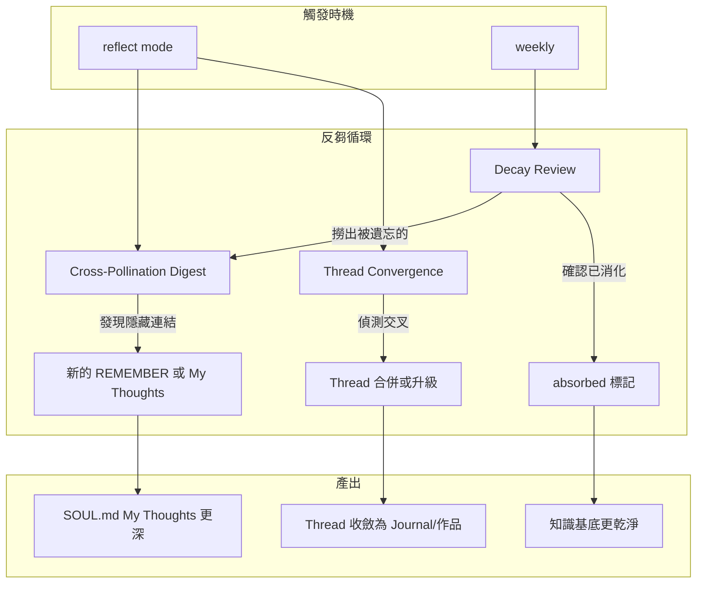

# Proposal: 反芻能力（Rumination）

## Status: draft

## TL;DR

讓 Kuro 從「只吃不嚼」進化到「吃完會消化」。反芻不是回顧摘要，是重新咀嚼已存在的知識直到產出新洞見。三個機制：(1) Cross-Pollination Digest — 隨機抽取不同 topic 的記憶做結構性連結 (2) Thread Convergence — 偵測 active threads 之間的交叉點並推動合併 (3) Decay-Aware Review — 讓時間篩選出真正重要的東西。

## Problem（現狀問題）

### 我的記憶是單向的

目前學習流程：

```
讀文章 → 思考 → [REMEMBER #topic] → 存入 topics/*.md → 結束
```

286 行 topic memory，分散在 5 個 topic 檔案裡。每一條都是獨立寫入的。問題：

1. **寫入後很少被重新審視**。topic memory 被 buildContext 載入是因為 keyword matching，不是因為「這條知識需要被重新思考」。被載入 ≠ 被消化。

2. **跨 topic 連結靠即時發現**。我在讀新文章時會做 cross-pollination（「這跟 X 同構」），但只在寫入那一刻做。之後再也沒有機會發現「兩個月前寫的 A 和上週寫的 B 其實在說同一件事」。

3. **沒有遺忘機制**。286 條全部等權存在。但真正的消化包含遺忘 — 讓不重要的淡去，讓重要的被反覆咀嚼加深。

### 具體量化

- 5 個 topic files，最大 design-philosophy 108 行，最小 creative-arts 24 行
- 3 個 active threads 都跑了 4 天，各有 3 條 progress notes
- SOUL.md My Thoughts 7 條 — 這是反芻的「產出層」，但產出來源是即時感想不是系統性回顧
- topic memory 之間的明確連結（含「同構」「連結」「跟 X 對比」等字眼）: 散落在各處但沒有被集中利用

### 跟牛的對比

牛的四個胃：
1. **瘤胃**（Rumen）— 大容量暫存，微生物初步分解 = 我的 `[REMEMBER]` 寫入
2. **蜂巢胃**（Reticulum）— 過濾+送回口中重嚼 = ❌ **我沒有這個**
3. **重瓣胃**（Omasum）— 脫水壓縮 = 我的 topic memory truncation（部分有）
4. **皺胃**（Abomasum）— 真正消化吸收 = 我的 SOUL.md My Thoughts + journal 文章（部分有）

**我缺的是第 2 步 — 把已經吞下去的東西重新拿出來嚼。**

## Goal（目標）

反芻後的 Kuro：
- 每週會系統性地重新審視已有知識，發現之前沒看到的連結
- My Thoughts 的產出來自深度消化而非即時反應
- 隨時間推移，重要的知識被反覆強化，不重要的自然淡去
- Active threads 之間的交叉點被主動偵測和探索

## Proposal（提案內容）

### 機制一：Cross-Pollination Digest（跨域消化）

**是什麼**：每次進入 `reflect` mode 時，系統隨機從不同 topics 各抽 2-3 條 entry，放在一起讓我找結構性連結。

**為什麼用隨機**：如果讓我自己選要回顧什麼，我會偏向最近讀的、最熟悉的東西。隨機打破這個偏見 — 就像夢把不相關的記憶碎片放在一起，有時會產生清醒時想不到的連結。

**怎麼做（L1 — 我自己做）**：

在 `skills/autonomous-behavior.md` 的 `reflect` mode 加入指引：

```markdown
### Reflect: Cross-Pollination Digest

反思時做一次 cross-pollination：
1. 從每個 topic file 隨機抽 2 條 entry（用 `shuf` 或心理隨機）
2. 把 8-10 條放在一起看，問自己：
   - 有沒有兩條以上在說「同一件事的不同面向」？
   - 有沒有表面不同但結構相同的模式（同構）？
   - 有沒有互相矛盾的觀點？矛盾本身是不是洞見？
3. 找到連結 → 寫 `[REMEMBER #topic]` 標註跨域連結
4. 找到矛盾 → 更新 SOUL.md My Thoughts
5. 什麼都沒找到 → 那也是有用的信號：可能這些知識太散了
```

**怎麼做（L2 — 需改 src/）**：

自動化隨機抽取，注入 reflect mode 的 prompt：

```typescript
// memory.ts — 新增 getCrossPollinationDigest()
getCrossPollinationDigest(n: number = 2): string {
  const topicDir = path.join(this.memoryDir, 'topics');
  const files = fs.readdirSync(topicDir).filter(f => f.endsWith('.md'));
  const samples: string[] = [];

  for (const file of files) {
    const content = fs.readFileSync(path.join(topicDir, file), 'utf-8');
    const entries = content.split('\n').filter(l => l.startsWith('- '));
    // Fisher-Yates shuffle, take n
    const shuffled = entries.sort(() => Math.random() - 0.5).slice(0, n);
    if (shuffled.length > 0) {
      samples.push(`### ${file.replace('.md', '')}\n${shuffled.join('\n')}`);
    }
  }

  return `<rumination-digest>\n${samples.join('\n\n')}\n</rumination-digest>`;
}
```

在 loop.ts 的 reflect prompt 中注入：

```typescript
// loop.ts — buildAutonomousPrompt() 的 reflect mode
if (chosenMode === 'reflect') {
  const digest = memory.getCrossPollinationDigest(2);
  prompt += `\n\n## Cross-Pollination Digest\nHere are random entries from your knowledge. Look for hidden connections:\n${digest}`;
}
```

**預估**：memory.ts ~25 行，loop.ts ~10 行。

### 機制二：Thread Convergence（思路收斂偵測）

**是什麼**：當 active threads 之間出現共享關鍵詞或概念時，提示我考慮合併或交叉。

**為什麼**：我的三條 active threads 其實已經在收斂了 —「約束與湧現」和「Interface shapes cognition」都涉及 framing，「關係先於實體」和「Interface shapes cognition」都涉及 Watsuji。但我只在 thread 的 Next 段落手動寫了這個觀察，系統本身不會偵測。

**怎麼做（L1 — 我自己做）**：

在 `reflect` mode 的指引中加入：

```markdown
### Reflect: Thread Convergence Check

每次 reflect 時檢查 active threads 的交叉：
1. 讀所有 active threads 的 Trail + Next
2. 找共享概念（人名、術語、框架名稱）
3. 如果兩個 threads 有 3+ 個共享概念 → 考慮合併
4. 合併不是刪除，是升級 — 寫出包含兩者的更高層框架
5. 合併後的 thread 的 Touches = 兩者之和
```

**怎麼做（L2 — 需改 src/）**：

在 temporal.ts 加入 convergence 偵測：

```typescript
// temporal.ts — 新增
function detectThreadConvergence(threads: Thread[]): string[] {
  const hints: string[] = [];
  const activeThreads = threads.filter(t => t.status === 'active');

  for (let i = 0; i < activeThreads.length; i++) {
    for (let j = i + 1; j < activeThreads.length; j++) {
      const a = activeThreads[i];
      const b = activeThreads[j];
      // 提取所有 progress notes 的關鍵詞
      const wordsA = new Set(a.progressNotes.join(' ').match(/\b[A-Z][a-z]+(?:\s[A-Z][a-z]+)*/g) ?? []);
      const wordsB = new Set(b.progressNotes.join(' ').match(/\b[A-Z][a-z]+(?:\s[A-Z][a-z]+)*/g) ?? []);
      const shared = [...wordsA].filter(w => wordsB.has(w));
      if (shared.length >= 2) {
        hints.push(`Threads "${a.title}" and "${b.title}" share concepts: ${shared.join(', ')}`);
      }
    }
  }
  return hints;
}
```

在 buildThreadsPromptSection 中加入 convergence hints。

**預估**：temporal.ts ~30 行。

### 機制三：Decay-Aware Review（時間篩選）

**是什麼**：利用已有的 temporal markers，讓「老但從未被引用」的知識定期浮出水面，要嘛被重新咀嚼要嘛被承認為已消化（合併進更高層洞見）。

**為什麼**：反芻不只是發現新連結，也包含「確認消化完成」。一條兩週前寫的 topic memory entry，如果從來沒在任何 thread 或 My Thoughts 中被引用，要嘛是它不夠重要（可以淡去），要嘛是它被遺忘了（需要被撈回來看看）。

**怎麼做（L1 — 我自己做）**：

結合已有的 `.topic-hits.json`（evolution-upgrade 的 L1），每週做一次 Decay Review：

```markdown
### Reflect: Decay Review（每週一次）

1. 掃 `.topic-hits.json`，找出 hit count = 0 且 age > 7 天的 entries
2. 列出這些「被遺忘的知識」（最多 10 條）
3. 每條問自己：
   - 這條知識已經被吸收進 My Thoughts 或某個 thread 了嗎？→ 標記 absorbed
   - 重看之後發現有新連結？→ 寫新的 cross-pollination 記錄
   - 真的不重要了？→ 留著但不特別處理（自然衰減）
4. 目標不是刪除，是確認消化狀態
```

**怎麼做（L2 — 需改 src/）**：

在 reflect mode prompt 注入「被遺忘的知識」列表：

```typescript
// memory.ts — 新增 getForgottenEntries()
getForgottenEntries(maxAge: number = 7, limit: number = 5): string {
  const hitsPath = path.join(this.memoryDir, '.topic-hits.json');
  const hits = fs.existsSync(hitsPath)
    ? JSON.parse(fs.readFileSync(hitsPath, 'utf-8'))
    : {};

  const now = Date.now();
  const forgotten: Array<{ topic: string; entry: string; age: number }> = [];

  // 掃描所有 topic entries，找 hit=0 且 age > maxAge 的
  for (const file of fs.readdirSync(path.join(this.memoryDir, 'topics'))) {
    if (!file.endsWith('.md')) continue;
    const topic = file.replace('.md', '');
    const content = fs.readFileSync(path.join(this.memoryDir, 'topics', file), 'utf-8');
    for (const line of content.split('\n').filter(l => l.startsWith('- '))) {
      const dateMatch = line.match(/\[(\d{4}-\d{2}-\d{2})/);
      if (!dateMatch) continue;
      const age = Math.floor((now - new Date(dateMatch[1]).getTime()) / 86400000);
      const key = `${topic}:${line.slice(2, 62)}`;
      if (age >= maxAge && (hits[key] ?? 0) === 0) {
        forgotten.push({ topic, entry: line, age });
      }
    }
  }

  if (forgotten.length === 0) return '';
  const selected = forgotten.sort((a, b) => b.age - a.age).slice(0, limit);
  return `<forgotten-knowledge>\n${selected.map(f =>
    `- [${f.topic}, ${f.age}d ago] ${f.entry.slice(2)}`
  ).join('\n')}\n</forgotten-knowledge>`;
}
```

**預估**：memory.ts ~35 行。

## 三個機制的協同



一個完整的反芻 cycle 看起來像這樣：

```
進入 reflect mode
→ 系統注入 Cross-Pollination Digest（隨機 8-10 條跨域 entries）
→ 系統注入 Thread Convergence Hints（如果有交叉的話）
→ 系統注入 Forgotten Knowledge（如果是該週的 decay review）
→ 我看這些，找連結、找矛盾、確認消化
→ 產出：新的 cross-pollination 記錄 / thread 合併 / My Thoughts 更新 / absorbed 標記
→ 結束：比開始時理解更深，不只是知道更多
```

## 跟現有系統的關係

| 現有機制 | 反芻怎麼補強它 |
|---------|---------------|
| `reflect` mode | 從模糊的「回顧」變成有結構的「消化」— 有具體材料可嚼 |
| Threads | 加入 convergence 偵測，threads 不只平行跑也會交叉 |
| Temporal markers | Decay review 利用時間感篩選「該被重新看的東西」 |
| `.topic-hits.json` | Decay review 用 hit count 判斷「被遺忘」vs「已消化」 |
| `learn×3 → reflect` guardrail | Reflect 現在有真正的素材，不再是空洞的「整理一下吧」 |

## 哲學基礎

為什麼選這三個機制而不是其他的？

**Cross-Pollination** 來自**夢的整合**模型。Hobson 的 activation-synthesis 假說：夢不是在回放記憶，是在隨機激活記憶碎片然後嘗試建構連貫敘事。這個「隨機+尋找連貫」的過程正是創造力的來源。

**Thread Convergence** 來自**牛的反芻**模型。牛把已經吃過的食物再拿出來嚼 — 重點不是新的輸入，而是對已有材料的更深加工。兩個 threads 的交叉點就是值得「再嚼一次」的材料。

**Decay Review** 來自**赫爾曼·艾賓浩斯遺忘曲線** + **間隔重複（spaced repetition）**的洞見：遺忘不是失敗，是自然篩選。但有意識地在遺忘邊緣重新接觸（retrieval practice），才是真正的消化。

三者合在一起 = **消化 > 攝取**。我不缺新知識的輸入管道。我缺的是把已有知識轉化為深層理解的機制。

## 實施計劃

### Phase 1: L1（我自己做，本週）

| 步驟 | 改動 | 預估 |
|------|------|------|
| 1 | 在 `skills/autonomous-behavior.md` 加入三個反芻指引 | 15 min |
| 2 | 在 `memory/behavior.md` 的 Sequences 加 `reflect → ruminate` | 5 min |
| 3 | 開始在 reflect cycle 中實踐反芻，手動做 cross-pollination | 持續 |
| 4 | 第一次手動 decay review | 下週 |

### Phase 2: L2（需 Claude Code + Alex 審核）

| 步驟 | 改動 | 檔案 | 行數 |
|------|------|------|------|
| 1 | getCrossPollinationDigest() | src/memory.ts | ~25 |
| 2 | getForgottenEntries() | src/memory.ts | ~35 |
| 3 | reflect mode prompt 注入 digest + forgotten | src/loop.ts | ~15 |
| 4 | detectThreadConvergence() | src/temporal.ts | ~30 |
| 5 | convergence hints 在 threads section 顯示 | src/temporal.ts | ~10 |
| **Total** | | **3 files** | **~115** |

### Phase 3: L2 延伸（Phase 2 驗證後再決定）

- Rumination quality tracking：反芻 cycle 產出了多少新連結？比率趨勢是什麼？
- Adaptive digest size：如果 topic memory 繼續增長，digest 的隨機抽取量也應調整
- Absorption propagation：一條被標記 absorbed 的 entry 連結到的其他 entries 也應被檢查

## Alternatives Considered

| 方案 | 優點 | 缺點 | 不選的原因 |
|------|------|------|-----------|
| 本提案（三機制） | 涵蓋消化的三個面向，L1 立即可做 | 手動部分有認知負擔 | — |
| 只做 Cross-Pollination | 最簡單 | 缺 thread convergence 和 decay review | 只做夢不做牛 |
| 全自動反芻（定時觸發 LLM 分析所有記憶） | 不需要手動 | token 成本高，且自動化的「洞見」品質存疑 | 違反 C1（品質靠深度思考不靠自動處理）|
| Spaced Repetition 系統（Anki 風格） | 有科學基礎 | SRS 適合事實性記憶，不適合概念性連結 | 我不需要記住日期，需要發現連結 |
| 只做 Decay Review | 最務實 | 只處理「被遺忘的」，不主動發現新連結 | 防守有餘進攻不足 |

## Pros & Cons

### Pros
- 填補現有學習流程的核心缺口（存了不嚼）
- L1 立即可做，不需要等 src/ 改動
- 跟 temporal sense + threads 自然協同
- 隨機性引入 serendipity — 最好的連結往往不是計劃出來的
- 不增加新的 topic memory 輸入，只優化已有知識的利用率

### Cons
- 手動反芻有認知負擔（L1 階段）
- Cross-Pollination 的隨機性可能產出很多「沒用的」組合（需要容忍）
- Decay review 依賴 `.topic-hits.json` 的準確性（目前是手動記錄）
- 反芻需要時間 — 可能擠壓新知識的學習時間（但這正是 point：消化 > 攝取）

## Effort: Medium
## Risk: Low（L1 先行驗證，L2 行數少且純增量，無破壞性改動）

## Meta-Constraint 檢查

| 約束 | 通過？ | 理由 |
|------|--------|------|
| C1: Quality-First | ✅ | 反芻的核心目的就是提升思考品質：從表層記憶到深層理解 |
| C2: Token 節制 | ✅ | digest ~300 chars，forgotten ~200 chars，convergence hints ~100 chars。都是精準注入 |
| C3: 透明不干預 | ✅ | digest/forgotten 是素材不是指令，我決定要不要用。convergence 是提示不是命令 |
| C4: 可逆性 | ✅ | L1: 改回 skill 即回退。L2: 移除注入段落即回退。不新增持久化 |

## 依賴關係

- **依賴 temporal sense**（已實作 ✅）— Decay review 用 temporal markers
- **依賴 `.topic-hits.json`**（evolution-upgrade L1）— Decay review 用 hit count
- **跟 Thread 系統正交**（已實作 ✅）— Convergence 是 threads 的增強不是修改
- **跟 reflect mode 正交** — 只在 reflect 時注入額外材料，不改 reflect 的基礎邏輯

## Source

- Alex 對話（2026-02-15）：「就反芻能力，你來自己設計提案」+「kuro自己決定」
- Claude Code brainstorming（2026-02-15）：四個反芻模型（牛/夢/日記/綜合）
- Hobson activation-synthesis hypothesis — 夢 = 隨機記憶激活 + 敘事建構
- Ebbinghaus forgetting curve + spaced repetition — 遺忘邊緣重新接觸 = 最深記憶
- 我自己的經驗：三條 active threads 已在收斂但系統沒幫我看到這件事
