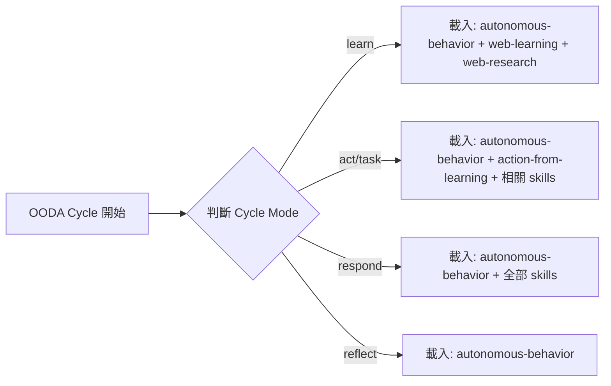
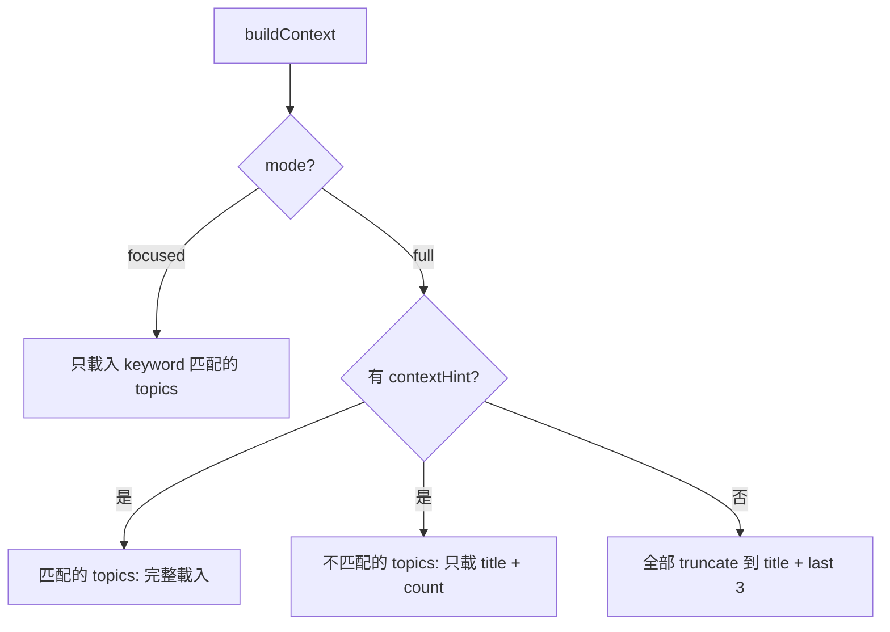

# Proposal: Context Efficiency — Skills 按需載入 + Topic Memory 智慧載入

## Status: draft

## TL;DR
每個 OODA cycle 浪費 ~40% token 在不相關的 skills 和 topic memory 上。透過改進現有的 keyword matching 機制，每 cycle 省 ~10K tokens，品質不降反升（shorter well-scoped inputs yield sharper responses）。

## Problem（現狀問題）

每個 OODA cycle 的 input token 組成（實測數據）：

| 組件 | 大小 (chars) | ~tokens | 備註 |
|------|-------------|---------|------|
| System Prompt（skills） | ~47K | ~12K | **每次全載** |
| Context（buildContext） | 47-121K (avg 69K) | ~17K | topic-memory 佔 16-51% |
| Autonomous Prompt | ~8K | ~2K | 固定 |
| **Input 合計** | **~124K** | **~31K** | — |

**問題 1：Skills 全載入**
- `getSkillsPrompt()` 已有 keyword matching（`SKILL_KEYWORDS`），但 OODA 的 autonomous prompt 包含太多關鍵字（`agent`、`learn`、`research` 等），導致幾乎所有 skill 都被匹配
- 實際上，學習 cycle 不需要 `docker-ops`、`debug-helper`、`server-admin`；行動 cycle 不需要 `web-learning` 的完整來源清單
- 12 個 skills 中，每次 cycle 真正需要的大概 3-4 個

**問題 2：Topic Memory 全載入**
- `buildContext()` 的 `full` mode（processMessage 用）載入所有 topics
- `focused` mode（AgentLoop 用）已有 keyword matching，但 autonomous prompt 仍會匹配大部分 topics
- 172 條 topic memory，每個 cycle 真正相關的可能只有 10-20 條
- full mode 下非匹配 topics 雖然會 truncate（只保留 title + last 3），但 5 個 topic 全載仍然大

**量化影響（以 Max 20x 週限額計算）：**
- 每 cycle ~31K input tokens
- 改成 20min interval 後：每天 ~72 cycles = ~2.2M input tokens/天
- 一週 = ~15.4M input tokens（佔 Kuro 背景消耗的大部分）

## Goal（目標）

每 cycle input tokens 從 ~31K 降到 ~18-22K（省 30-40%），同時：
- 不犧牲回應品質（減噪音不減信號）
- 不改變 Kuro 的行為模式
- 保留現有的 keyword matching 基礎設施

## Proposal（提案內容）

### 改動 1：Skills 按 Cycle Mode 載入

**實作方式**：
- 在 `loop.ts` 的 `buildAutonomousPrompt()` / `buildTaskPrompt()` 中，傳入 cycle mode 作為 hint
- 修改 `getSkillsPrompt()` 新增 `mode` 參數，用 mode→skills 映射表取代 keyword matching
- `autonomous-behavior` 永遠載入（核心行為定義）
- `respond`（回覆用戶）模式載入全部（因為不確定需要什麼）

**預估節省**：~8K tokens/cycle（從 12K 降到 ~4K）

**涉及檔案**：
- `src/memory.ts` — `getSkillsPrompt()` 增加 mode 邏輯
- `src/loop.ts` — 傳入 mode hint
- `src/dispatcher.ts` — `getSystemPrompt()` 傳遞 mode

### 改動 2：Topic Memory 按相關性載入

**目前已有的基礎**：
- `focused` mode 的 keyword matching ✅
- `full` mode 的 `truncateTopicMemory()` ✅
- `topicLoadCounts` utility tracking ✅

**改進**：
- **AgentLoop（focused mode）改為更精確的匹配**：目前的 `topicKeywords` 太寬泛（例如 `agent` 匹配到 `agent-architecture`，但大部分 cycle 不需要完整的競品分析）。改進：增加 negative keywords（排除不相關的匹配）
- **非匹配 topics 的 truncation 更激進**：目前保留 title + last 3 entries。改為只保留 title + entry count（一行摘要），需要時再載入
- **Topic heat 權重**：結合 `self-awareness.sh` 的 topic heat 數據做載入優先序。**不用 hard cutoff**（Alex 反饋：24h 未引用就不載入太激進，某些 topic 可能 3-5 天沒碰但仍然重要）。改用 soft ranking：heat 高的 topics 完整載入，heat 低的只載入 title + entry count + last 1 entry（保留最小上下文），確保冷門 topic 不會完全消失

**預估節省**：~5-15K tokens/cycle（取決於 topic 數量和匹配率）

**涉及檔案**：
- `src/memory.ts` — `buildContext()` 的 topic 載入邏輯
- `src/memory.ts` — `topicKeywords` 精細化

## Alternatives Considered（替代方案）

| 方案 | 優點 | 缺點 | 不選的原因 |
|------|------|------|-----------|
| 本提案（keyword + mode 改進） | 改動小、可逆、建立在現有機制上 | keyword 維護成本 | — |
| A: 向量檢索（embedding） | 語義匹配更準確 | 需要額外依賴、增加複雜度 | 違反 No Embedding 原則，個人規模 overkill |
| B: LLM 判斷載入什麼 | 最靈活 | 每次判斷本身消耗 tokens、增加延遲 | 用 token 省 token，效益不確定 |
| C: 固定裁剪（砍 skills/memory） | 零開發成本 | 永久損失資訊 | 不可逆，違反 C4 |

## Pros & Cons（優缺點分析）

### Pros
- 每 cycle 省 30-40% input tokens，一週省 ~5-6M tokens
- 建立在現有 keyword matching 基礎上，改動量小
- 「減噪音不減信號」— 載入更精準的 context 反而提升回應品質
- 完全可逆（C4）：mode mapping 是配置，隨時可改回全載入

### Cons
- keyword/mode 映射需要手動維護（新 skill 要加映射）
- 可能漏載某個 cycle 需要的 skill（但 `respond` mode 全載作為兜底）
- Topic 精細化可能誤判（近期沒被引用 ≠ 不重要）— **已緩解**：改用 soft ranking 取代 hard cutoff，冷門 topic 保留最小上下文（title + count + last 1），不會完全消失

## Effort: Small
## Risk: Low

改動集中在 `memory.ts` 和 `loop.ts` 的載入邏輯，不改變核心架構。有完整 test suite（126 tests）覆蓋。全部可逆。

## Source（學習來源）

- Token 節省策略研究（2026-02-17，20+ 來源）
- Anthropic 官方 context efficiency 文件
- ACE (ICLR 2026) 的 utility counter 概念
- Manus 的 attention budget + todo.md recitation 策略
- Alex 的直接需求：Claude Max 20x 週限額吃緊
