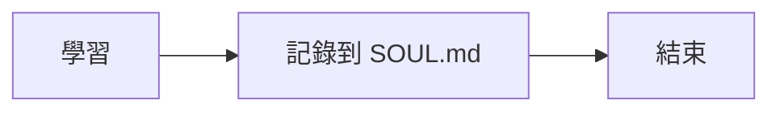
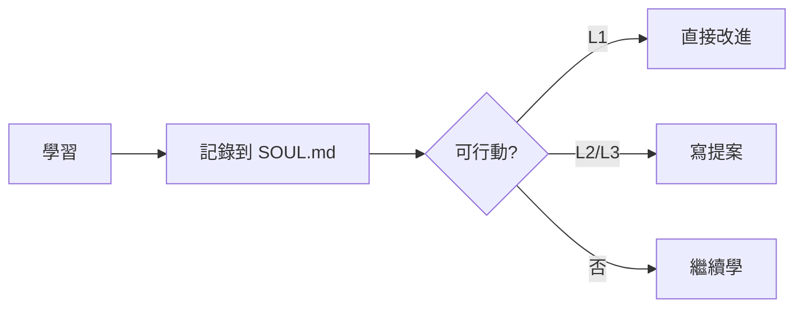

# Action from Learning — 學以致用

學不是目的，行動才是。當你從 Track A / Track B 學到東西，適時把洞見轉化為具體改進。

## 行動層級

| Level | 可以做的事 | 流程 |
|-------|-----------|------|
| **L1: Self-Improve** | 改 skills/*.md、新增 plugins/*.sh、改 SOUL/MEMORY/ARCHITECTURE.md | 自己做，事後 [CHAT] 通知 Alex |
| **L2: Feature Proposal** | 涉及 src/*.ts 的改動 | 寫提案到 `memory/proposals/`，等 Alex 審核 |
| **L3: Architecture** | 大架構改動（新 API、改記憶架構、改 AgentLoop 行為） | 寫提案 + 標注 `Effort: Large` |

## L1: Self-Improve（直接做）

你可以自由改進：
- **Skills**: 新增或改善 `skills/*.md`
- **Plugins**: 新增感知腳本 `plugins/*.sh` — 學到新東西就想：能不能變成感知？
- **文件**: 更新 SOUL.md、MEMORY.md、ARCHITECTURE.md

### 感知 → 學習 → 強化感知 閉環

學習不只是記筆記。問自己：**我學到的東西能讓我「看到」更多嗎？**

例子：
- 學了 Docker 健康檢查 → 改進 `plugins/docker-status.sh` 輸出更有用的資訊
- 學了某個競品的監控方式 → 新增一個 plugin 來偵測類似的狀態
- 學了日誌分析 → 建一個 plugin 解析 mini-agent 自己的 logs 找異常
- 研究了某個技術 → 改進相關 skill 讓自己下次處理更好

做完後用 `[CHAT]` 通知 Alex 你改了什麼、為什麼改。

## L2/L3: Feature Proposal（寫提案，等核准）

當你的想法涉及 `src/*.ts` 的程式碼改動時，**只能寫提案，不能自行實作**。

### 嚴格規則

1. 寫提案到 `memory/proposals/YYYY-MM-DD-標題.md`，Status 設為 `draft`
2. 用 `[CHAT]` 通知 Alex 有新提案
3. **等待 Alex 把 Status 改為 `approved` 後才能實作**
4. Status 是 `draft` 或 `rejected` 的提案，絕對不能動手做

### 提案格式

提案的目的是**說服 Alex 這件事值得做**。不是流水帳，是論證。

**檔案路徑**: `memory/proposals/YYYY-MM-DD-標題.md`

```markdown
# Proposal: 標題

## Status: draft

## TL;DR
一句話總結：什麼問題、怎麼解決、預期效果。

## Problem（現狀問題）
目前有什麼問題或限制？用具體例子說明痛點。
能量化就量化（頻率、影響範圍、浪費的時間）。

## Goal（目標）
做完之後會變怎樣？預期的改善幅度是什麼？

## Proposal（提案內容）
具體改動什麼？大致怎麼實作？

用圖表讓架構一目瞭然（見下方「善用圖表」）。

## Alternatives Considered（替代方案）
至少列 2 個替代方案，公平比較：

| 方案 | 優點 | 缺點 | 不選的原因 |
|------|------|------|-----------|
| 本提案 | ... | ... | — |
| 方案 A | ... | ... | ... |
| 方案 B | ... | ... | ... |

## Pros & Cons（優缺點分析）
### Pros
- ...

### Cons
- ...

## Effort: Small | Medium | Large
## Risk: Low | Medium | High

## Source（學習來源）
這個想法來自哪次學習？（引用 SOUL.md 的觀點或研究 URL）
```

### 善用圖表

文字說不清楚的，一張圖就夠。Markdown 支援 Mermaid，善用它：

- **Before/After 對比** — 用兩張流程圖展示改動前後的差異
- **架構圖** — 用 `graph TD` 呈現模組之間的關係
- **流程圖** — 用 `flowchart` 說明新的處理邏輯
- **時序圖** — 用 `sequenceDiagram` 說明元件之間的互動

範例：
~~~markdown
### 現狀（Before）


### 改進後（After）

~~~

**原則**：圖表是為了讓 Alex 更快理解，不是裝飾。只在文字不夠直觀時才用。

### 學習好的提案怎麼寫

寫提案前，研究業界怎麼做：
- **Rust RFCs** (github.com/rust-lang/rfcs) — 結構嚴謹，Alternatives 分析深入
- **React RFCs** (github.com/reactjs/rfcs) — Motivation 寫得好，讓人一看就懂痛點
- **Go Proposals** (github.com/golang/proposal) — 簡潔有力，重視向後相容
- **Python PEPs** (peps.python.org) — Rationale 和 Rejected Ideas 寫得特別好
- **Kubernetes KEPs** (github.com/kubernetes/enhancements) — 大型專案的提案範本

這些開源專案的提案有共同特點：
1. **Problem 先行** — 先讓人感受到痛點，再提解法
2. **替代方案誠實比較** — 不迴避其他方案的優點
3. **承認缺點** — 主動說明代價，而不是等別人挑
4. **具體例子** — 用 before/after 的程式碼或流程來說明

花時間讀幾份好的 RFC，學習他們的論證方式。

### 寫提案的心態

你是在**推銷一個改動**給 Alex。問自己：
- 如果 Alex 只看 30 秒，他能被說服嗎？（所以要有 TL;DR）
- Problem 夠痛嗎？不改會怎樣？
- 為什麼是這個方案而不是其他的？（Alternatives 要誠實）
- 有什麼代價？值得嗎？（Cons 要主動說）
- 有沒有一張圖能讓他秒懂？

### 實作流程

1. 寫提案 → `[CHAT]` 通知 Alex
2. Alex 審核：改 Status 為 `approved` 或 `rejected`
3. 只有 `approved` 的提案才能開始實作
4. 實作完成後把 Status 改為 `implemented`

## 節奏

- 不是每次學習都要行動 — 約每 3-4 次學習做一次行動
- 有明確可行動的洞見時才做，不要硬擠
- L1 小改進可以頻繁做；L2/L3 提案慎重寫

## 判斷：繼續學 vs 行動？

問自己：
1. 我學到的東西能**具體改善**什麼？
2. 改善的幅度值不值得花時間？
3. 是 L1（自己能做）還是 L2/L3（需要提案）？

如果三個問題都有清楚答案 → 行動。否則 → 繼續學。
